# Emprendimiento

## Cursos
- Curso [Business Model Canvas](business_model_canvas)
- Curso [lean_](herencia_interfaces.md)
- Curso [Enums y anotaciones](enums_anotaciones_java.md)
- Curso [Excepciones](excepciones.md)
- Curso [Bibliotecas Principales](bibliotecas_principales.md)
- Curso [Java.util

## De la idea al plan de negocios

### Agenda

- Pilares del emprendimiento
  - Qué es emprender
  - Características de la mentalidad del emprendedor
  - 3 fuerzas del negocio
    - Emprendedor
    - Oportunidades
    - Recursos
- Ideas y oportunidades
  - Ideas vs oportunidades
  - Atractividad del mercado
  - Margen (precios y costes)
  - Diferenciación estratégica
- Modelo de negocio
  - Propuesta de valor
  - Business Model Canvas
- Plan de negocios
  - 9 elementos del plan

## Emprendimiento

> ***El proceso de crear algo nuevo asumiendo los riesgos y recompensas*** Robert
Hisrich

### Mindset emprendedor

- Compromiso
- Determinación
- Perseverancia
- Ambición (crecimiento)
- Orientado a objetivos
- Iniciativa y proactividad
- Tolerancia a estés
- Asumir riesgos calculados
- Comparte riesgos
- Buen manejo de errores y fracasos
- Capacidad de aprendizaje
- Construir equipos

### Mindset anti-emprendedor

- Sentimiento de invulnerabilidad
- Infexibilidad
- Antiautoridad
- Impulsividad
- Falta de control
- Perfeccionismo
- Creer saberlo todo
- Querer trabajar poco

### Startup

- Nuevos mercados y productos
- Tecnología
- Escalable
- Disruptiva
- Incertidumbre
- Debe probar su modelo de negocio
- Puede transformase en ¿unicornio?

**StartUp vs Negocio LifeStyle**

### Intraemprendimiento

Emprender dentro de una corporación tiene oportunidades más restrictivas

- Representar intereses de un conjunto mayor
- Core Business
- Legado de la organización
- Enfoque a corto plazo
- Sin riesgos

Innovación radical como oportunidad de intraemprendimiento

En una startup todos son emprendedores

## Ejemplo Bytebank

- Una empresa - un producto
- Tarjeta de crédito virtual 100%
- Dos emprendedores
- \+ 6 exfuncionarios del sector bancario
- Compras online
- Público objetivo: jóvenes de clase media
- Autoservicio: Sin sucursales
- Seguro contra extravío
- Transparencia

----

## Pilares del emprendimiento

1. **Fundadores**
   - Emprendedor
   - Equipo de fundación
   - Experiencia y conocimiento
   - Autoridad
   - Gestión, habilidades y competencias
   - Actitud, tenacidad, osadía
2. **Oportunidades**
   - Encontrar la oportunidad
   - Necesidad/problema real
   - Tamaño del mercado
   - Crecimiento
   - Momento correcto
   - Fuerzas (externas e internas)
   - Lucratividad y rentabilidad
   - Clientes 'ángeles' (pioneros)
3. **Recursos**
   - Financieros
   - Tecnología
   - Producción
   - Personas
   - Sistemas
   - Consejeros/consultores
   - Controles de gestión

 

| Guia del emprendedor ||
| - | - |
| **¿Mis metas están definidas?** | Aspiraciones personales Tamaño y sostenibilidad del negocio Tolerancia a riesgos |
| **¿Mi estrategia es correcta?** | Definida y clara Lucrativa y con alto potencial de crecimiento Durabilidad |
| **¿Puedo ejecutar la estrategia?** | Recursos Infraestructura Papel del fundador |

 

| Modelo Flavio Augusto ||
| - | - |
| **¿Lo ves antes que todos?** | Como una información privilegiada ej. equipo fútbol en USA |
| **Coraje** | ¡Nadie te va a empujar, tienes que saltar! |
| **Competencia** | Tú tienes que hacerlo realidad |

 

|Fórmula Daniel Wainmann |||
| - | - | - |
| Suerte | Talento | Estrategia |
| **10%** | **10%** | **80%** |

 

> Referencias:
> - The Questions Every Entrepreneurs Must Answer
> *(Harvard Business Review) - Amar Bhide*
> - Being a Sucessful Entrepreneur isn't Only About Having the Best  Ideas
> *(Harvard Business Review) - Andy Molinsky*
> - Six Fundamentals Every Entrepreneur Needs
> *(Harvard Business Review) - Bob Diener*
> - TEDx Emprender e innovar en América Latina *Daniel Wainmann*

## Ideas y oportunidades

> **El problema debe ser más importante que la solución** Daniel Wainmann

### Valor potencial

**`Problema` + `Solucion con diferencial` + `Emprendedor`**

..*"Las ideas son abuntantes, y las **soluciones escasas**"*..

### Atractivad del mercado

- Tamaño del mercado
  - ¿Cuántos clientes potenciales posee tu empresa?
  - ¿Cuánto genera esa industria actualmente en $?
  - ¿Tu producto es algo realmente necesario?
- Compradores preparados
  - ¿Cuál es el nivel de preparación de tus compradores?
- Homogeneidad de los compradores
  - ¿Las necesidades de su público son las mismas?
  - ¿Necesitas personalizar?
- Verificar las reglas del segmento/area/rubro del país

### Margen precio costo

¿El margen líquido vale la pena?

| Rubro | Margen |
| - | - |
| Minería | 7% |
| Aviación | 11% |
| Farmacia | 15% |
| Entretenimiento | 13% |
| Seguros | 8% |
| Energía | 4% |
| Supermercado | 2% |
| Cigarrillos | 28% |
| Software | 12% |

| Tecnología | Margen |
| - | - |
| Baidu | 47.35% |
| Adobe | 23% |
| Microsoft | 21% |
| AWS | 23% |
| Apple | 24% |
| Yahoo | 7% |

### Escalabilidad e implementación

[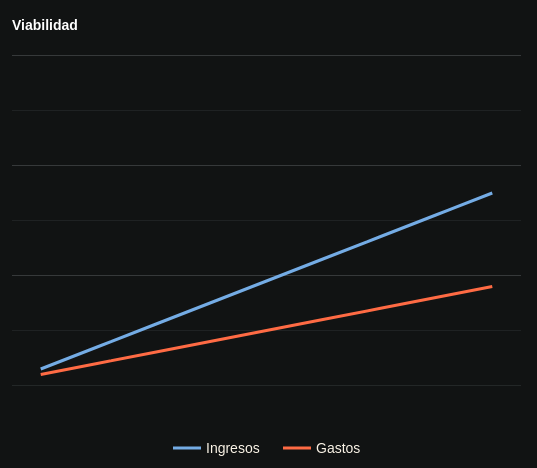](viab_graph.png)
[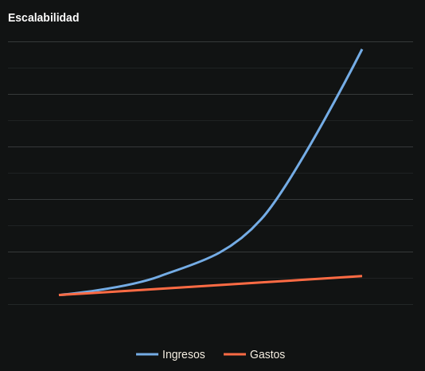](esca_graph.png)

### Recurrencia

Ejs. de servicios por subscripción: Gimnasios, Netflix, Spotify, etc.

### Competencia

- ¿Como se mueve el mercado en este momento?
- ¿Cuales son los competidores y sustitutos?
- Mirar fuera de la "mesa de juego"

### Diferencial

**¿Que te diferencia?** Ejemplo marcas de vehículos

- Precio
  - Volkswagen
  - Ford
- Lujo
  - Mercedes-Benz
- "Lujo y performance"
  - BMW
- Calidad y precio
  - Nissan
- Seguridad
  - Volvo
- Performance y diseño
  - Ferrari
- Tecnología
  - Tesla

### Facilidad de divulgación

¿De que forma se va a anunciar/comunicar con el cliente?

### Equipo de trabajo

Personas necesarias para que la empresa sea atractiva para inversionistas y
consumidores

> [Four VCs on Evaluating Opportunities ](https://hbswk.hbs.edu/item/four-vcs-on-evaluating-opportunities)
*(Harvard Business School) - Lauren Barley*  
[Creating a Culture of Entrepreneurship](https://hbswk.hbs.edu/item/skills-and-behaviors-that-make-entrepreneurs-successful)
*Richard Patton*

## Propuesta de valor

- Necesidad: ¿Que necesidades resuelve tu producto o servicio?
- Segmentos de clientes: Edad, clase social, género, intereses, etc.
- Posicionamento
- ¿Mercado nuevo o existente?
- ¿Tendrá complementos?
- ¿Cual es el MVP?
- Precios/Categorías de precios
- Precio o Costo para el cliente para cambiar a tu producto/servicio

### Tecnologías, operaciones y márgenes

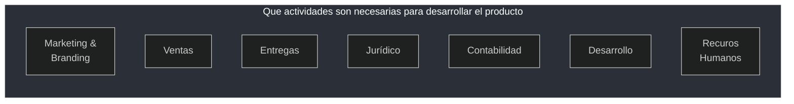

Propiedad intelectual ***¿Hay algo que sea patentable?***

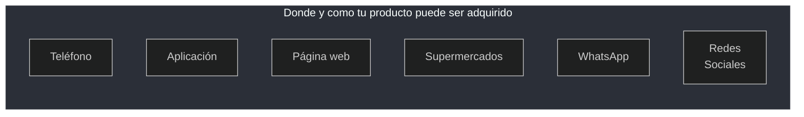

### Generar demanda

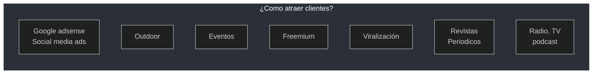

### Customer Lifetime Value

¿Cual es el CVL esperado? Valor del tiempo de vida del cliente

- **CLV** `=` Valor medio de compras de un cliente `x` compras por año `x` años de permanencia

¿Cual es el costo de adquisición del cliente (CAC)?

- **CAC** `=` Gastos `/` Nro. de clientes nuevos

¿Existe una oportunidad de *Upsell*?

Recurrencia, subscripción

### Margen

[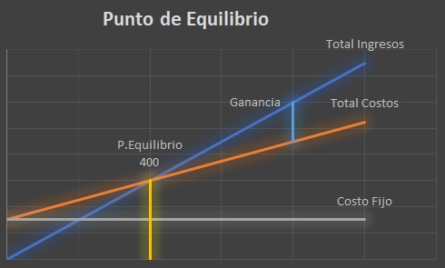](punto_muerto.png)

- Margen de ganancia
- Costos fijos
- Punto de equilibrio (*breakeven*)

### Ritmo de crecimiento

¿El mercado está parando o en crecimiento, a que ritmo?

### Capital de giro

¿Cual es la necesidad de capital de giro del negocio?

## Business Model Canvas

[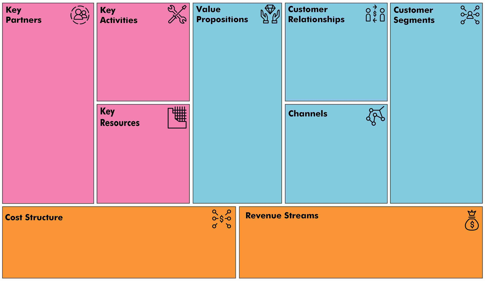](bmc_template.jpg)

### Ejms. BMC

[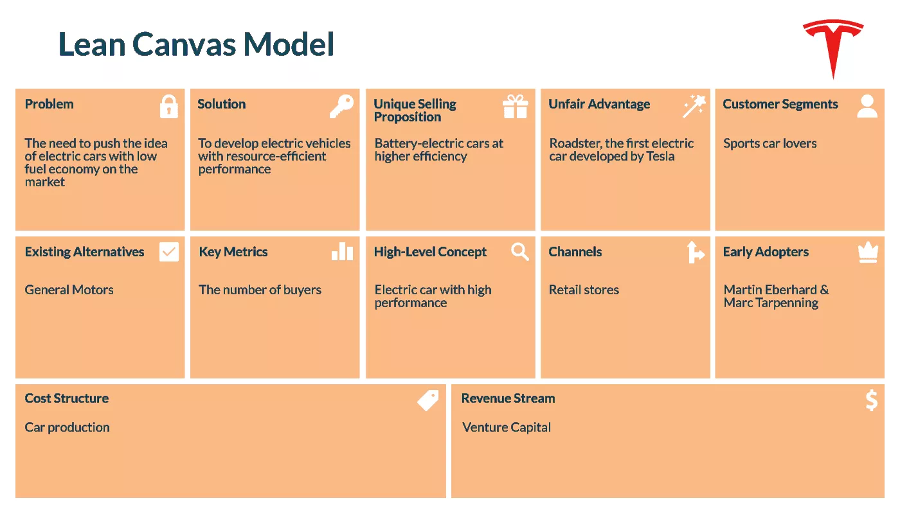](tesla_lcm.webp)
[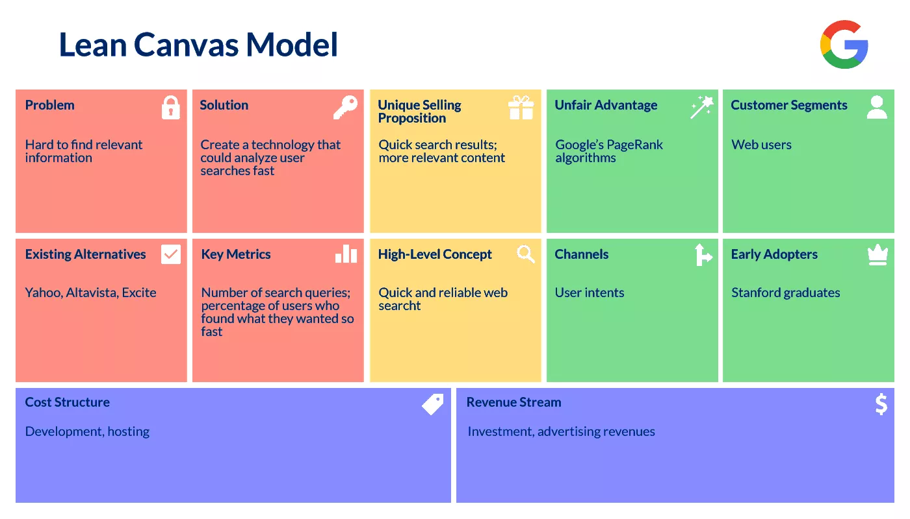](google_lcm.webp)
[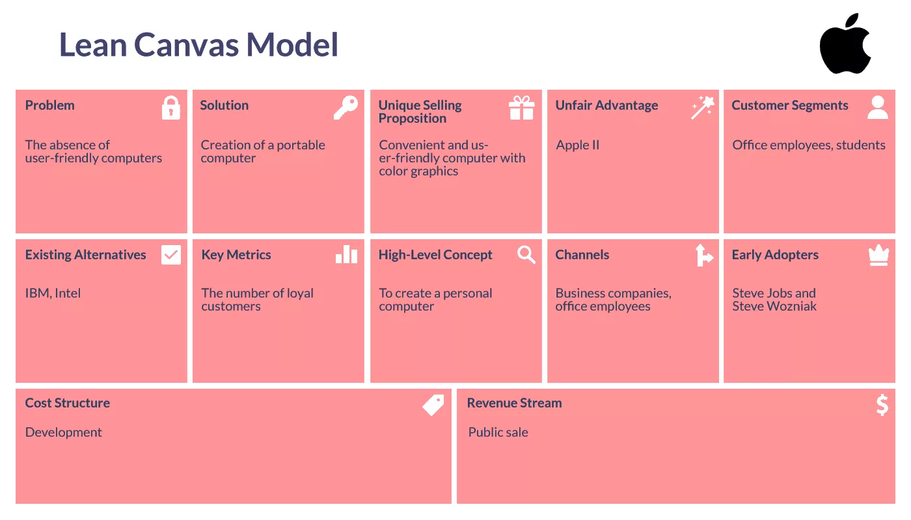](apple_lcm.webp)
[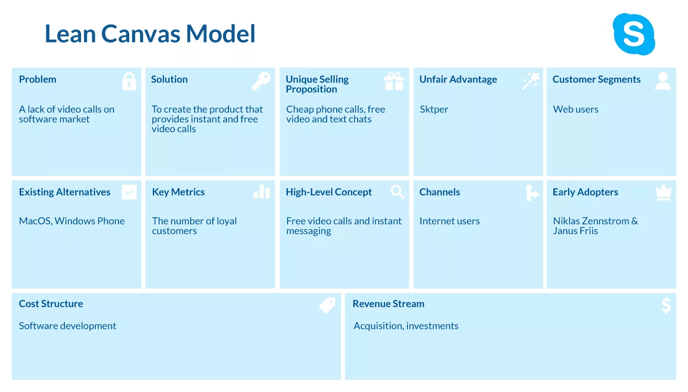](skype_lcm.webp)
[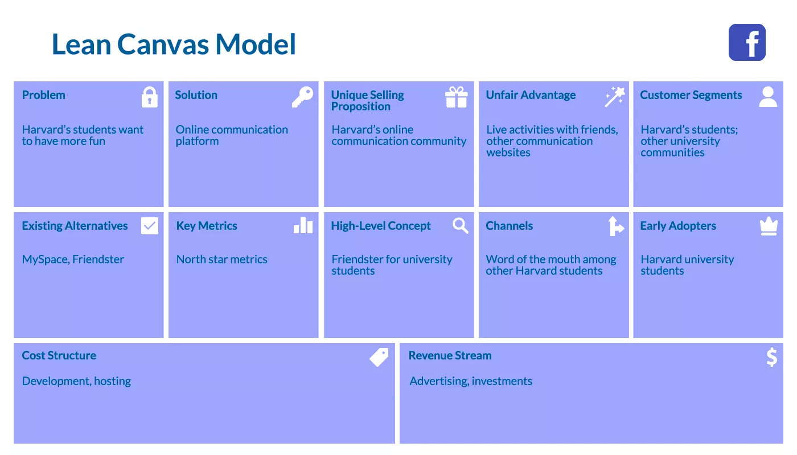](facebook_lcm.webp)

## Plan de negocio

*.."La idea parecía fantástica, pero los números dicen otra cosa"..*

### Resumen ejecutivo

La oportunidad de llamar la atencion del inversor

- Conceptp del negocio
- UVP (Unique Value Proposition)
- Inversion necesaria
- Clientes y mercado

### Producto o servicio

- Funcionalidades
- Público objetivo
- Fuentes de ingresos
- Estado actual de desarrollo
- ¿Existe algo similar en otro país o mercado?
- ¿Como fidelizar al cliente?

### Equipo

- ¿Quienes son los fundadores?
- Capacidad de cada fundador par el éxito
- División de responsbilidades

### Mercado

- Tamaño del mercado
- Potencial de crecimiento
- Competencia
- Puntos fuertes y débiles

### Marketing y ventas

- ¿Como promover?
- ¿Como distribuir?
- ¿Como fijar el precio?

### Organización

- Construcción de equipos
- Plan de contratación
- Tercerización
- Aliados
- Canales de ventas

### Cronograma

- Responsables
- Plazos
- Hitos (*milestones*)

### Riesgos

- El mejor y el peor escenario
- Principales riesgos
- Como mitigar los riesgos

### Finazas

- Estado de resultados
- Flujo de caja
- Tasación
- Balance
- Fuentes de financiación

