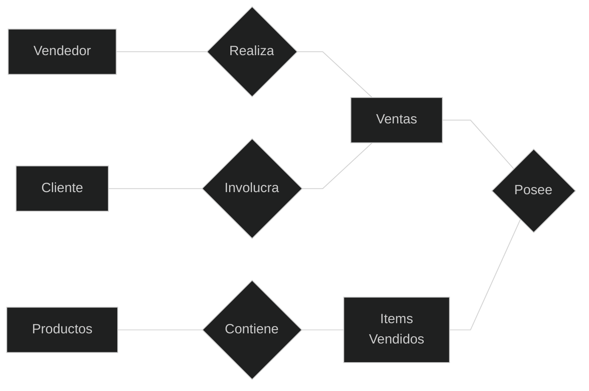
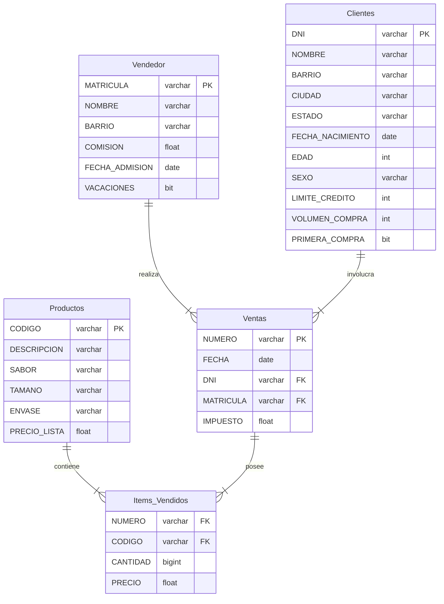

# Data Manipulation Language

Se repasa lo visto en el primer curso sobre
[bases de datos](study_drive/Alura/06_mysql/base_de_datos.md)

### Tipos de datos

- MySQL data [types](https://dev.mysql.com/doc/refman/8.0/en/data-types.html)
- MariaDB data [types](https://mariadb.com/kb/en/data-types/)

## Diseño de la base de datos

### 1. Análisis de requerimientos

- Comprender las reglas del negocio (entrevistas, reuniones)
- El diseño del modelo debe corresponder con la realidad

### 2. Modelo Conceptual

- Diagrama **E**ntidad **R**elación
- Establecer la cardinalidad de las entidades (relaciones `1-1`, `1-N`,
`N-N`)

<style>div.mermaid{text-align: center;}</style>



### 3. Establecer atributos de las entidades

#### Vendedor

| Vendedor | Cliente | Venta | Producto | Items Vendidos |
| - | - | - | - | - |
| ***Matrícula*** | ***DNI*** | ***Número*** | ***Código*** | <ins>*Número*</ins> |
| Nombre | Nombre | Fecha | Sabor | <ins>*Código*</ins> |
| Barrio | Dirección | <ins>*Matrícula*</ins> | Tamaño | Cantidad |
| Comisión | Barrio | Impuesto | Envase | Precio |
| Fecha Admisión | Ciudad | <ins>*DNI*</ins> | Precio Lista |  |
| Vacaciones | Estado |  | Descripción  |  |
|  | CP |  |  |  |
|  | Fecha nacimiento |  |  |  |
|  | Edad |  |  |  |
|  | Sexo |  |  |  |
|  | Límite credito |  |  |  |
|  | Volumen compra |  |  |  |
|  | Primera compra |  |  |  |

### 4. Creación de diagrama entidad relación



### 5. Crear base de datos

Se pueden utilizar herramientas para esto. Computer-Aide Software Engineering,
Start UML, Astah, ERWin, etc.

#### Creación

```sql
CREATE {DATABASE | SCHEMA} [IF NOT EXISTS] db_name
    [create_options] ...

create_options: [DEFAULT] {
    CHARACTER SET [=] charset_name
    | COLLATE [=] collation_name
    | ENCRYPTION [=] {'Y' | 'N'}
}
```

#### Eliminación

```sql
DROP {DATABASE | SCHEMA} [IF EXISTS] db_name
```

#### Creación de tablas

```sql
CREATE [TEMPORARY] TABLE [IF NOT EXISTS] tbl_name
    (create_definitions, ...)
    [table_options]
    [partition_options]

CREATE [TEMPORARY] TABLE [IF NOT EXISTS] tbl_name
    (create_definitions, ...)
    [table_options]
    [partition_options]
    [IGNORE | REPLACE]
    [AS] query_expression

CREATE [TEMPORARY] TABLE [IF NOT EXISTS] tbl_name
    (create_definitions, ...)
    { LIKE old_tbl_name | (LIKE old_tbl_name) }
```

### Creación tablas

```sql
USE ventas_jugos;

CREATE TABLE tb_vendedor(
    MATRICULA VARCHAR(5) NOT NULL,
    NOMBRE VARCHAR(100) NULL,
    BARRIO VARCHAR(50) NULL,
    COMISION FLOAT NULL,
    FECHA_ADMISION DATE NULL,
    DE_VACACIONES BIT(1) NULL,
    PRIMARY KEY(MATRICULA)
);

CREATE TABLE tb_producto(
    CODIGO VARCHAR(10) NOT NULL,
    DESCRIPCION VARCHAR(100) NULL,
    SABOR VARCHAR(50) NULL,
    TAMANO VARCHAR(50) NULL,
    ENVASE VARCHAR(50) NULL,
    PRECIO_LISTA BIT(1) NULL,
    PRIMARY KEY(CODIGO)
);

...
```

```sql
CREATE TABLE tb_venta(
    NUMERO VARCHAR(5) NOT NULL,
    FECHA DATE NULL,
    DNI VARCHAR(11) NOT NULL,
    MATRICULA VARCHAR(5) NOT NULL,
    IMPUESTO FLOAT,
    PRIMAREY KEY(NUMERO)
);

/* tb_cliente.DNI como llave foranea en tb_venta */
ALTER TABLE tb_venta ADD CONSTRAIN FK_CLIENTE
FOREIGN KEY (DNI) REFERENCES tb_cliente(DNI);

/* tb_vendedor.MATRICULA como llave foranea tb_venta */
ALTER TABLE tb_venta ADD CONSTRAIN FK_VENDEDOR
FOREIGN KEY (MATRICULA) REFERENCES tb_vendedor(MATRICULA);

CREATE TABLE tb_items_facturas
(NUMERO VARCHAR(5) NOT NULL,
CODIGO VARCHAR(10) NOT NULL,
CANTIDAD INT,
PRECIO FLOAT,
PRIMARY KEY (NUMERO, CODIGO));

/* Renombrando tb_venta a tb_factura */
ALTER TABLE tb_venta RENAME tb_factura;

/* tb_factura.MATRICULA como llave foranea tb_factura */
ALTER TABLE tb_items_facturas ADD CONSTRAINT FK_PRODUCTO
FOREIGN KEY (NUMERO) REFERENCES tb_facturas(NUMERO);

/* tb_producto.CODIGO como llave foranea tb_items_facturas */
ALTER TABLE tb_items_facturas ADD CONSTRAINT FK_PRODUCTO
FOREIGN KEY (NUMERO) REFERENCES tb_producto(CODIGO);
```

## Insert

```sql
INSET [LOW_PRIORITY | DELAYED | HIGH_PRIORITY] [IGNORE]
    [INTO] tbl_name
    [PARTITION (partition_name [, partition_name] ...)]
    [(col_name [, col_name] ...)]
    { {VALUES | VALUE} (value_list) [, (value_list)] ...
      |
      VALUES row_constructor_list
    }
    [AS row_alias[(col_alias [, col_alias] ...)]]


INSET [LOW_PRIORITY | DELAYED | HIGH_PRIORITY] [IGNORE]
    [INTO] tbl_name
    [PARTITION (partition_name [, partition_name] ...)]
    [AS row_alias[(col_alias [, col_alias] ...)]]
    SET assignment_list
    [ON DUPLICATE KEY UPDATE assignment_list]
```

```sql
INSERT INTO tb_producto (
    CODIGO, DESCRIPCION, SABOR, TAMANO, ENVASE, PRECIO_LISTA
) VALUES
    ('1040107', 'Light', 'Sandía', '350 ml', 'Lata', 4.56),
    ('1040108', 'Light', 'Guanába', '350 ml', 'Lata', 4.56),
    ('1040109', 'Light', 'Asaí', '350 ml', 'Lata', 3.50);
```

```sql
INSERT INTO TABLA_DE_CLIENTES
    DNI, NOMBRE, DIRECCION, BARRIO, CIUDAD, ESTADO, CP, FECHA_NACIMIENTO,
    EDAD, SEXO, LIMITE_CREDITO, VOLUMEN_COMPRA, PRIMERA_COMPRA
VALUES
    ('9283760794', 'Edson Calisaya', 'Sta Úrsula Xitla', 'Barrio del Niño Jebús',
    'Ciudad de México', 'EM', '22002002', '1995-01-07', 25, 'M', 150000, 250000, 1),
    ('7771579779', 'Marcelo Perez', 'F.C. de Cuernavaca 13', 'Carola',
    'Ciudad de México', 'EM', '88202912', '1992-01-25', 29, 'M', 120000, 200000, 1),
    ('5576228758', 'Patricia Olivera', 'Pachuca 75',  'Condesa', 'Ciudad de México',
    'EM', '88192029', '1995-01-14', 25, 'F', 70000, 160000, 1);
```

### Insertar datos desde otro schema

```sql
USER jugos_ventas;

INSERT INTO tb_producto
SELECT CODIGO_DEL_PRODUCTO AS CODIGO, NOMBRE_DEL_PRODUCTO AS DESCRIPCION,
SABOR, TAMANO, ENVASE, PRECIO_DE_LISTA AS PRECIO_LISTA
FROM jugos.vetnas.tabla_de_productos
WHERE CODIGO_DEL_PRODUCTO NOT IN (SELECT CODIGO FROM tb_producto);

INSERT INTO tb_cliente
SELECT DNI, NOMBRE, DIRECCION_1 AS DIRECCION,
BARRIO, CIUDAD, ESTADO, CP, FECHA_DE_NACIMIENTO 
AS FECHA_NACIMIENTO, EDAD, SEXO, LIMITE_DE_CREDITO
AS LIMITE_CREDITO, VOLUMEN_DE_COMPRA AS VOLUMEN_COMPRA,
PRIMERA_COMPRA FROM jugos_ventas.tabla_de_clientes
WHERE DNI NOT IN (SELECT DNI FROM tb_cliente);
```

### Table Data Import Wizard


## Update

```sql
UPDATE [LOW_PRIORITY] [IGNORE] table_reference
    SET assignment_list
    [WHERE where_condition]
    [ORDER BY ...]
    [LIMIT row_count]

value: {expr | DEFAULT}

assignment:
    col_name = value

assignment_list:
    assignment [, assignment] ...
```

### Actualizar un campo

```sql
UPDATE tb_producto SET PRECIO_LISTA = 5
WHERE CODIGO = '1000889';
```

### Actualizar varios campos

```sql
UPDATE tb_producto SET
    DESCRIPCION = 'Sabor de la Montaña',
    TAMANO = '1 Litro',
    ENVASE = 'Botella PET'
WHERE CODIGO = '1000889';

UPDATE tb_cliente SET
    DIRECCION = 'Ruben Ramirez 16',
    BARRIO = 'Antonio',
    CIUDAD = 'Guadalajara',
    ESTADO = 'Jalisco',
    CP = '44700000'
WHERE DNI = '5840119709';
```

### Actualizar todos los registros de una columna

```sql
UPDATE tb_cliente SET VOLUMEN_COMPRA = VOLUMEN_COMPRA/10;
```

### Update con datos de otro schema

```sql
/* Se usa substring ya que el format de matrícula en la tabla B
 es '00???' */
UPDATE tb_vendedor A
    SELECT * FROM tb_vendedor A
    INNER JOIN
        jugos_ventas.tabla_de_vendedores B
    ON A.MATRICULA = SUBSTRING(B.MATRICULA, 3, 3)
SET A.DE_VACACIONES = B.VACACIONES;
```

***Aumentar en 30% el volumen de compra de los clientes***
***cuyos barrios tengan vendedores con domicilio allí***

```sql
UPDATE tb_clientes A 
INNER JOIN 
    tb_vendedor B
ON A.BARRIO = B.BARRIO
SET A.VOLUMEN_COMPRA = A.VOLUMEN_COMPRA * 1.3;
```

## DELETE

```sql
DELETE [LOW_PRIORITY] [QUICK] [IGNORE] FROM tbl_name [[AS] tbl_alias]
    [PARTITION (partition_name [, partition_name] ...)]
    [ORDER BY ...]
    [LIMIT row_count]
```

```sql
DELETE FROM tb_producto WHERE CODIGO = '1001000';

DELETE FROM tb_producto WHERE TAMANO = '1 Litro';
```

```sql
DELTE FROM tb_producto
WHERE CODIGO NOT IN (
    SELECT CODIGO_DEL_PRODUCTO
    FROM jugos_.tabla_de_productos
);
```

***Eliminar las facturas cuyos clientes tengan menos de 18 años***

```sql
DELETE A FROM tb_facturas A
INNER JOIN tb_vendedor B
ON A.DNI = B.DNI
WHERE B.EDAD < 18;
```

## COMMIT y ROLLBACK

Confirmar o revertir una transacción

```sql
START TRANSACTION

-- TRANSACCIÓN

ROLLBACK
-- o
COMMIT
```

## AUTO_INCREMENT

```sql
CREATE TABLE tb_identificacion(
    ID INT AUTO_INCREMENT NOT NULL,
    DESCRIPCION VARCHAR(50) NULL,
    PRIMARY KEY(ID)
);
```

## Campo con valor DEFAULT

```sql
CREATE TABLE tb_default(
    ID INT AUTO_INCREMENT,
    DESCRIPCION VARCHAR(50) NOT NULL,
    DIRECCION VARCHAR(100) NULL,
    CIUDAD VARCHAR(50) DEFAULT 'Gaza',
    CREACION TIMESTAMP DEFAULT CURRENT_TIMESTAMP(),
    PRIMARY KEY(ID)
);
```

## TRIGGERS

```sql
CREATE
    [ DEFINER = user ]
    TRIGGER trigger_name
    trigger_time trigger_event
    ON tbl_name FOR EACH ROW
    [trigger_order]
    trigger_boddy

trigger_time: { BEFORE | AFTER }

trigger_event: { INSERT | UPDATE | DELETE }

trigger_order: { FOLLOWS | PRECEDES } other_trigger_name
```

```sql
CREATE TABLE tb_facturacion(
    FECHA DATE NULL,
    VENTA FLOAT
);

DELIMITER //

CREATE TRIGGER TG_FACTURACION_INSERT
AFTER INSERT ON tb_items_facturas
FOR EACH ROW BEGIN

    DELETE FROM tb_facturacion;
    INSERT INTO tb_facturacion
    SELECT A.FECHA, SUM(B. CANTIDAD * B.PRECIO) AS VENTA
    FROM tb_factura A
    INNER JOIN
        tb_items_facturas B
    ON A.NUMERO = B.NUMERO
    GROUP BY A.FECHA;

END //
```

***Crear trigger que actualize la edad de los clientes cada vez que se
inserte un nuevo cliente***

```sql
DELIMITER //
CREATE TRIGGER TG_EDAD_CLIENTES_INSERT 
BEFORE INSERT ON tb_clientes
FOR EACH ROW BEGIN
    SET NEW.EDAD = timestampdiff(YEAR, NEW.FECHA_NACIMIENTO, NOW());
END//
```

### Triggers para DELETE y UPDATE

```sql
DELIMITER //

CREATE TRIGGER TG_FACTURACION_DELETE
AFTER DELETE ON tb_items_facturas
FOR EACH ROW BEGIN

    DELETE FROM tb_facturacion;
    INSERT INTO tb_facturacion
    SELECT A.FECHA, SUM(B. CANTIDAD * B.PRECIO) AS VENTA
    FROM tb_factura A
    INNER JOIN
        tb_items_facturas B
    ON A.NUMERO = B.NUMERO
    GROUP BY A.FECHA;

END //

DELIMITER //

CREATE TRIGGER TG_FACTURACION_UPDATE
AFTER UPDATE ON tb_items_facturas
FOR EACH ROW BEGIN

    DELETE FROM tb_facturacion;
    INSERT INTO tb_facturacion
    SELECT A.FECHA, SUM(B. CANTIDAD * B.PRECIO) AS VENTA
    FROM tb_factura A
    INNER JOIN
        tb_items_facturas B
    ON A.NUMERO = B.NUMERO
    GROUP BY A.FECHA;

END //
```

## Manipulación de datos

- Stored Procedures
- Herramientas ETL (extract transform load) Pentaho, Power Center, SAP Data
Services, SQL Server Information Services, ...
- Lenguajes Python, Java, PHP, ...
