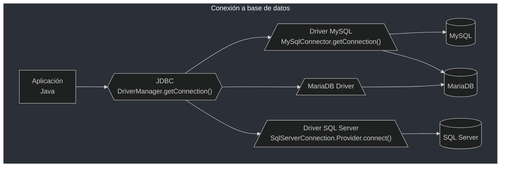
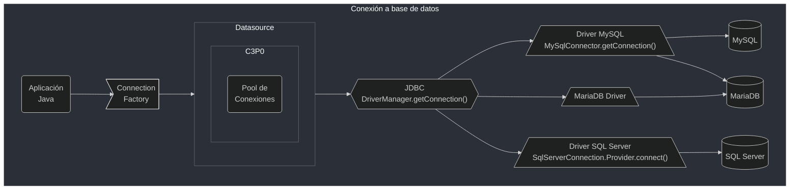
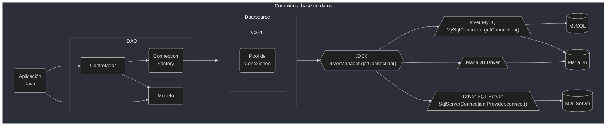

# JDBC
## Cursos
- Curso [JPA Persistence Hibernate](study_drive/Alura/07_java_spring_boot/jpa_persistence_hibernate.md)
- Curso [JPA Avanzado](study_drive/Alura/07_java_spring_boot/jpa_avanzado.md)
- Curso [Spring Boot 1](study_drive/Alura/07_java_spring_boot/spring_boot_1.md)
- Curso [Spring Boot 2](study_drive/Alura/07_java_spring_boot/spring_boot_2.md)
- Curso [Spring Boot 3](study_drive/Alura/07_java_spring_boot/spring_boot_3.md)
## Lectura
- Lectura [JDBC](https://www.aluracursos.com/blog/conociendo-el-jdbc)
- Lectura [Maven](https://www.aluracursos.com/blog/que-es-maven)
- Lectura [Rest](https://www.aluracursos.com/blog/rest-concepto-y-fundamentos)

```sh
mysql -u <user> -h <host> -p
```

```sql
CREATE DATABASE control_de_stock;
USE control_de_stock;

CREATE TABLE producto(
    id INT AUTO_INCREMENT,
    nombre VARCHAR(50) NOT NULL,
    descripcion VARCHAR(255),
    cantidad INT NOT NULL DEFAULT 0,
    PRIMARY KEY(id)
)Engine=InnoDB;

INSERT INTO producto(
    nombre, descripcion, cantidad)
    values('Mesa', 'Mesa de 4 lugares', 10);

INSERT INTO producto(
    nombre, descripcion, cantidad)
    values( 'Celular', 'Celular Samsung', 50);

SELECT * FROM producto;

+----+----------+-------------------+----------+
| id | nombre   | descripcion       | cantidad |
+----+----------+-------------------+----------+
|  1 | Mesa     | Mesa de 4 lugares |       10 |
|  2 | Celuclar | Celular Samsung   |       50 |
+----+----------+-------------------+----------+
```



### Url de conexión

**`jdbc:<tipo_db>://<host:puerto>/<nombre_db>?<opc_params>`**

ejm. `jdbc:mysql//localhost:3306/control_de_stock`

## Proyecto

### Configuración de maven - pom.xml

```xml
<project xmlns="http://maven.apache.org/POM/4.0.0" xmlns:xsi="http://www.w3.org/2001/XMLSchema-instance" xsi:schemaLocation="http://maven.apache.org/POM/4.0.0 https://maven.apache.org/xsd/maven-4.0.0.xsd">
  <modelVersion>4.0.0</modelVersion>
  <groupId>com.alura</groupId>
  <artifactId>control-de-stock</artifactId>
  <version>0.0.1-SNAPSHOT</version>
  <name>Control de Stock</name>
  <description>Proyecto para trabajar con bases de datos con JDBC</description>
  <properties>
      <java.version>17</java.version>
  </properties>
  <dependencies>
      <dependency>
          <groupId>mysql</groupId>
          <artifactId>mysql-connector-java</artifactId>
          <version>8.0.33</version>
      </dependency>
  </dependencies>
  <build>
      <plugins>
          <plugin>
              <groupId>org.apache.plugins</groupId>
              <artifactId>maven.compiler.plugin</artifactId>
              <version>4.0.0</version>
              <configuration>
                  <source>${java.version}</source>
                  <target>${java.version}</target>
                  <optimize>true</optimize>
              </configuration>
          </plugin>
      </plugins>
  </build>
</project>
```

### Prueba del conector

```java
package com.alura.tests;

import java.sql.Connection;
import java.sql.DriverManager;
import java.sql.SQLException;

public class PruebaConexion {

    private static String dbname = "control_de_stock";
    private static String dbuser = "alura";
    private static String dbpass = "alura";
    private static String dburl = "192.168.0.8:3306";
    private static String params = "useTimeZone=true&serverTimeZone=UTC";

    public static void main(String[] args) throws SQLException {
        System.out.println("hola");
        Connection con = DriverManager.getConnection(
                "jdbc:mysql://"+dburl+"/"+dbname+"?"+params, dbuser, dbpass);
        con.close();
        System.out.println("chao");
    }

}
```

### Uso de Clase
ConnectionFactory

```java
package com.alura.jdbc.factory;

import java.sql.Connection;
import java.sql.DriverManager;
import java.sql.SQLException;

public class ConnectionFactory {

    private static String dbdriver = "jdbc:mysql://";
    private static String dburl = dbdriver+"192.168.0.8:3306/";
    private static String params = "?useTimeZone=true&serverTimeZone=UTC";
    private static String dbname = "control_de_stock";
    private static String dbuser = "alura";
    private static String dbpass = "alura";

    public Connection recuperaConexion() throws SQLException {
        return DriverManager.getConnection(dburl + dbname + params, dbuser, dbpass);
    }
}
```

### Uso de try with resources para las conexiones

En clase ProductoController para cierre automático de recursos `Statement`, `ResultSet`, `Connection`.

Y tratamiento de *querys* con `PreparedStatement`

```java
...

    public void guardar(Map<String,String> producto) throws SQLException {
        String nombre = producto.get("NOMBRE");
        String descripcion = producto.get("DESCRIPCION");
        int cantidad = Integer.valueOf(producto.get("CANTIDAD"));
        int max_cantidad = 50;

        final Connection con = new ConnectionFactory().recuperaConexion();
        try (con) {
            con.setAutoCommit(false);
            final PreparedStatement statement = con.prepareStatement(
                    "INSERT INTO producto(nombre, descripcion, cantidad) VALUES(?,?,?)",
                    Statement.RETURN_GENERATED_KEYS);

            try (statement) {
                do {
                    int cantidad_a_guardar = Math.min(cantidad, max_cantidad);
                    ejecutaRegistro(nombre, descripcion, cantidad_a_guardar, statement);
                    cantidad -= max_cantidad;
                } while (cantidad > 0);
                con.commit();
            } catch (Exception e) {
                con.rollback();
            }
        }
    }

...
```

## Pool de conexiones



### Implentando Pool Datasource en ConnectionFactory

- [c3p0](https://www.mchange.com/projects/c3p0/) - DJBC3 Connection and Statement
Pooling

- [mchange-commons-java](https://www.mchange.com/projects/mchange-commons-java/index.html)

Dependencias pom.xml

```xml
    ...
      <dependency>
          <groupId>com.mchange</groupId>
          <artifactId>c3p0</artifactId>
          <version>0.9.5.5</version>
      </dependency>
      <dependency>
          <groupId>com.mchange</groupId>
          <artifactId>mchange-commons-java</artifactId>
          <version>0.2.20</version>
      </dependency
    ...
```

```java
package com.alura.jdbc.factory;

import java.sql.Connection;
import java.sql.SQLException;
import javax.sql.DataSource;
import com.mchange.v2.c3p0.ComboPooledDataSource;

public class ConnectionFactory {

    private final static String driver = "jdbc:mysql://";
    private final static String dbaddr = "192.168.0.8:3306/";
    private final static String params = "?useTimeZone=true&serverTimeZone=UTC";
    private final static String dbname = "control_de_stock";
    private final static String dburl  = driver+dbaddr+dbname+params;
    private final static String dbuser = "alura";
    private final static String dbpass = "alura";

    private DataSource datasource;

    public ConnectionFactory() {
        var pooledDataSource = new ComboPooledDataSource();
        pooledDataSource.setJdbcUrl(dburl);
        pooledDataSource.setUser(dbuser);
        pooledDataSource.setPassword(dbpass);
        pooledDataSource.setMaxPoolSize(10);
        this.datasource = pooledDataSource;
    }

    public Connection recuperaConexion() throws SQLException {
        return this.datasource.getConnection();
    }
}
```

```txt
Aug 14, 2023 11:33:59 PM com.mchange.v2.log.MLog 
INFO: MLog clients using java 1.4+ standard logging.
Aug 14, 2023 11:34:00 PM com.mchange.v2.c3p0.C3P0Registry 
INFO: Initializing c3p0-0.9.5.5 [built 11-December-2019 22:18:33 -0800; debug? true; trace: 10]
Aug 14, 2023 11:34:00 PM com.mchange.v2.c3p0.impl.AbstractPoolBackedDataSource 
INFO: Initializing c3p0 pool... com.mchange.v2.c3p0.ComboPooledDataSource [ acquireIncrement -> 3, acquireRetryAttempts -> 30, acquireRetryDelay -> 1000, autoCommitOnClose -> false, automaticTestTable -> null, breakAfterAcquireFailure -> false, checkoutTimeout -> 0, connectionCustomizerClassName -> null, connectionTesterClassName -> com.mchange.v2.c3p0.impl.DefaultConnectionTester, contextClassLoaderSource -> caller, dataSourceName -> z8kfsxax1wlsb2gfqn07n|10dba097, debugUnreturnedConnectionStackTraces -> false, description -> null, driverClass -> null, extensions -> {}, factoryClassLocation -> null, forceIgnoreUnresolvedTransactions -> false, forceSynchronousCheckins -> false, forceUseNamedDriverClass -> false, identityToken -> z8kfsxax1wlsb2gfqn07n|10dba097, idleConnectionTestPeriod -> 0, initialPoolSize -> 3, jdbcUrl -> jdbc:mysql://192.168.0.8:3306/control_de_stock?useTimeZone=true&serverTimeZone=UTC, maxAdministrativeTaskTime -> 0, maxConnectionAge -> 0, maxIdleTime -> 0, maxIdleTimeExcessConnections -> 0, maxPoolSize -> 10, maxStatements -> 0, maxStatementsPerConnection -> 0, minPoolSize -> 3, numHelperThreads -> 3, preferredTestQuery -> null, privilegeSpawnedThreads -> false, properties -> {password=******, user=******}, propertyCycle -> 0, statementCacheNumDeferredCloseThreads -> 0, testConnectionOnCheckin -> false, testConnectionOnCheckout -> false, unreturnedConnectionTimeout -> 0, userOverrides -> {}, usesTraditionalReflectiveProxies -> false ]
Abriendo conexión nro: 1
Abriendo conexión nro: 2
Abriendo conexión nro: 3
Abriendo conexión nro: 4
Abriendo conexión nro: 5
Abriendo conexión nro: 6
Abriendo conexión nro: 7
Abriendo conexión nro: 8
Abriendo conexión nro: 9
Abriendo conexión nro: 10
```

```sql
SHOW PROCESSLIST;

+-----+-------+--------------------+------------------+---------+------+----------+------------------+----------+
| Id  | User  | Host               | db               | Command | Time | State    | Info             | Progress |
+-----+-------+--------------------+------------------+---------+------+----------+------------------+----------+
| 193 | alura | 192.168.0.10:36856 | control_de_stock | Sleep   |   15 |          | NULL             |    0.000 |
| 194 | alura | 192.168.0.10:36854 | control_de_stock | Sleep   |   15 |          | NULL             |    0.000 |
| 195 | alura | 192.168.0.10:36852 | control_de_stock | Sleep   |   15 |          | NULL             |    0.000 |
| 196 | alura | 192.168.0.10:36882 | control_de_stock | Sleep   |   15 |          | NULL             |    0.000 |
| 197 | alura | 192.168.0.10:36896 | control_de_stock | Sleep   |   15 |          | NULL             |    0.000 |
| 198 | alura | 192.168.0.10:36880 | control_de_stock | Sleep   |   15 |          | NULL             |    0.000 |
| 199 | alura | 192.168.0.10:36902 | control_de_stock | Sleep   |   15 |          | NULL             |    0.000 |
| 200 | alura | 192.168.0.10:36918 | control_de_stock | Sleep   |   15 |          | NULL             |    0.000 |
| 201 | alura | 192.168.0.10:36920 | control_de_stock | Sleep   |   15 |          | NULL             |    0.000 |
| 202 | alura | 192.168.0.10:36934 | control_de_stock | Sleep   |   15 |          | NULL             |    0.000 |
| 203 | alura | 192.168.0.8:42234  | NULL             | Query   |    0 | starting | show processlist |    0.000 |
+-----+-------+--------------------+------------------+---------+------+----------+------------------+----------+
11 rows in set (0.001 sec)
```

## Dao

Data Access Object [wiki](https://en.wikipedia.org/wiki/Data_access_object) en
clase 
ProductoDAO



```java
package com.alura.jdbc.dao;

import java.sql.Connection;
import java.sql.PreparedStatement;
import java.sql.ResultSet;
import java.sql.SQLException;
import java.sql.Statement;
import java.util.ArrayList;
import java.util.List;
import com.alura.jdbc.modelo.Producto;

public class ProductoDAO {
    private final Connection con;

    public ProductoDAO(Connection conexion) {
        this.con = conexion; 
    }

    public void guardar(Producto producto) {
        try {
            final PreparedStatement statement = con.prepareStatement(
                    "INSERT INTO producto(nombre, descripcion, cantidad) VALUES(?,?,?)",
                    Statement.RETURN_GENERATED_KEYS);
            try (statement) {
                ejecutaRegistro(producto, statement);
            }
        } catch (SQLException e) {
            throw new RuntimeException(e);
        }
    }

    private void ejecutaRegistro(Producto producto, PreparedStatement statement)
            throws SQLException {
        statement.setString(1, producto.getNombre());
        statement.setString(2, producto.getDescripcion());
        statement.setInt(3, producto.getCantidad()); 
        statement.execute();
        final ResultSet resultSet = statement.getGeneratedKeys();
        try (resultSet) {
            while (resultSet.next()) {
                producto.setId(resultSet.getInt(1));
                System.out.println(String.format("Producto insertado %s: ", producto));
            }
        }
    }

    public List<Producto> listar() {
        List<Producto> resultado = new ArrayList<>();
        try {
            final PreparedStatement statement = con.prepareStatement(
                    "SELECT ID, NOMBRE, DESCRIPCION, CANTIDAD FROM producto;");
            try (statement) {
                statement.execute();
                ResultSet resultSet = statement.getResultSet();
                while (resultSet.next()) {
                    Producto fila = new Producto(
                                            resultSet.getInt("ID"),
                                            resultSet.getString("NOMBRE"),
                                            resultSet.getString("DESCRIPCION"),
                                            resultSet.getInt("CANTIDAD")
                                        );
                    resultado.add(fila);
                }
                return resultado;
            }
        } catch (SQLException e) {
            throw new RuntimeException(e);
        }
    }

    public int modificar(Producto producto) {
        try {
            final String query = "UPDATE producto SET NOMBRE=?, DESCRIPCION=?, CANTIDAD=? WHERE ID=?;";
            final PreparedStatement statement = con.prepareStatement(query);
            try (statement) {
                statement.setString(1, producto.getNombre());
                statement.setString(2, producto.getDescripcion());
                statement.setInt(3, producto.getCantidad());
                statement.setInt(4, producto.getId());
                statement.execute();
                int resultado = statement.getUpdateCount();
                return resultado;
            }
        } catch (SQLException e) {
            throw new RuntimeException(e);
        }
    }

    public int eliminar(Integer id) {
        try {
            final PreparedStatement statement = con.prepareStatement("DELETE FROM producto WHERE ID=?;");
            try (statement) {
                statement.setInt(1, id);
                statement.execute();
                int resultado = statement.getUpdateCount();
                return resultado;
            }
        } catch (SQLException e) {
            throw new RuntimeException(e);
        }
    }

}
```

### MVC

El proyecto sigue el patrón **M**odelo **V**ista **Controlador**

Ejm. Producto

- Modelo
- Vista
- Controlador

    ```java
    package com.alura.jdbc.controller;

    import java.util.List;

    import com.alura.jdbc.dao.ProductoDAO;
    import com.alura.jdbc.factory.ConnectionFactory;
    import com.alura.jdbc.modelo.Producto;

    public class ProductoController {
        
        private ProductoDAO productoDAO;

        public ProductoController() {
            this.productoDAO = new ProductoDAO(new ConnectionFactory().recuperaConexion());
        }

        public int modificar(Producto producto) {
            return productoDAO.modificar(producto);
        }

        public int eliminar(Integer id) {
            return productoDAO.eliminar(id);
        }

        public List<Producto> listar() {
            return productoDAO.listar();
        }

        public void guardar(Producto producto) {
            productoDAO.guardar(producto);
        }


    }
    ```

- Para cada tabla del modelo hay una clase de dominio
  - Para la tabla de `producto` hay una clase `Producto` asociada
  - Los objetos del tipo `Producto` representan un registro de la tabla
- Para acceder a la tabla se utiliza el estándar **Data Access Object (DAO)**
  - Para cada clase de dominio hay un **DAO** asociado. Ejm, la clase
  `Producto` posee la clase `ProductoDAO`
  - Todos los métodos JDBC relacionados al producto están encapsulados en `ProductoDAO`
- Aplicación escrita en capas
  - Las capas más conocidas son las de **view**, **controller**, **modelo** y
  **persistencia**, que componen el estándar **MVC**
- El flujo de una consulta entre las capas es el siguiente
  - `view` <--> `controller` <--> `persistencia`

> **Note** No es buena práctica dejar los detalles de implementación de una capa en otras
que no tienen esta responsabilidad (ejm. la capa de controller lanzar una
SQLException)
>
> Esta es una aplicación desktop embebida, pero hay otros tipos de aplicaciones
con otros tipos de view, como html para aplicaciones web.

## Relación entre tablas

Creación tabla `categoria` + 4 categorías

```sql
CREATE TABLE categoria(id INT AUTO_INCREMENT,
                       nombre VARCHAR(50) NOT NULL,
                       PRIMARY KEY(id)
)Engine=InnoDB;

INSERT INTO categoria(nombre)
    VALUES('Muebles'),('Tecnología'),('Menaje'),('Calzado');
```

Modifcando tabla para agregar la columna `categoria_id`

```sql
ALTER TABLE producto ADD COLUMN categoria_id INT;
```

Creando **llave foranea**

```sql
ALTER TABLE producto ADD FOREIGN KEY(categoria_id) REFERENCES categoria(id);
```

Asignación de categoría a productos

```sql
UPDATE producto SET categoria_id=1 WHERE id=1;
...
UPDATE producto SET categoria_id=1 WHERE id>11 AND id<17;
...
```

```sql
SELECT * FROM categoria;

+----+-------------+
| id | nombre      |
+----+-------------+
|  1 | Muebles     |
|  2 | Tecnología  |
|  3 | Menaje      |
|  4 | Calzado     |
+----+-------------+
```

```sql
SELECT * FROM producto;

+----+------------+--------------------------------+----------+--------------+
| id | nombre     | descripcion                    | cantidad | categoria_id |
+----+------------+--------------------------------+----------+--------------+
|  1 | Mesa       | Mesa de 4 lugares              |       10 |            1 |
|  2 | Celular    | Celular Samsung                |       50 |            2 |
|  3 | Vaso       | Vaso de cristal                |       10 |            3 |
|  5 | Cuchara    | Cuchara de plastico            |      100 |            3 |
|  7 | Mouse      | Mouse inálambrico              |      100 |            2 |
|  9 | Linterna   | Linterna con pilas recargables |       50 |            2 |
| 11 | Zapatillas | Zapatillas de futbol           |       40 |            4 |
| 12 | Botellas   | Botellas de vidrio             |       50 |            1 |
| 13 | Botellas   | Botellas de plástico           |       24 |            1 |
| 14 | Platos     | Platos de plastico             |       50 |            1 |
| 15 | Platos     | Platos de plastico             |       10 |            1 |
| 16 | Platos     | Platos de loza                 |       50 |            1 |
| 30 | Teclado    | Teclado inalámbrico            |        6 |            2 |
+----+------------+--------------------------------+----------+--------------+
```

## Inner JOIN

Cuando se tiene una relación entre tablas se debe cuidar de no crear el problema
de quieries `N+1`. Es decir, no buscar los datos de una relación en otras queries.

Esto puede producir problemas de performance tanto en la aplicación como en la DB.

Para ello utilizar ***join*** en la query SQL

```java
...
    public List<Categoria> listarConProductos() {
        List<Categoria> resultado = new ArrayList<>();
        final String query = "SELECT C.ID, C.NOMBRE, P.ID, P.NOMBRE, P.CANTIDAD"
                + "FROM categoria C INNER JOIN producto P ON C.ID = P.CATEGORIA_ID ";
        System.out.println(query);
        try {
            final PreparedStatement statement = con.prepareStatement(query);
            try (statement) {
                statement.execute();
                final ResultSet resultSet = statement.getResultSet();
                try (resultSet){
                    while (resultSet.next()) {
                        Integer categoriaId = resultSet.getInt("C.ID");
                        String categoriaNombre = resultSet.getString("C.NOMBRE");
                        var categoria = resultado
                                .stream()
                                .filter(cat -> cat.getId().equals(categoriaId))
                                .findAny().orElseGet(() -> {
                                        Categoria cat = new Categoria(categoriaId,
                                                                      categoriaNombre);
                                        resultado.add(cat);
                                        return cat;
                                    });
                        Producto producto = new Producto(resultSet.getInt("P.ID"),
                                                    resultSet.getString("P.NOMBRE"),
                                                    resultSet.getInt("P.CANTIDAD"));
                        categoria.agregar(producto);
                    }
                };
            }
        } catch (SQLException e) {
            throw new RuntimeException(e);
        }
        return resultado;
    }
...
```

Aplicación Control de Stock

