# Lean Startup

Curso
[Lean Startup](https://app.aluracursos.com/course/lean-startup-metodo-eficaz-idea-negocio-empresa)

El método eficaz para transformar una idea de negocio en una empresa.
Contenido inspirado en **The Lean Startup** de *Eric Ries*.

## Método de experimentación y aprendizaje validado

- Construir
- Medir
- Aprender

### Ciclo de validación de Lean Startup

```mermaid
%%{init: {'theme':'dark','flowchart': {'curve':'natural'}}}%%
graph LR
    A(Aprender)-->B(IDEA)
    style B fill:#3f3f3f,stroke:#000,stroke-width:2px
    B-->C(CONSTRUIR)
    C--> E(PRODUCTO)
    style E fill:#3f3f3f,stroke:#000,stroke-width:2px
    E--> F(MEDIR)
    F--> G(DATOS)
    style G fill:#3f3f3f,stroke:#000,stroke-width:2px
    G--> A
```

 

#### Early adopteres

- Primeros usuarios
- Ayudan a modelar el producto
- Cliente en el centro del diseño de negocio

#### Producto mínimo viable

- Ayuda a probar rápidamente una hipótesis
- Pasa por etapas
- No necesita ser un producto final
- Se va refinando a partir del proceso de validación
- Un experimento ya es un producto

No sirve de nada crear un producto asombroso, con varias características bien
modeladas si no sirve a los clientes, si no encuentra una audiencia.
Nuestras soluciones de mercado deben ser vendibles. Google Wave fue una iniciativa
lanzada por Google en 2009, la idea de la empresa era reinventar el correo
electrónico. Resulta que el correo electrónico se creó hace más de 40 años y
ya cubre una serie de necesidades, es decir, la gente no quería que se
reinventara esta herramienta.

Hubo una gran promoción de lanzamiento BETA para ese producto. Permitía el
envío de correos electrónicos, existía la posibilidad de traducción simultánea
de los mismos en varios idiomas, y permitía visualizar la evolución de una
conversación. Eran características interesantes, pero el furor se fue apagando.
Google pensó que estaba creando algo que todos querían y no era así.

### Early adopters

Y aquí surge la idea de Lean Startup. El primer concepto que veremos es el de
Early Adopters, o primeros usuarios. Google lanzó un producto masivo, pensando
que todos querían esta nueva herramienta, cuando en realidad tenía más que ver
con el entorno corporativo. La empresa debería haber buscado comentarios de los
primeros usuarios antes de lanzarse a gran escala. Al principio hubo 100.000
visitas, luego nadie más pudo acceder y finalmente se suspendió en 2010.

Si encontramos a nuestros primeros usuarios, podremos modelar la solución que
estamos desarrollando. Incluyendo averiguar si dichos usuarios están interesados
en pagar por la solución. Google Wave era un producto masivo, pero este público
no se adhirió a él. Quizás si el enfoque fuera otro (corporativo, por ejemplo),
Google Wave aún estaría disponible.

Antes de lanzar el producto, los primeros usuarios accederán a la solución y la
probarían. A partir de esa prueba, podrían impulsar el desarrollo e incluso el
enfoque empresarial.

Usemos otro ejemplo para hablar más sobre los primeros usuarios. Imaginemos que
estamos desarrollando un software que ayuda a las personas a perder peso
conectando entrenadores personales con estudiantes de gimnasia por un precio más
bajo de lo esperado en una consulta cara a cara. Una mujer con sobrepeso fue a
gimnasios, tomó batidos para adelgazar y probó diferentes dietas, pero aún así
no pudo perder peso. Navegando por Internet buscando una solución a su problema,
encuentra nuestro producto, que acaba de ser lanzado y está incompleto. Ella es
nuestra primera usuaria, es nuestra pionera. Después de usar el sistema, es este
usuario quien dirá cuánto pagará por él.

Para explorar nuestro primer usuario y las posibilidades que nos ofrece, existen
varias técnicas. No solo podemos modelar el producto y sus soluciones, sino
también descubrir su interés en pagar por la solución. Todo esto antes de que
todo se volviera un fracaso, como fue el caso de Google Wave.

### Validación

Todo esto para llegar a la Validación. Es extremadamente necesario que validemos
nuestro producto y nuestras hipótesis creadas para el producto. Lean Startup es
un proceso de validación de hipótesis.

Si encontramos a nuestro pionero en adopción, debemos validar si está interesado,
por ejemplo, en pagar por la solución. Resolvemos esto construyendo una hipótesis
como precio. Por ejemplo, podemos poner un valor de $100,00. Cuando tengamos los
cinco primeros usuarios, ofrecemos el producto a ese precio y medimos sus respuestas.
De los cinco, sólo dos aceptaron. Esta retroalimentación sólo se puede medir si
estamos trabajando con métricas. Si la hipótesis inicial era que al menos cuatro
acordaron pagar, la respuesta no es muy buena, se debería cambiar el precio.
Aprendemos de este proceso: construimos el producto y las hipótesis para ello,
medimos las respuestas teniendo primero una métrica establecida y aprendemos de
los comentarios. A partir de ahí reconstruimos el negocio.

### MVP

*Producto Mínimo Viable*

#### Enfoque

- 1 público
- 1 problema
- 1 solución

**¡Registrar todo!**

Etapas del MVP

1. Explorar el problema
  **Entrevista exploratoria**: Tiene como objetivo descubrir las causas y los
  problemas, y no escuchar la opinión de los entrevistados:
   - ¿Ud. ya pasó por este problema?
   - ¿Como fue la experincia?
   - ¿Y si...?
2. Estructurar el producto vendible
3. Probar/Validar rápidamente el modelo de negocio

Ejms. MVP:

- Video
- Blog
- Landing Page

### Etapas del MVP

Se pasa de una hipótesis validada a un producto final vendible. No se debe
confundir MVP con este producto final. MVP es mucho más simple, MVP es 
conocimiento validado.

Ejemplo de Dropbox: la empresa creó y lanzó un video en Youtube para que la
gente se interesara en comprar el producto, solo tenían que hacer clic en el
enlace disponible e irían a la página de la empresa. El video y la página son
MVP, ya que había personas interesadas incluso antes de que existiera el producto.
De esta forma, pudieron ahorrar tiempo. Incluso antes de crear un producto
validado y vendible, Dropbox ya tenía clientes. Exactamente lo contrario del
caso de Google Wave.

## Las tres etapas de MVP

### 1. Exploración del problema

Hay que plantear el problema que queremos resolver, es decir, ¿de quién es el
problema? ¿Quién es esta audiencia? Es necesario crear una persona, el perfil
de nuestro público objetivo.

Con esa definición converse con el público objetivo, realice preguntas
exploratorias para entender las necesidades y dolores. También es posible comenzar
a probar hipótesis e ideas.

A menudo, el público ya da la idea de un producto que resolverá su problema.
Otro enfoque interesante es contar una historia con la que el encuestado pueda
identificarse.

Después de la conversación, la comprensión del problema y la construcción de
una posible solución, viene su validación. A través de pantallas (o videos, o
modelos) que simulan el producto, presentamos la solución para que nuestros
Early Adopters la aprueben o no.

### 2. Estructuración del producto comercializable

Hay tres pasos dentro de la fase de estructuración:

- **Precios de arriba hacia abajo**: Es hora de vender nuestro producto. La gente
puede incluso querer nuestro servicio, pero tendrá que pagar, lo que puede causar
impedimentos. Necesitamos encontrar una forma de vender definiendo un modelo de
negocio. Ahora veremos cómo lo hacemos para fijar el precio del producto.
Nunca empezamos a fijar precios de abajo hacia arriba. El cliente puede estar
dispuesto a pagar más de lo que pensamos. Así que estipulamos un valor alto para,
así, negociarlo y el público acomodar ese valor. Siempre de arriba hacia abajo.

- **Innovación**: Tendremos competidores. Tanto las empresas que ya existen como
las que vendrán. Y un factor que nos diferenciará en el mercado y nos situará por
delante es la innovación. ¿Qué podemos ofrecer que nadie haya ofrecido todavía?

- **Beta**: Es la primera versión del producto. La versión Beta es la fase de
modelado, aquí es donde tienen lugar la mayoría de los cambios. Los primeros
usuarios también se denominan ***Usuarios Beta*** para nosotros, son socios en
esta compilación.

### 3. Probar y validar

La fase de recepción, o *concierge*, es la validación del modelo de negocio
mediante una simulación manual del mismo sin asumir grandes riesgos. Antes de
automatizar su negocio, pruebe a sus pioneros utilizando medios de respuesta
baratos y rápidos.

## Medir y Pivotar

Cambios en la escencia de la solución, que impactan en el modelo del negocio.
Cuando lanzamos nuestro MVP es importante medir los resultados para tomar
decisiones. Eric Ries explica que existen dos tipos de métricas: ***Métricas
accionables*** vs ***Métricas de vanidad***.

Si un sitio web recibe diariamente miles de visitas, esta métrica pude indicarnos
resultados positivos. Sin embargo, otras métricas indican que pocas personas
permanecen, retornan o compran, lo que impacta directamente nuestro modelo de
negocio. La primera métrica es de vanidad, la segunda nos permite entender el
problema y tomar decisiones para nuestro negocio.

### Pivotes

Los pivotes son cambios en la esencia de la solución que impactan en el modelo
de negocio.
Si decidimos vender un producto y nos damos cuenta de que no es posible venderlo
a un precio alto, pero por debajo de las expectativas, esto significa que
necesitaremos trabajar más volumen y precios bajos. O sea, necesitaremos **pivotar**
el modelo y la solución, iniciando así un nuevo ciclo iterativo.
En resumen: pivote es cada cambio que necesitaremos hacer en nuestro **MVP**.
A partir de pivotar, aparece un nuevo **MVP**.

### Tipos de pivotes

- Zoom in: Son pivotes que comprimen (adentro) una empresa. Imaginemos un proyecto
de producto que tiene varias características y sus desarrolladores notan que será
mejor enfocarse en solo una de ellas. Hicieron un Zoom-in y convirtieron esta
característica en el producto en sí. Un buen ejemplo es el caso de Flickr que,
a partir de un juego con función para compartir imágenes, se modificó para
ofrecer solo esta función. Zoom-out es lo contrario: nos dimos cuenta de que
será necesario agregar más funciones al producto, expandimos el negocio.
- Zoom out: Son pivotes que expanden (alejan) una empresa. Un ejemplo es el caso
de GetResponse, que comenzó como un servicio de correo electrónico y hoy en día
tiene muchas otras características.
- Segmentación / Segmento de clientes: Ofrecemos el mismo producto a todos los
clientes, pero dándoles opciones. Un buen ejemplo, que puede considerarse el
primer caso pivotante de la historia, es la opción de diferentes colores para
los coches que ofrece Chevrolet.
- Necesidades de clientes
- Plataforma/Producto
- Arquitectura de negocios
- Valor de captura
- Motor de crecimiento
- Canal
- Tecnología

## Acelerar, Crecer e innovar

***¿Cómo una startup puede crecer sin sacrificar su velocidad y agilidad que son
parte de su ADN?***

Algunas recomendaciones para responder a esta pregunta.

### Agrupar en lotes

- En un trabajo orientado al proceso, el desepeño individual nos es tan importante
como el desepeño del sistema
- Aunque la cantidad de tiempo sea exactamente igual, lostes pequeños producen
un producto acabado cada pocos segundos
- Lotes grandes entregan todos los productos al final

Si tenemos algún problema en el proceso, el modelo de lotes pequeños nos permitirá
identificar y corregir el problema rápidamente.

#### Ej. Toyota

- Fue capaz de producir automóviles completos mediante lotes pequeños
- Mejoró el sistema de cambio que llevaba horas, a minutos
- Más diversidad de productos
- Logró atender mercados menores que eran mas fragmentados
- Sistema *Andon* permite identificar y corregir problemas con agilidad
- Evaluaciones históricas de alta calidad y de bajo coste de la empresa

#### ¿De dónde viene el crecimiento?

- Boca a boca
- Efecto colateral de la utilización del producto
- Publicidad
- Compra y uso repetido

**Los 3 motores de crecimiento**

- Recurrente: Pago constante por subscripción. Ejm. Netflix, Amazon Prime, TAQE
- Viral: Sistema de recomendación de personas. Ejm. Hotmail y el mensaje en los
e-mails para crear correo
- Pago: Inversión fuerte en publicidad y equipo de ventas.

Es importante identificar cuáles de esos motores son los que influencian en el
crecimiento de la empresa para trabajar estrategias adecuadas.

### Adaptación e innovación

- Técnica de los 5 porqués
- Recursos escasos, no desperdiciar
- Espacios de experimentación controlada
- Atribuya responsabilidades a los equipos de trabajo internos

### Recomendaciones para prototipar

El éxito de Dropbox, cómo logró atraer a muchos usuarios con un solo video y
un enlace. Este enlace conducía a una página de destino, que tiene como
objetivo atraer la atención del usuario y venderle el producto o servicio.

ej. DropBox [demo](https://www.youtube.com/watch?v=7QmCUDHpNzE)

Con una Landing Page podemos validar nuestra hipótesis, el primer paso en MVP.
De esa forma empezamos a averiguar si hay mercado. Para ello también es necesario
establecer métricas como ***de cada 100 visitantes al sitio, queremos convertir 10***.
Pero, ¿qué significa convertirse? En el caso de Dropbox, los visitantes se
suscribieron.

Esta será la métrica de éxito (o fracaso) y a partir de ahí podemos finalizar
el ciclo de validación y tener el primer MVP. En otras palabras, es válido
utilizar Landing Page para validar las hipótesis.

Para crear una página web es posible usar herramientas como **Bootstrap. Wordpress
y Wix**.

Podemos monitorizar los accesos y conversiones de usuarios en LP a través de
**Google Analytics (MEAS)** y validar nuestras hipótesis. También es interesante
crear más de una página, cada uno con un enfoque diferente, para analizar cuál
de ellos tuvo más conversiones (A / B Test) e invertir en la mejor solución o
pivote (LEARN).

Recordando que la página no se difunde sola. Podemos hacer esto invirtiendo en
**AdWords**, publicando en grupos en las redes sociales. Sin olvidar también que
existen otros métodos para medir, cómo formularios, conversaciones, entrevistas
y otras herramientas.

### Herramientas para prototipado

Se recomienda herramientas como **Invision** o **Adobe XD** para transformar el
diseño de pantallas de la solución en una navegación.

Se puede validar una hipótesis de negocio, a través de una entrevista, un
formulario por e-mail, una página de contacto.

## Beneficios de Lean Startup

- Economía de tiempo: No trabajar en una solución que nadie comprará y que
nos hará empezar de cero
- Mayor emprendimiento: Trabajar con productos que tengan mercado
- Data freak (obsesión por los datos): Lidiar con más datos y menos sentimientos.
Buscar validaciones de datos entre los usuarios y sus experiencias.
- Tambien funciona para intraemprendedores: El ciclo de validación puede llevarse
a empresas más grandes.
- Utíl para Startups como para Spin-offs
- Respuestas rápidas: Cuando validamos, recibimos una respuesta rápida que, a
su vez, nos permite actuar rápidamente para mejorar el producto.

