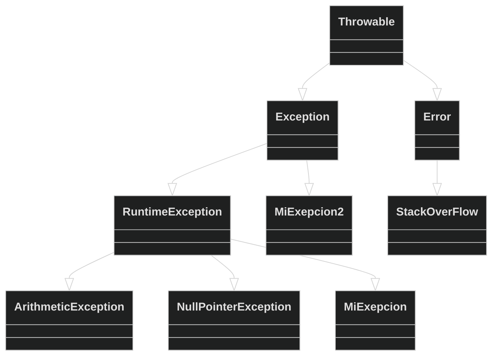

# Lanzar y controlar [Excepciones](https://app.aluracursos.com/course/java-excepciones)


## Pila de ejecución

Ejemplo visual del flujo
de ejecución

```java
public class Flujo {

    public static void main(String[] args) {
        System.out.println("Inicio Main");
        metodo1();
        System.out.println("Fin Main");
    }

    public static void metodo1(){
        System.out.println("Inicio Método1");
        metodo2();
        System.out.println("Fin Método1");
    }

    public static void metodo2(){
        System.out.println("Inicio Método2");
        for(int i =1; i<= 5; i++){
            System.out.println("i:"+i);
        }
        System.out.println("Fin Método2");
    }
}
```

Punto de interrupción **breakpoint** en el IDE


## Excepciones

Induciendo error en `metodo2()`, clase
Flujo.java

```java
    public static void metodo2(){
        System.out.println("Inicio Método2");
        for(int i =1; i<= 5; i++){
            System.out.println("i:"+i);
        }
        System.out.println("Fin Método2");
    }
```

```java
Exception in thread "main" java.lang.ArithmeticException: / by zero  <- Tipo de Excepción, donde/cuando
    at pila_ejecucion.Flujo.metodo2(Flujo.java:19)                   <- último elemento de la pila
    at pila_ejecucion.Flujo.metodo1(Flujo.java:12)                   <- segundo elemento de la pila
    at pila_ejecucion.Flujo.main(Flujo.java:7)                       <- primer elemento de la pila
```

- Donde y Tipo de Excepción se produce
- Rastro, **traceback** de los elementos en la pila de ejecución

## Manejo de excepciones

```java
    public static void metodo2(){
        System.out.println("Inicio Método2");
        for(int i =1; i<= 5; i++){
            try {
                //int num = 0;
                //int resultado = i/num;
                //System.out.println("Resultado: "+resultado);
                String resultado = null;
                System.out.println("Resultado: "+resultado.toString());
            } catch (ArithmeticException e) {
                System.out.println(e.getMessage());
                e.printStackTrace();
            } catch (NullPointerException e) {
                System.out.println(e.getMessage());
                e.printStackTrace();
            }
        }
        System.out.println("Fin Método2");
    }
```

### Creación de excepciones

Clase Flujo2.java

### Ejemplo excepción propia ArithmeticException

```java
public class Flujo2 {

    public static void main(String[] args) {
        System.out.println("Inicio Main");
        metodo1();
        System.out.println("Fin Main");
    }

    public static void metodo1(){
        System.out.println("Inicio Método1");
        try {
            metodo2();
        } catch (ArithmeticException ae) {
            ae.printStackTrace();
        }
        System.out.println("Fin Método1");
    }

    public static void metodo2(){
        System.out.println("Inicio Método2");
        //ArithmeticException ae = new ArithmeticException();
        //throw ae;
        throw new ArithmeticException("Error Aritmético");
    }
}
```

```java
Inicio Main
Inicio Método1
Inicio Método2
java.lang.ArithmeticException: Error aritmético
	at pila_ejecucion.Flujo2.metodo2(Flujo2.java:26)
	at pila_ejecucion.Flujo2.metodo1(Flujo2.java:14)
	at pila_ejecucion.Flujo2.main(Flujo2.java:7)
Fin Método1
Fin Main
```

### Lanzando exception heredando de RuntimeException

```java
    ...
    public static void metodo1() {
        System.out.println("Inicio Método1");
        try {
            metodo2();
        } catch (MiExepcion me) {
            me.printStackTrace();
        }
        System.out.println("Fin Método1");
    }

    public static void metodo2(){
        System.out.println("Inicio Método2");
        throw new MiExcepcion("Mi excepción");
    }
}
```

```java
Inicio Main
Inicio Método1
Inicio Método2
pila_ejecucion.MiExcepcion: Mi excepción
	at pila_ejecucion.Flujo2.metodo2(Flujo2.java:27)
	at pila_ejecucion.Flujo2.metodo1(Flujo2.java:14)
	at pila_ejecucion.Flujo2.main(Flujo2.java:7)
Fin Método1
Fin Main
```

### Lanzando exception heredando de Exception

```java
    ...
    public static void metodo1(){
        System.out.println("Inicio Método1");
        try {
            metodo2();
        } catch (MiExcepcion2 me2) {
            me2.printStackTrace();
        }
        System.out.println("Fin Método1");
    }

    public static void metodo2() throws MiExcepcion2 {
        System.out.println("Inicio Método2");
        throw new MiExepcion2("Mi excepción 2");
    }
```

```java
Inicio Método1
Inicio Método2
pila_ejecucion.MiExcepcion2: Mi excepcion 2
	at pila_ejecucion.Flujo2.metodo2(Flujo2.java:29)
	at pila_ejecucion.Flujo2.metodo1(Flujo2.java:14)
	at pila_ejecucion.Flujo2.main(Flujo2.java:7)
Fin Método2
Fin Método1
Fin Main
```

<style>div.mermaid{text-align: center;}</style>



## Excepciones UN/CHECKED

- **UNCHECKED** Excepciones no verificadas por el compilador.
- **CHECKED** Excepciones verificadas, el compilador nos obliga a informar
que se lanzara esta excepción, ***throws***.


### Sumario

- Existe una gran jerarquía de clases que representan excepciones. Por ejemplo,
**ArithmeticException** es hija de **RuntimeException**, que hereda de Exception,
que a su vez es hija de la clase de excepciones más ancestral, **Throwable**.
Conocer bien esta jerarquía significa saber cómo usar las excepciones en su
aplicación.

- **Throwable** es la clase que debe extenderse para poder lanzar un objeto en
la **pila** (usando la palabra reservada ***throw***)

- Es en la clase **Throwable** donde tenemos casi todo el código relacionado con
las excepciones, incluyendo `getMessage()` e `printStackTrace()`. El resto de la
jerarquía tiene solo algunas sobrecargas de constructores para comunicar mensajes
específicos.

- La jerarquía que comenzó con la clase **Throwable** se divide en excepciones
y errores. Las **excepciones** se utilizan en los **códigos de aplicación**. Los
**errores** son utilizados exclusivamente por la **máquina virtual**.

- Las clases que heredan de Error se utilizan para informar errores en la máquina
virtual. Los desarrolladores de aplicaciones no deben crear errores que hereden
de Error.

- **StackOverflowError** es un error de **máquina virtual** para informar que la
pila de ejecución no tiene más memoria.

- Las excepciones se dividen en dos categorías amplias: las que el compilador
comprueba obligatoriamente y las que no.

  - Los primeros se denominan **checked** y se crean por pertenecer a una jerarquía
  que no pasa **RuntimeException**.

  - Los segundos están **unchecked** y se crean como descendientes de
  **RuntimeException**.

## Ejemplo de manejo de checked exception


Clase
SaldoInsuficienteExcepction.java
proyecto bytebank
```java
public class SaldoInsuficienteExcepction extends Exception {
    public SaldoInsuficienteExcepction(String mensaje) {
        super(mensaje);
    }
}
```

Clase Cuenta.java

```java
    public void retirar(double valorRetiro) throws SaldoInsuficienteExcepction {
        if (this.saldo < valorRetiro) {
            throw new SaldoInsuficienteExcepction("Saldo insuficiente");
        }
        this.saldo -= valorRetiro;
    }

    public boolean transferir(double montoTransferencia, Cuenta cuenta) throws SaldoInsuficienteExcepction{
        if (this.saldo >= montoTransferencia) {
            try {
                this.retirar(montoTransferencia);
            } catch (SaldoInsuficienteExcepction e) {
                e.printStackTrace();
            }
            cuenta.depositar(montoTransferencia);
            return true;
        } else {
            throw new SaldoInsuficienteExcepction("Saldo insuficiente\nSaldo : $ "+
                                                  this.saldo+"\nRetiro: $ "+montoTransferencia);
        }
    }
}
```

Clase CuentaCorriente.java

```java
    @Override
    public void retirar(double valorRetiro) throws SaldoInsuficienteExcepction {
        double comision = 0.2;
        System.out.println("Ejecutando retiro sobreescrito");
        super.retirar( valorRetiro + comision );
    }

    @Override
    public void depositar(double valorDeposito) {
        this.saldo += valorDeposito;
    }
}
```

Test
TestCuentaExceptionSaldo.java

```java
public class TestCuentaExceptionSaldo {
    public static void main(String[] args) {
        Cuenta ca = new CuentaAhorro(11, 22);
        System.out.println("Deposito 1000");
        ca.depositar(1000);
        try {
            System.out.println("Retirando 1000");
            ca.retirar(1000);
            System.out.println("Retiro OK");
            
            //System.out.println("Retirando 1");
            //ca.retirar(1);
            //System.out.println("Retiro OK");
            
            Cuenta cc = new CuentaCorriente(11, 33);
            cc.depositar(1000);
            cc.transferir(500, ca);
            cc.transferir(5000, ca);
            System.out.println(ca.getSaldo());
            System.out.println(cc.getSaldo());
        } catch (SaldoInsuficienteExcepction e) {
            e.printStackTrace();
        }
        System.out.println("Fin Programa");
    }
}
```

Salida del programa con mensaje personalizado del error  `Saldo: $499.8` y
`Retiro: $5000.0`, incluyendo valores de variables

```java
Deposito 1000
Retirando 1000
Retiro OK
Cuentas creadas: 2
Ejecutando retiro sobreescrito
bytebank_excep.SaldoInsuficienteExcepction: Saldo insuficiente
Saldo : $ 499.8
Retiro: $ 5000.0
    at bytebank_excep/bytebank_excep.Cuenta.transferir(Cuenta.java:41)
    at bytebank_excep/bytebank_excep.TestCuentaExceptionSaldo.main(TestCuentaExceptionSaldo.java:20)
Fin Programa
```

### finally

Conexion.java

```java
public class Conexion {

    public Conexion() {
        System.out.println("Abriendo conexion");
        //throw new IllegalStateException();
    }

    public void leerDatos() {
        System.out.println("Recibiendo datos");
        throw new IllegalStateException();
    }

    public void cerrar() {
        System.out.println("Cerrando conexion");
    }
}
```

TestConexion.java

```java
public class TestConexion {
    public static void main(String[] args) {
        Conexion con = null;
        try {
            con = new Conexion();
            con.leerDatos();
        } catch (IllegalStateException e) {
            System.out.println("Ejecutando catch");
            e.printStackTrace();
        } finally {
            System.out.println("Ejecutando finally");
            if (con != null) {
                con.cerrar();
            }
        }
    }
}
```

## try with resources

Similar a los ***context managers*** de Python. Se usan con **recursos**, donde
la clase instanciada implementa la interfáz `AutoCloseable`, que requiere
implementar un método `close()`.

Conexion.java

```java
public class Conexion implements AutoCloseable {

    public Conexion() {
        System.out.println("Abriendo conexion");
        //throw new IllegalStateException();
    }

    public void leerDatos() {
        System.out.println("Recibiendo datos");
        throw new IllegalStateException();
    }

    public void cerrar() {
        System.out.println("Cerrando conexion");
    }

    @Override
    public void close() throws Exception {
        cerrar();
    }
}
```

TestConexion.java

```java
public class TestConexion {
    public static void main(String[] args) throws Exception {
        try (Conexion con = new Conexion()){
            con.leerDatos();
        } catch (IllegalStateException e) {
            System.out.println("Ejecutando catch");
            e.printStackTrace();
        }
    }
}
```

