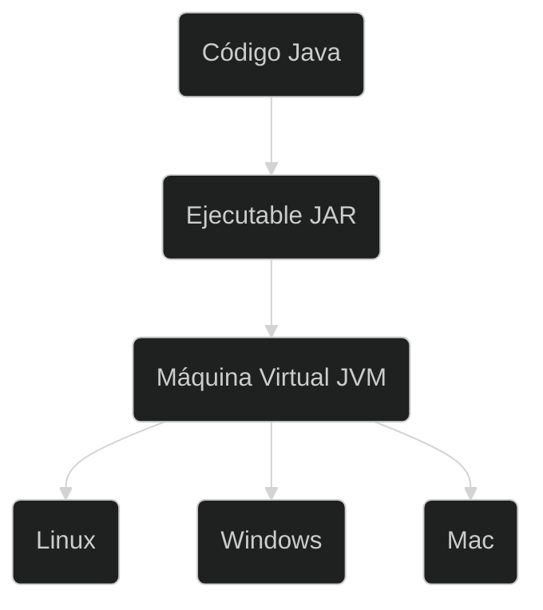

# Java 
[Primeros Pasos](https://app.aluracursos.com/course/java-primeros-pasos)
## Cursos
- Curso [Orientación a objetos](study_drive/Alura/java-oo/orientacion_obj.md)
- Curso [Herencia e Interfaces](study_drive/Alura/java-oo/herencia_interfaces.md)
- Curso [Enums y anotaciones](study_drive/Alura/java-oo/enums_anotaciones_java.md)
- Curso [Excepciones](study_drive/Alura/java-oo/excepciones.md)
- Curso [Bibliotecas Principales](study_drive/Alura/java-oo/bibliotecas_principales.md)
- Curso [Java.util](study_drive/Alura/java-oo/java_util.md)
## ¿Que es Java?
**Java** es un lenguaje de programación que se actualiza periódicamente por **Oracle**, la empresa responsable de su desarrollo. Cada nueva versión de Java trae consigo nuevas características, mejoras de rendimiento, correcciones de errores y actualizaciones de seguridad. Estas versiones se numeran, siguiendo un patrón específico.

Cuando se lanza una nueva versión, puede incluir nuevas bibliotecas, clases, métodos y otros recursos que los desarrolladores pueden utilizar para crear aplicaciones Java más eficientes y con menos errores.

Aquí hay algunos ejemplos de algunas de las principales versiones de Java y sus características:

- [Java **8**](https://www.java.com/es/download/help/java8_es.html#:~:text=Una%20de%20las%20funciones%20destacables,el%20lenguaje%20de%20programaci%C3%B3n%20Java.&text=Esta%20nueva%20API%20permitir%C3%A1%20a,natural%20y%20f%C3%A1cil%20de%20comprender)  
  Introdujo la programación funcional, incluyendo la **interfaz** `java.util.function`,
  que permite el uso de expresiones lambda. Además, se agregó una nueva API de
  fecha y hora que proporciona una forma más simple y segura de manejar fechas y horas.
  
- Java **11**  
  Introdujo el sistema de módulos de Java, que ayuda a simplificar la creación y
  mantenimiento de aplicaciones complejas. Además, se agregó la **clase** `HttpClient`,
  que admite comunicaciones HTTP/2.

- Java **15**  
  Agregó características como la palabra clave `sealed`, que permite que las
  clases restrinjan qué otras clases pueden extenderlas o implementarlas,
  y también agregó mejoras a la API Records, que ayuda a simplificar la creación
  de clases de datos inmutables.

- [Java **17**](https://www.oracle.com/cl/news/announcement/oracle-releases-java-17-2021-09-14/)  
  Introduce nuevas características y mejoras, como patrones de coincidencia que mejoran la sintaxis al trabajar con estructuras de datos complejas. Además, se mejoran el rendimiento del recolector de basura para reducir la latencia en las aplicaciones Java. 
   
  También se agregan funcionalidades a los registros, que
  son clases inmutables y compactas utilizadas para representar datos, incluyendo la capacidad de definir registros locales dentro de métodos. 
   
  Otra adición importante son las nuevas clases y métodos en el paquete
  `java.util` para trabajar con estructuras de datos persistentes, lo que permite realizar cambios en los datos sin modificar las estructuras originales. 
  
  Por último, se agrega soporte para **CGroups** en la API de Java, lo que permite una mejor administración de recursos en entornos de contenedores.

Al actualizar a una nueva versión de Java, es importante tener en cuenta la
compatibilidad con versiones anteriores. A veces, se eliminan o modifican
características o funcionalidades en una nueva versión, lo que puede afectar el código existente. Por esta razón, es importante probar su código al actualizar a una nueva versión de Java.

Además, es posible que coexistan diferentes versiones de Java en un sistema, lo que permite que las aplicaciones se ejecuten en versiones específicas de la JVM (Java Virtual Machine) para garantizar la compatibilidad con el código existente.

Otras características de las
[diferentes versiones de Java](https://www.aluracursos.com/blog/caracteristica-destacables-java8-delante).

Algunas [estadisticas](https://www.jetbrains.com/es-es/lp/devecosystem-2022/java/)
de jetbrains (2022).

### Máquina Virtual Java - JVM



ej. código Java

```java
package com.alura.java;

public class Persona {
    
    String nombre;
    String apellido,
    int edad;

    void datosDefault() {
        this.nombre = "Diego";
        this.apellido = "Arguelles";
        this.edad = 28;
    }

}
```

ej. bytecode

```java
{
  java.lang.String nombre;
    descriptor: Ljava/lang/String;
    flags: (0x0000)

  java.lang.String apellido;
    descriptor: Ljava/lang/String;
    flags: (0x0000)

  int edad;
    descriptor: I
    flags: (0x0000)

  public com.alura.java.Persona();
    descriptor: ()V
    flags: (0x0001) ACC_PUBLIC
    Code:
      stack=1, locals=1, args_size=1
         0: aload_0
         1: invokespecial #1                  // Method java/lang/Object."<init>":()V
         4: return
      LineNumberTable:
        line 3: 0

  void datosDefault();
    descriptor: ()V
    flags: (0x0000)
    Code:
      stack=2, locals=1, args_size=1
         0: aload_0
         1: ldc           #7                  // String Diego
         3: putfield      #9                  // Field nombre:Ljava/lang/String;
         6: aload_0
         7: ldc           #15                 // String Arguelles
         9: putfield      #17                 // Field apellido:Ljava/lang/String;
        12: aload_0
        13: bipush        28
        15: putfield      #20                 // Field edad:I
        18: return
      LineNumberTable:
        line 10: 0
        line 11: 6
        line 12: 12
        line 13: 18
}
```

### Características de JVM

- Administración de memoria
- Multiplataforma
- Seguridad
- Optimización
- Librerías

Otros lenguajes soportados por la máquina virtual de Java son:
***Ruby, Scala, Python, Groovy, Clojure***

Principales características de Java:

- Orientado a objetos
- Parecido a C++
- Muchas librerías y una gran comunidad
- Para ejecutar el Bytecode necesitamos tener la máquina virtual de Java
- El Bytecode es independiente del sistema operativo

Principales componentes de la plataforma Java:

- Java Virtual Machine (JVM)
- Lenguaje Java
- Librerias Java (API)

### Youtube alura [JVM](https://youtu.be/GrEO8nZzyZM)

Archivo `HolaMundo.java`

```java
public class HolaMundo {
    public static void main(String[] args) {
        System.out.println("Hola Mundo!");
    }
}
```

- Compilar: `javac HolaMundo.java`
- Correr: `java HolaMundo`
- Salida: `Hola Mundo!`

Archivo `HolaMundo.class` en formato hexadecimal con `:%!xxd` en **vim**

```hex
00000000: cafe babe 0000 0040 001d 0a00 0200 0307  .......@........
00000010: 0004 0c00 0500 0601 0010 6a61 7661 2f6c  ..........java/l
00000020: 616e 672f 4f62 6a65 6374 0100 063c 696e  ang/Object...<in
00000030: 6974 3e01 0003 2829 5609 0008 0009 0700  it>...()V.......
00000040: 0a0c 000b 000c 0100 106a 6176 612f 6c61  .........java/la
00000050: 6e67 2f53 7973 7465 6d01 0003 6f75 7401  ng/System...out.
00000060: 0015 4c6a 6176 612f 696f 2f50 7269 6e74  ..Ljava/io/Print
00000070: 5374 7265 616d 3b08 000e 0100 0b48 6f6c  Stream;......Hol
00000080: 6120 4d75 6e64 6f21 0a00 1000 1107 0012  a Mundo!........
00000090: 0c00 1300 1401 0013 6a61 7661 2f69 6f2f  ........java/io/
000000a0: 5072 696e 7453 7472 6561 6d01 0007 7072  PrintStream...pr
000000b0: 696e 746c 6e01 0015 284c 6a61 7661 2f6c  intln...(Ljava/l
000000c0: 616e 672f 5374 7269 6e67 3b29 5607 0016  ang/String;)V...
000000d0: 0100 0948 6f6c 614d 756e 646f 0100 0443  ...HolaMundo...C
000000e0: 6f64 6501 000f 4c69 6e65 4e75 6d62 6572  ode...LineNumber
000000f0: 5461 626c 6501 0004 6d61 696e 0100 1628  Table...main...(
00000100: 5b4c 6a61 7661 2f6c 616e 672f 5374 7269  [Ljava/lang/Stri
00000110: 6e67 3b29 5601 000a 536f 7572 6365 4669  ng;)V...SourceFi
00000120: 6c65 0100 0e48 6f6c 614d 756e 646f 2e6a  le...HolaMundo.j
00000130: 6176 6100 2100 1500 0200 0000 0000 0200  ava.!...........
00000140: 0100 0500 0600 0100 1700 0000 1d00 0100  ................
00000150: 0100 0000 052a b700 01b1 0000 0001 0018  .....*..........
00000160: 0000 0006 0001 0000 0001 0009 0019 001a  ................
00000170: 0001 0017 0000 0025 0002 0001 0000 0009  .......%........
00000180: b200 0712 0db6 000f b100 0000 0100 1800  ................
00000190: 0000 0a00 0200 0000 0300 0800 0400 0100  ................
000001a0: 1b00 0000 0200 1c0a                      ........
```

Oracle Docs [Opcode Mnemonics](https://docs.oracle.com/javase/specs/jvms/se8/html/jvms-7.html)

`javap -c HolaMundo`

```java
Compiled from "HolaMundo.java"
public class HolaMundo {
  public HolaMundo();
    Code:
       0: aload_0
       1: invokespecial #1                  // Method java/lang/Object."<init>":()V
       4: return

  public static void main(java.lang.String[]);
    Code:
       0: getstatic     #7                  // Field java/lang/System.out:Ljava/io/PrintStream;
       3: ldc           #13                 // String Hola Mundo!
       5: invokevirtual #15                 // Method java/io/PrintStream.println:(Ljava/lang/String;)V
       8: return
```

## Primeros Pasos

```mermaid
%%{init: {'theme': 'dark','themeVariables': {'clusterBkg': '#2b2f38'}}}%%
flowchart LR
subgraph <b>JDK</b>
subgraph <b>JRE</b>
  c(JVM)
  style c fill:#3f3f3f,stroke:#000,stroke-width:2px
  d(Librerías)
  style d fill:#3f3f3f,stroke:#000,stroke-width:2px
end
  a(Tools)
end
```

### Instalación

#### Archlinux

```sh
# última versión
sudo pacman -S jdk-openjdk

# Versiones LTS
# jdk8-openjdk
# jdk11-openjdk
# jdk17-openjdk
```

Cambiar la versión de Java a utlizar

```
# listar verisones instaladas
sudo archlinux-java status

# establecer versión a utilizar
sudo archlinux-java set java-20-openjdk
```

#### Ubuntu

```sh
sudo apt install openjdk-17-jdk

# headless
# sudo apt install openjdk-17-jdk-headless
```

Exportar variable `JAVA_HOME`

```sh
# Buscar ruta de instalación
sudo update-alternatives --config java

# o 
whereis java

# agregar en .bashrc
export JAVA_HOME=<ruta_a_bins_java>
```

#### Comprobar instalación

```sh
javac --version
javac 20.0.1
```

```sh
java --version
openjdk 20.0.1 2023-04-18
OpenJDK Runtime Environment (build 20.0.1+9)
OpenJDK 64-Bit Server VM (build 20.0.1+9, mixed mode, sharing)
```

## IDE

### Eclipse

Instalación desde AUR, o descarga desde
[eclipse.org](https://www.eclipse.org/downloads/packages/)

### IntelliJ IDEA

```sh
sudo pacman -S intellij-idea-community-edition
```

Al crear projectos con IDEs estos crean la estrucutura principal del proyecto y al
compilar guardan los bytecodes en un directorio distinto de donde esta el codigo
fuente.

Para correr un archivo bytecode en otra ruta se puede usar el flag `--clas-path`.

ej. proyecto creado con IntelliJ IDEA

```tree
📂️ intellij_idea
└── 📂️ java_primeros_pasos
    ├── 📂️ out
    │   └── 📂️ production
    │       └── 📂️ java_primeros_pasos
    │           └──  Ejemplo.class
    ├── 📂️ src
    │   └── ☕️ Ejemplo.java
    └── 📄️ java_primeros_pasos.iml
```

```sh
java --class-path ./intellij_idea/java_primeros_pasos/out/production/java_primeros_pasos/ Ejemplo
```

## Tipos y Variables

TipoVariable.java
```java
public class TipoVariable {
    public static void main(String[] args) {
        // Entero
        int edad = 16*2;
        System.out.println("La edad es " + edad);

        // Double
        double salario = 1250.58;
        System.out.println("El salario es de " + salario + " centavos" );

        // División de enteros devuelve enteros - 32/5 = 6.4 --> 6
        System.out.println( edad / 5);

        // Divisin de decimales devuelve decimales - 4.0 / 2 = 2.0
        System.out.println( 4.0 / 2 );

        // CONVERSIONES
        int salario_int = (int)salario;
        System.out.println("Salario convertido a entero : " + salario_int);

        long numero_largo = 9_223_372_036_854_775_807L;
        int numero = 1_999_999_999;
        short numero_corto = 19_999;
        byte clasico_byte = 127;
        float decimal_bajo = 16.5F;

        System.out.println(
                "long  : " + numero_largo + "\n"+
                "int   : " + numero + "\n"+
                "short : " + numero_corto + "\n" +
                "byte  : " + clasico_byte + "\n" +
                "float : " + decimal_bajo);
    }
}
```

Como se ve en los videos, cuando intentamos poner un valor entero en una variable de tipo double, Java no muestra un error. Sin embargo, cuando intentamos poner un doble en una variable del tipo entero, tenemos un error de compilación.

Esta propiedad se produce porque Java convierte implícitamente de un tipo más pequeño a tipos "más grandes". De entero a double, por ejemplo.

Lo contrario no es cierto porque hay pérdida de datos cuando se realiza la
conversión. Resultando en un " type mismatch" que muestra que esta instrucción es de tipos incompatibles.

Para realizar una conversión donde puede haber pérdida de información, es
necesario hacer un type casting. Vea las instrucciones a continuación.

```java
int edad = (int)30.0;
```

En el caso anterior, es **explícito** que se realizará la conversión de
*double* a *entero*.

Funcionamiento del cast implícito y explícito en la sgte. tabla.

| DE/HACIA | `byte` | `short` | `char` | `int` | `long` | `float` | `double` |
| - | - | - | - | - | - | - | - |
| **`byte`**   | - | Impl. | (char) | Impl. | Impl. | Impl. | Impl. |
| **`short`**  | (byte) | - | (char) | Impl. | Impl. | Impl. | Impl. |
| **`char`**   | (byte) | (short) | - | Impl. | Impl. | Impl. | Impl. |
| **`int`**    | (byte) | (short) | (char) | - | Impl. | Impl. | Impl. |
| **`long`**   | (byte) | (short) | (char) | (int) | - | Impl. | Impl. |
| **`float`**  | (byte) | (short) | (char) | (int) | (long) | - | Impl. |
| **`double`** | (byte) | (short) | (char) | (int) | (long) | (float) | - |

### Tamaño de Variables

| Tipo | Tamaño |
| - | - |
| `boolean` | 1 bit |
| `byte` | 1 byte |
| `short` | 2 bytes |
| `char` | 2 bytes |
| `int` | 4 bytes |
| `float` | 4 bytes |
| `long` | 8 bytes |
| `double` | 8 bytes |

### Char y String

String [format()](https://www.javatpoint.com/java-string-format)

EjemploCaracteres.java

```java
public class EjemploCaracteres {
    public static void main(String[] args) {
        char caracter = 'F';
        System.out.println(caracter);

        caracter = 65;
        System.out.println(caracter);

        caracter = 65 + 1;
        char segundo_caracter = (char)(caracter + 1);
        System.out.println(segundo_caracter);

        String cadena = "Alura Latam";
        System.out.println(cadena);
        cadena = cadena + " + Oracle Next Education " + 2023;
        System.out.println(cadena);
    }
}
```

### Variables y Memoria

VariablesMemoria.java

```java
public class VariablesMemoria {
    public static void main(String[] args) {
        int var1 = 10;
        int var2 = 6;

        var1 = var2;
        var2 = 20;

        // var1 tima el VALOR de la variable var1 al momento de la asignación
        // java no asinga punteros de variables, solo valores
        System.out.println(var1);
    }
}
```

### Condicional if

Condicionales.java

```java
public class Condicionales {
    public static void main(String[] args) {
        int edad = 15;
        String mensaje = "";
        if (edad > 18) {
            mensaje = "Eres mayor de edad";
        } else {
            mensaje = "Eres menor de edad";
            if (edad >= 16){
                mensaje += " pero puedes pasar";
            } else {
                mensaje += " y no puedes pasar";
            }
        }
        System.out.println(mensaje);

        // Sintaxis relajada para una linea sgte. al if
        if (edad > 18) System.out.println("la edad es " + edad);
    }
}
```

### Boolean

Condicionales2.java

```java
public class Condicionales2 {
    public static void main(String[] args) {
        int edad = 18;
        int personas = 2;
        boolean pareja = personas > 1;
        boolean permitido = edad >= 18 && pareja;
        String mensaje;

        if (permitido) {
            mensaje = "Puedes pasar";
        } else {
            mensaje = "No puedes pasar";
        }
        System.out.println(mensaje);
    }
}
```

### Scope

Ambito.java

```java
public class Ambito {
    public static void main(String[] args) {
        int personas = 2;
        boolean pareja;

        if (personas > 1) {
            pareja = true;
        } else {
            pareja = false;
        }
    }
}
```

### Ejercicio

María es propietaria de una tienda de ropa y le gustaría crear un programa que
calcule el valor final del producto después de aplicar un descuento que ofrecería
a sus clientes.

- Si el valor de la compra está entre $100.0 y $199.99, el descuento es del 10%.
- Si el valor de la compra está entre $200.0 y $299.99, el descuento es del 15%.
- Para compras superiores a $300.0, el descuento es del 20%.

TestDescuento.java

```java
public class TestDescuento {

    public static void main(String[] args) {

        double valorCompra = 250.0;
        int dscto;
        if (valorCompra >= 100.0 && valorCompra <= 199.99){
            dscto = 10;
        } else if (valorCompra >= 200.0 && valorCompra <= 299.99) {
            dscto = 15;
        } else if (valorCompra >= 300.0) {
            dscto = 20;
        } else {
            dscto = 0;
        }
        double valorDescuento = valorCompra * (dscto / 100.00 );
        double totalCompra = valorCompra - valorDescuento;
        System.out.println("Total compra    : $"+valorCompra+"\n"+
                                          "Descuento       : "+dscto+"%\n"+
                                          "    Total Final : $"+totalCompra);
    }
}
```

```txt
    Total compra    : $250.0
    Descuento       : 15%
        Total Final : $212.5
```

### Switch

Si tenemos una variable `mes`, y necesitamos probar su número e imprimir su
mes correspondiente. Entonces, *¿vamos a hacer 12 if?*

Una alternativa al `if/else` es el `switch`, de cambio, que es una estructura
de control de flujo que permite ejecutar diferentes acciones basadas en el valor
de una expresión. Es una forma más simplificada y legible de escribir varios
bloques if/else encadenados.

Funciona de la siguiente manera (sintaxe del switch):

```java
    switch (variable) {
        case opción1:
            // instrucción(es) si coincide con la opción 1
            break;
        case option2:
            // intrucción(es) si coincide con la opción 2
            break;
        case option3:
            // instrucción(es) si coincide con la opción 3
            break;
        default:
            // instrucción(es) si no hay coincidencia
    }
```

### Ciclo While

CiclosWhile.java
Nros. del 1 al 10

```java
public class CiclosWhile {
    public static void main(String[] args) {
        int contador = 0;
        while (contador < 10){
            contador++;
            System.out.println(contador);
        }
    }
}
```

CicloWhile2.java
Suma de los nros. del 1 al 10

```java
public class CiclosWhile2 {
    public static void main(String[] args) {
        int contador = 0;
        int sumatoria = 0;
        while (contador < 10){
            contador++;
            sumatoria+=contador;
            System.out.println("Ciclo "+contador+" : "+sumatoria);
        }
    }
}
```

### Ciclo For

CicloFor.java
Nros. del 1 al 10

```java
public class CicloFor {
    public static void main(String[] args) {
        for (int i=0; i<10; i++){
            System.out.println(i+1);
        }
    }
}
```

TablaMultiplicacion.java
Tablas de multiplicar

```java
public class TablaMultiplicacion {
    public static void main(String[] args) {
        for (int i=1; i<=10; i++){
            System.out.println("Tabla Nro "+i);
            for (int mult = 0; mult <= 10; mult++){
                System.out.println(i+" x "+mult+" = "+(mult*i));
            }
            System.out.println();
        }
    }
}
```

EjercicioMatriz.java

```java
public class EjercicioMatriz {
    public static void main(String[] args) {
        for (int fila = 0; fila <= 10; fila++){
            for (int columna = 0; columna < fila; columna++){
                System.out.print("* ");
            }
            System.out.println();
        }
    }
}
```

### Desafios

DesafioMultiplos.java
Multiplos de 3 de 1 al 100

```java
public class DesafioMultiplos {
    public static void main(String[] args) {
        for (int i=1; i<100; i++){
            if (i % 3 == 0){
                System.out.println(i);
            }
        }
    }
}
```

En este ejercicio opcional, tu desafío es imprimir los factoriales del 1 al 10.

¿Recuerdas el factorial? ¿No? No hay problema, sigue las reglas:

El factorial de `0` es `1`  
El factorial de `1` es `(0!) * 1 = 1`  
El factorial de `2` es `(1!) * 2 = 2`  
El factorial de `3` es `(2!) * 3 = 6`  
El factorial de `4` es `(3!) * 4 = 24`  
El factorial de un número `n` es `n * n-1 * n-2 ... hasta n = 1`  

Es decir, el factorial de `4!` = `1 x 2 x 3 x 4` = `24`  
El factorial de `6!` = `1 x 2 x 3 x 4 x 5 x 6` = `720`  

Ahora crea una nueva clase, escribe un for que comience una variable `n` (nro actual)
como 1 y factorial (resultado total) como 1.

¡Haz su ciclo entre 1 y 10 y calcula el resultado!

DesafioFactorial.java

```java
public class DesafioFactorial {
    public static void main(String[] args) {
        for (int num = 1; num <= 10; num++) {
            System.out.println("El factorial de "+num+" es "+calculoFactorial(num));
        }
    }
    static int calculoFactorial(int num){
        int resultado = 1;
        while (num > 1){
            resultado = resultado * num;
            num--;
        }
        return resultado;
    }
}
```

```txt
El factorial de 1 es 1
El factorial de 2 es 2
El factorial de 3 es 6
El factorial de 4 es 24
El factorial de 5 es 120
El factorial de 6 es 720
El factorial de 7 es 5040
El factorial de 8 es 40320
El factorial de 9 es 362880
El factorial de 10 es 3628800
```

SolucionFactorial.java

```java
class Factorial {
    public static void main(String[] args) {
        int factorial = 1;
        for (int i = 1; i < 11; i++) {
            factorial *= i;
            System.out.println("Factorial de " + i + " = " + factorial);
        }
    }
}
```
