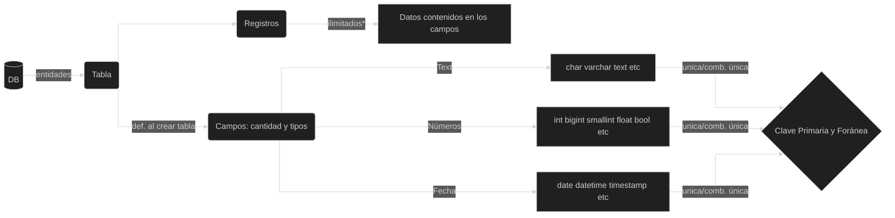
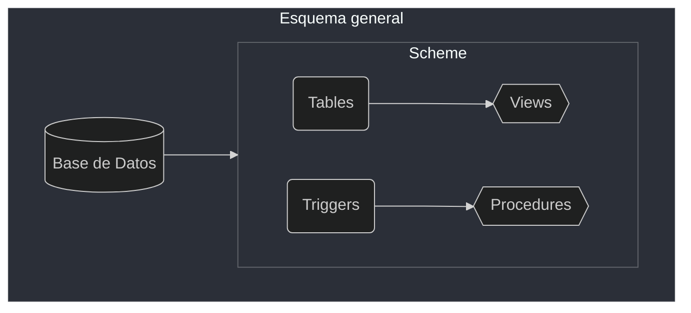

# Java y Bases de Datos
## Cursos
- Curso [Consultas SQL](study_drive/Alura/mysql/consultas_sql.md)
- Curso [DML: Manipulación de datos](study_drive/Alura/mysql/dml.md)
- Curso [Stored Procedures](study_drive/Alura/mysql/procedures.md)
- Curso [DBA](study_drive/Alura/mysql/dba_seguridad_optimizacion.md)
- Curso [Proyecto MySQL](study_drive/Alura/mysql/proyecto_mysql.md)
## Lectura y videos
- Lectura [SELECT, INSERT, UPDATE y DELETE](https://www.aluracursos.com/blog/select-insert-update-delete-sql)
- Lectura [null, blank](https://www.aluracursos.com/blog/en-sql-null-es-null-vacio-es-vacio)
- Videos [SQL y NOSQL](https://www.youtube.com/watch?v=cLLKVd5CNLc&t=630s) y [Base de datos MySQL](https://www.youtube.com/watch?v=8J0AoPZMVxA)

Para desarrollar una aplicación más completa y robusta, es probable que se necesite manejar información de clientes y/o productos, que deben estar almacenadas de forma segura. Por lo tanto, es importante aprender a trabajar con una base de datos.

Este módulo desarrolla un mayor conocimiento acerca de bases de datos relacionales **MySQL**, la API de Java para el acceso a la base de datos llamada **JDBC**, y también acerca de la **JPA**, que facilita el desarrollo de la conexión a la base de datos.

El lenguaje **SQL**,funciona siguiendo **CRUD**, que es **C**reate **R**ead **U**pdate
**D**elete.

La ***ANSI*** divide estos comandos en 3 grupos mayores:

- **DDL** Data Definition Language: se encarga de manipular todas las estructuras de las bases de datos en sí. Por ejemplo, el comando create para crear una base de datos o una tabla, etc.
- **DML** Data Manipulation Lenguaje: lenguaje de manipulación de los datos. Select, para seleccionar unos datos, insert para insertar datos a las tablas, etc.
- **DCL** Data Control Language: se encarga de la administración en sí de toda la estructura de la base de datos. Ejemplo, la administración de la base de datos, la administración de los accesos a usuarios de los logs, es toda la parte de políticas de crecimiento de la base de datos, etc.

#### Principles Ventajas

- Bajo costo de aprendizaje
- Portabilidad
- Longevidad
- Comunicación
- Libertad de elección

#### Principales Desventajas

- Falta de creatividad
- NoSQL
- Falta de mayor estructuración del lenguage

## MySQL

### Historía

Creada por *David Axmark*, *Allan Larsson*, *Michael Widenius* como **software libre**, desarrollaron su propia API de consultas y base de datos utilzando C++. El 2008 Sun Microsystems compró MySQL. El 2009 Oracle compró Sun Microsystems (JAVA y MySQL).

### Características

- Servidor robusto. Multi-access, data integrity, transaction control
- Portabilidad. Linux, Windows. Acceso a datos usando DotNET, Python, Java, JS, PHP, etc
- Multi-thread. Facilita la integración con Hardware. Mas escalabilidad
- Almacenamiento. Prioriza Velocidad/Volumen
- Velocidad. Más rápida, ideal para e-commerce, AWS/BiqQuery/Azure tienen
instancias de MySQL
- Seguridad
- Capacidad. Hasta 65000TB
- Aplicabilidad. Internet/Desktop/Corporativo
- Logs. Registra todo. Recuperación, Réplica de servidores


### Como está organizada una base de datos




#### Schemes

```mermaid
%%{init: {'theme': 'dark','themeVariables': {'clusterBkg': '#2b2f38'}, 'flowchart': {'curve': 'monotoneY'}}}%%
flowchart
subgraph Esquemas
DB[(Base de Datos)]
subgraph esqA[Esquema A]
  f(tabla)
  style f fill:#3f3f3f,stroke:#000,stroke-width:2px
  g(tabla)
  style g fill:#3f3f3f,stroke:#000,stroke-width:2px
end
subgraph esqB[Esquema B]
  c(tabla)
  style c fill:#3f3f3f,stroke:#000,stroke-width:2px
  d(tabla)
  style d fill:#3f3f3f,stroke:#000,stroke-width:2px
  e(tabla)
  style e fill:#3f3f3f,stroke:#000,stroke-width:2px
end
subgraph esqC[Esquema C]
  a(tabla)
  style a fill:#3f3f3f,stroke:#000,stroke-width:2px
  b(tabla)
  style b fill:#3f3f3f,stroke:#000,stroke-width:2px
end
DB-->esqA
DB-->esqB
DB-->esqC
end
```



#### Views

- Las vistas consulta de `n` tablas al mismo tiempo
- Alto costo de procesamiento
- Unen tablas a travez de un ***join***
- Creación de filtros

```mermaid
%%{init: {'theme': 'dark','themeVariables': {'clusterBkg': '#2b2f38'}, 'flowchart': {'curve': 'monotoneY'}}}%%
flowchart
subgraph Vistas
DB[(Base de Datos)]
subgraph esqA[Tablas]
  c[tabla a]-->d
  style c fill:#3f3f3f,stroke:#000,stroke-width:2px
  d[tabla b]-->e
  style d fill:#3f3f3f,stroke:#000,stroke-width:2px
  e[tabla c]
  style e fill:#3f3f3f,stroke:#000,stroke-width:2px
end
subgraph vista[Vista]
end
DB-->esqA
vista--query-->esqA
end
```



#### Procedures

Procedimientos

- Lógica estructurada con lenguage nativo SQL `if, while, for...`

```sql
IF a > 0 THEN
X= y + z
z = ISNTR (z + 1)
SELECT * FROM alpha
PUT ...
...
```

#### Trigger

Disparador

- Avisos automáticos cuando hay algún tipo de cambio en la base de datos o en la tabla
- Ejecuta una función o procedimiento cuando se cumple la condición del ***trigger***

### Esquema global de una DB



## Manipulando la base de datos

### Crear base de datos

```sql
CREATE DATABASE jugos;
```

```sql
CREATE SCHEMA `jugos2` DEFAULT CHARACTER SET utf8;
```

### Eliminar base de datos

```sql
DROP SCHEMA jugos;
```

### Crear tabla

#### Números enteros

|  Tipo | Valor en Bytes | Menor Valor | Menor Valor (unsigned) | Mayor valor | Mayor valor (unsigned) |
| - | - | - | - | - | - |
| **TINYINT** | 1 | -128 | 0 | 127 | 255 |
| **SMALLINT** | 2 | -32768 | 0 | 32767 | 65535 |
| **MEDIUMINT** | 3 | -8388608 | 0 | 83888607 | 16777215 |
| **INT** | 4 | -2147483648 | 0 | 2147483647 | 4294967295 |
| **BIGINT** | 8 | -2⁶³ | 0 | 2⁶³-1 | 2⁶⁴-1 |

#### Números decimales


|  Tipo | Precisión Bytes | Tipo |
| - | - | - |
| **FLOAT¹** | 4 | Simple |
| **DOUBLE¹** | 8 | Doble |

> [¹] coma flotante: ej. si se declara un `FLOAT (6,4)` y se incluye el número
`76.00009` el valor almacenado será `76.0001`

|  Tipo | Cantidad de dígitos |
| - | - |
| **DECIMAL** o<br>**NUMERIC** | 65 |

> Es un nro. fijo, si se declara un `DECIMAL(5,3)` solo se podrá almacenar desde
`-99.999` hasta `99.999`

|  Tipo | Cantidad de Bits |
| - | - |
| **BIT** | 64 |

> ej. `BIT(1)` puede ser `0` o `1`,
`BIT(3)` puede ser `000`, `001`, `010`, `011`, `100`,`101`,`110`,`111`.

#### Atributos de los campos numéricos

- **SIGNED** o **UNSIGNED**: con o sin signo
- **ZEROFILL**: llena los espacios con ceros, ej. `INT(5)` al almacenar `54`, el
	campo queda `00054`
- **AUTO_INCREMENT**: incremento secuencial, ej, `1`, `2`, `3`, `4`,...; `2`,
	`4`,`8`,...
- **OUT OF RANGE**: Error cuando los valores salen de los límites

#### Fecha y hora

- **DATE**: `1000-01-01` hasta `9999-12-31`
- **DATETIME**: `1000-01-01 00:00:00` hasta `9999-12-31 23:59:59`
- **TIMESTAMP**: `1970-01-01 00:00:01 UTC` hasta `2038-01-19 UTC`
- **TIME**: `-838:59:59` hasta `839:59:59`
- **YEAR**: `1901` hasta `2155` (se puede expresar en formad ode 2 o 4 dígitos)

#### String

- **CHAR**: cadena de caracteres con valor fijo de **0 a 255**. Ej.
`CHAR(4) = "aa"` -> `"··aa"`
- **VARCHAR**: cadena de caracteres con valor variable de **0 a 255**.
Ej. `VARCHAR(4) = "aa"` -> `"aa"`
- **BINARY**: cadena de caracteres con valor fijo de **0 a 255** (Con números
binarios - bits)
- **VARBINARY**: cadena de caracteres con valor variable de **0 a 255** (Con
números binarios - bits)
- **BLOB**: Binarios  largos -> `TINYBLOB`, `MEDIUMBLOB`, `LONGBLOG`
- **ENUM**: Para definir una lista predefinida -> `Talla ENUM(´pequeño´,
´medio´,´grande´)`

#### Atributos de los campos string

**SET** y **COLLATE**: Tipo de conjunto de caracteres que van a ser aceptados ->
`utf-8`,`utf-16`, ...

#### Campos espaciales (GPS)

- **GEOMETRY** -> Area
- **LINESTRING** -> Línea
- **POINT** -> Punto
- **POLYGON** -> Area

----

## Prácticas

### Empresa de jugos

Desde el área de registro de clientes, comentan que la información más
relevante de un cliente es el DNI, nombre completo, dirección, edad, sexo,
límite de crédito, volumen mínimo de jugo que puede comprar, y si ya ha
realizado su primera compra.

#### Creación de tabla **`cliente`**, query manual

```sql
-- show databases;
USE jugos;
CREATE TABLE cliente(
                dni VARCHAR(20),
                nombre VARCHAR(150),
                direccion1 VARCHAR(150),
                direccion2 VARCHAR(150),
                barrio VARCHAR(50),
                cuidad VARCHAR(50),
                estado VARCHAR(50),
                codpost VARCHAR(10),
                edad SMALLINT,
                sexo VARCHAR(1),
                limite_credito FLOAT,
                volumen_compra FLOAT,
                primera_compra BIT(1)
);
```

#### Creación de tabla **`vendedor`**

```sql
USE jugos;
CREATE TABLE vendedor(
                matricula VARCHAR(4),
                nombre VARCHAR(100),
                comision FLOAT
);
```

#### Elimnar tabla

```sql
USE jugos;
-- CREATE TABLE vendedor2(
--                 matricula VARCHAR(4),
--                 nombre VARCHAR(100),
--                 comision FLOAT
-- );

DROP TABLE vendedor2;
```

#### Insertar registros

```sql
USE jugos;

INSERT INTO producto(id_producto, nombre, envase, volumen, sabor, precio)
VALUES ('695594', 'Festival de Sabores', 'Botella PET', '1.5 Litros', 'Asaí',
    18.51);

INSERT INTO producto(id_producto, nombre, envase, volumen, sabor, precio)
VALUES ('1041119', 'Línea Citrus', 'Botella de Vidrio', '700 ml', 'Lima',
    4.90);
```

```sql
USE jugos;
INSET INTO vendedor(matricula, nombre, comision) VALUES(
    '0233', 'Joan Geraldo de la Fonseca', 0.1);

INSET INTO vendedor(matricula, nombre, comision) VALUES(
    '0235', 'Máricio Almeida Silva', 0.08);

INSET INTO vendedor(matricula, nombre, comision) VALUES(
    '0236', 'Cláudia Morais', 0.08);
```

#### Modificar registros

```sql
UPDATE vendedor SET comision = 0.11 WHERE matricula = '0236';

UPDATE vendedor SET nombre = 'Joan Geraldo de la Fonseca'
WHERE matricula = '0233';
```

#### Eliminar registros

```sql
DELETE FROM producto WHERE id_producto = '1041119';
```
Precaución de **Siempre** usar clausula `WHERE`, de lo contrario se eliminan
todos los registros de la tabla


#### Modificar tabla

Modificar tabla `producto` para que el campo `id_producto` sea una llave primaria

```sql
ALTER TABLE producto ADD PRIMARY KEY(id_producto);
```

Modificar tabla `cliente` para agregar el campo `fecha_nacimiento` como `DATE`

```sql
ALTER TABLE cliente ADD COLUMN(fecha_nacimiento DATE);
```

#### Seleccionar registros

```sql
SELECT nombre, matricula FROM vendedor;

-- Filtrando resultados
SELECT nombre, matricula FROM vendedor WHERE matricula='00236';
```

Filtro por edad

```sql
-- Mayor que
SELECT * FROM cliente WHERE edad < 27;

-- Menor que
SELECT * FROM cliente WHERE edad > 27;

-- Menor o igual que
SELECT * FROM cliente WHERE edad <= 27;

-- Distinto de
SELECT * FROM cliente WHERE edad <> 27;
```

> este tipo de filtro también funciona con strings

Filtro por rango `BETWEEN`

```sql
SELECT * FROM producto WHERE precio BETWEEN 28.49 AND 28.52;
```

Por año

```sql
SELECT * FROM cliente WHERE fecha_nacimiento = '1995-01-13';

SELECT * FROM cliente WHERE YEAR(fecha_nacimiento) = 1995;

SELECT * FROM cliente WHERE DAY(fecha_nacimiento) = 20;
```

#### Filtros compuestos

```sql
SELECT * FROM producto 
WHERE (precio >= 15 AND precio <= 25) or (envase = 'Botella PET');
```

