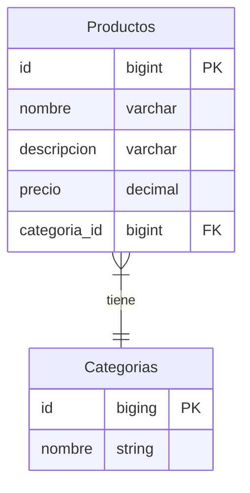

# JPA

## Java Persistence API

[H2 Database Engine](https://mvnrepository.com/artifact/com.h2database/h2/2.2.222)
### JDBC

- Especificación para acceso al banco de datos relacional JAVA
- Abstracción del protocolo de comunicación con BD
- Drivers de la BD son implementaciones de JDBC
- Impacto mínimo en la aplicación al cambiar de BD
- Pattern DAO ayuda a aislar el código entre la API y el JDBC

```mermaid
%%{init: {'theme': 'dark','themeVariables': {'clusterBkg': '#2b2f38'}, 'flowchart': {'curve': 'monotoneY'}}}%%
flowchart
subgraph JDBC
DB[(Base de Datos)]
CS("Controller/Service
(Lógica de Negocios)")
style CS fill:#3f3f3f,stroke:#000,stroke-width:2px
DAO("DAO
(JDBC)")
style DAO fill:#3f3f3f,stroke:#000,stroke-width:2px
CS-->DAO-->DB
end
```



Ejemplo

```java
public class RegistroDeProductoService {
    private ProductoDao dao;

    public RegistroDeProductoService(ProductoDao dao) {
        this.dao = dao;
    }
    public void registrarProducto(Producto producto) {
        // lógica de negocio
        this.dao.registrar(producto);
    }
}
```

### Desventajas de JDBC

- Demasiado detalle, muchas lineas de código
- Alto acoplamiento con la BD, cualquier cambio en una parte tiene alto impacto
en otra parte

### Hibernate

- Creado en el año 2001 por ***Gavin King***
- Alternativa a JDBC/EJB 2
- Posteriormente Gavin King fue contratado por Red Hat

### JPA

- Especificación para ORM (Object Relational Mapping) en JAVA
- Lanzada el 2006
- Versión 2.0 lanzada el 2009
- Hibernate 3.5.0 (2010) paso a soportar JPA 2

```mermaid
%%{init: {'theme': 'dark','themeVariables': {'clusterBkg': '#2b2f38'}, 'flowchart': {'curve': 'monotoneY'}}}%%
flowchart
subgraph " "
direction BT
JP(JPA)
HB(Hibernate)
style HB fill:#3f3f3f,stroke:#000,stroke-width:2px
EL(EclipseLink)
style EL fill:#3f3f3f,stroke:#000,stroke-width:2px
OJP(OpenJPA)
style OJP fill:#3f3f3f,stroke:#000,stroke-width:2px
HB-->JP
EL-->JP
OJP-->JP
end
```



JPA es una capa (una abstracción) se debe usar una biblioteca que la implemente
Existen detalles específicos de Hibernate que dificultan cambiar de implementacion
de JPA. Es recomendable mantenerse dentro del patrón de JPA.

EclipseLink es la implementación de referencia de JPA.

pom.xml

```xml
...
    <build>
        <plugins>
            <plugin>
                <groupId>org.apache.plugins</groupId>
                <artifactId>maven-compiler-plugin</artifactId>
                <version>3.11.0</version>
                <configuration>
                    <source>${java.version}</source>
                    <target>${java.version}</target>
                    <optimize>true</optimize>
                </configuration>
            </plugin>
        </plugins>
    </build>
    <dependencies>
        <dependency>
            <groupId>org.hibernate</groupId>
            <artifactId>hibernate-entitymanager</artifactId>
            <version>5.6.15.Final</version>
        </dependency>
        <dependency>
            <groupId>com.h2database</groupId>
            <artifactId>h2</artifactId>
            <version>2.2.222</version>
            <scope>test</scope>
        </dependency>
    </dependencies>
...
```

/tienda/src/main/resources/META-INF/persistence.xml

```xml
<?xml version="1.0" encoding="UTF-8"?>
<persistence version="2.2"
     xmlns="http://xmlns.jcp.org/xml/ns/persistence"
     xmlns:xsi="http://www.w3.org/2001/XMLSchema-instance"
     xsi:schemaLocation="http://xmlns.jcp.org/xml/ns/persistence
     http://xmlns.jcp.org/xml/ns/persistence/persistence_2_2.xsd">
    <persistence-unit name="tienda" transaction-type="RESOURCE_LOCAL">
        <properties>
            <property name="javax.persistence.jdbc.driver" value="org.h2.Driver"/>
            <property name="javax.persistence.jdbc.url" value="jpdc:h2:mem:tienda"/>
            <property name="javax.persistence.jdbc.user" value="sa"/>
            <property name="javax.persistence.jdbc.password" value=""/>
            <property name="hibernate.dialect" value="org.hibernate.dialect.H2Dialect"/>
        </properties>
    </persistence-unit>
</persistence>
```

### Mapeo de entidades

```mermaid
%%{init: {'theme': 'dark','themeVariables': {'clusterBkg': '#2b2f38'}, 'flowchart': {'curve': 'monotoneY'}}}%%
flowchart
subgraph " "
DB[(Base de Datos)]
EN(Entidades)
style EN fill:#3f3f3f,stroke:#000,stroke-width:2px
subgraph ORM
OR("Tablas == Clases
Columnas == Atributos
Filas == Objetos")
style ORM fill:#3f3f3f,stroke:#000,stroke-width:2px
end
ORM-->EN-->DB
end
```



Entidades



### Ciclo de vida de una entidad en JPA

```mermaid
%%{init: {'theme': 'dark','themeVariables': {'clusterBkg': '#2b2f38'}, 'flowchart': {'curve': 'linear'}}}%%
flowchart
subgraph " "
NO["operador
new"]
TR(tranciente)
NO-->TR
MG(Managed)
TR-->MG
subgraph " "
RM(removed)
DT(detached)
MG<-->RM
MG<--"close, clear
detach"-->DT
end
direction TB
DB[(Base de Datos)]
MG--"flush,
commit"-->DB
DB--"find,
query"-->MG
end
style DT fill:#3f3f3f,stroke:#000,stroke-width:2px
style RM fill:#3f3f3f,stroke:#000,stroke-width:2px
```



#### Estados de una Transacción

- Transiente
- Managed  
**flush()**: permite realizar un rollback.  
**commit()**: los cambios son definitivos.  
**close()**: cierra el ***EntityManager***.  
**clear()**: envia todas las entidades a un estado ***detach*** (ahorro de memoria).  
**merge()**: actualiza un registro (primero realiza un select, luego se debe
asignar para su posterior merge, trae un registro al estado *Managed*).  
**remove()**: delete registro si tiene estado *managed*.  
- Detached
- Removed

### Consultas JPA

ProductoDao.java

```java
...
    public Producto consultaPorId(Long id) {
        return em.find(Producto.class, id);
    }
    
    public List<Producto> consultarTodos() {
        String jpql = "SELECT P FROM Producto AS P";
        return em.createQuery(jpql, Producto.class).getResultList(); 
    }
    
    public List<Producto> consultaPorNombre(String nombre) {
        String jpql = "SELECT P FROM Producto AS P WHERE P.nombre=:nombre";
        return em.createQuery(jpql, Producto.class).setParameter("nombre", nombre).getResultList();
    }

    public List<Producto> consultaPorNombreDeCategoria(String nombre) {
        String jpql = "SELECT P FROM Producto AS P WHERE P.categoria.nombre=:nombre";
        return em.createQuery(jpql, Producto.class).setParameter("nombre", nombre).getResultList();
    }
    
    public BigDecimal consultaPrecioPorNombreDeProducto(String nombre) {
        String jpql = "SELECT P.precio FROM Producto AS P WHERE P.nombre=:nombre";
        return em.createQuery(jpql, BigDecimal.class).setParameter("nombre", nombre).getSingleResult();
    }
}
```

----

Archivos de configuración:

- pom.xml
- presistence.xml
