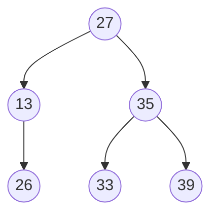
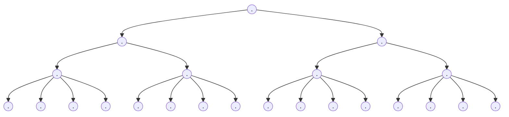
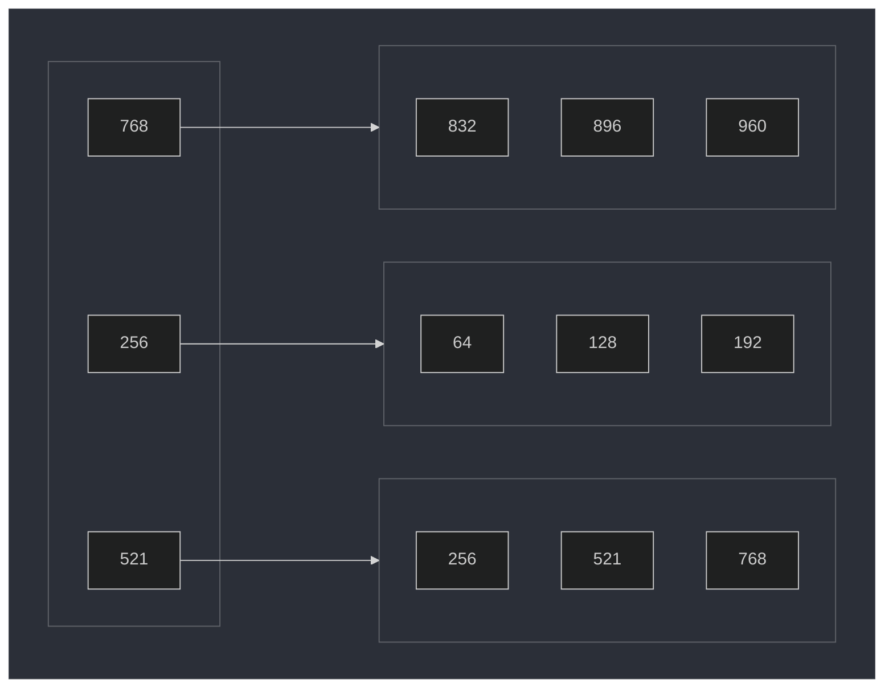

# DBA

Seguridad y Optimización de la BD

## DBA

### ¿Quien es un DBA?

Es el profesional responsable de administrar la base de datos

### Funciones

- Evalúa el ambiente, es decir, el Hardware, realiza instalación y
mantenmiento de MySQL según las necesidades operativas de la empresa
- Configura que los accesos se realizen de forma segura. Conexiones/IDE y
otras interfaces
- Mantiene un buen desempeño de la BD. Trabaja con los indices para mejorar
las consultas a la base de datos
- Almacenamiento/Respaldo de datos. Realiza los ***backups***
- Apoya al área de desarrollo con el mantenimiento de los datos. Elimina datos
no desados, desfragmentar la DB, entre otros
- Monitorea la instalación de MySQL. Gestiona los recursos usados por la BD y
la adecua a las necesidades de la los usuarios.
- Configura el ambiente y sus diversas propiedades (MySQL `my.ini`)
- Administra los usuarios que tendrán acceso a la DB. Otorga niveles de acceso

## Conexiones

### MariaDB

```sh
mariadb -u <USER> -h <HOST> [<DBNAME>] -P <PORT> -p
```
### MySQL

```sh
mysql -u <USER> -h <HOST> [<DBNAME>] -P <PORT> -p
```


## Detener servicio

### SystemD

```sh
systemctl stop mariadb
```

```sh
systemctl stop mysql
```

## Servicio de Windows

```sh
# C:\Windows\system32
> net stop mysql80
```

## Tuning

La puesta a punto de MySQL se puede realizar de 4 maneras

### Esquemas, índices, variables internas de MySQL (mysqld), Hardware y S.O.

#### HARDWARE

- Utilizar sistemas operativos de 64-bits. Mysql puede usar procesamiento
en paralelo y consumir toda la memoria
- Configuración de RAM. Parametro que permite indicar el máximo de memoria
disponible para los procesos. No se recomienda exceder el 50%
- Dependiendo de la forma con la que se trabaje la base de datos va a variar
su consumo de memoria
- El tipo del disco: HDD, SSD, NVME
- Conexión SATA, SAS, M2, PCIe.
- Uso del controlador de disco **RAID** (0, 1, 5 y 10) para la seguridad
de los datos
  - **RAID 0**: Divide los datos en dos HD diferentes, y actuan como un
  solo disco a nivel de S.O
  - **RAID 1**: Uno de los HD es copia del otro, y lo que realize en uno
  se replica automáticamente en el otro
  - **RAID 5**: Divide los datos en más de dos HD diferentes, y actuan
  como un solo disco a nivel de S.O
  - **RAID 10**: Los discos tiene ***espejos***, y lo que realize en uno
  se replica automáticamente en el otro
  - **RAID 1 y 10**: Utilizan mas espacio producto de la redundancia, pero
  son mas seguros por tener backup disponible

> RAID [wiki](https://en.wikipedia.org/wiki/Standard_RAID_levels)  
Nested RAID [wiki](https://en.wikipedia.org/wiki/Nested_RAID_levels)  
RAID [ArchWiki](https://wiki.archlinux.org/title/RAID)

## Variables de ambiente MySQL

Estas variables establecen parametros de funcionamento predefindos. Existen mas
de 250 variables. Estas pueden cambiar según la versión de MySQL

`SHOW STATUS` muestra los valores actuales de las variables de ambiente

2 Tipos de variables de ambiente **GLOBAL** y **SESSION**

`my.ini` o `my.cnf`: Directivas para daemon(servicio) y client

[MySQL doc](https://dev.mysql.com/doc/refman/8.2/en/server-system-variables.html)  
[MariaDB doc](https://mariadb.com/kb/en/server-system-variables/)

```sql
SHOW GLOBAL STATUS LIKE '%tmp%tables%';
+-------------------------+-------+
| Variable_name           | Value |
+-------------------------+-------+
| Created_tmp_disk_tables | 338   |
| Created_tmp_tables      | 18175 |
+-------------------------+-------+
```

```sql
SHOW GLOBAL VARIABLES LIKE '%table_size%';
+-----------------------+----------------------+
| Variable_name         | Value                |
+-----------------------+----------------------+
| max_heap_table_size   | 16777216             |
| tmp_disk_table_size   | 18446744073709551615 |
| tmp_memory_table_size | 16777216             |
| tmp_table_size        | 16777216             |
+-----------------------+----------------------+

SET GLOBAL tmp_table_size = 33554432;

SHOW GLOBAL VARIABLES LIKE 'tmp_table_size';
+----------------+----------+
| Variable_name  | Value    |
+----------------+----------+
| tmp_table_size | 33554432 |
+----------------+----------+
```

Esta modificación es efímera, se pierde al reiniciar el servicio o maquina

Para establecer el valor de forma permanente editar archivos de configuración

### Debian

```sh
sudo vim /etc/mysql/mariadb.conf.d/50-server.cnf
```

```txt
#
# * Fine Tuning
#

tmp_table_size          = 33554432
```

### Windows

```
C:\ProgramData\MySQL Server 8.0\my.ini
```

## Mecanismos de Almacenamiento

Es la forma de almacenar la información en las tablas

MySQL 8.0 Community dispone 9 mecanismos para almacenar datos

Una misma DB puede usar diversos mecanismos en sus tablas

### ENGINE

Es el parametro que indica el mecanismo de almacenamiento

### MyISAM

- No es transaccional. No esta diseñado para que varios usuarios realicen
  operaciones en las tablas simultaneamente
- Solo permite el bloqueo a nivel de tabla (Lectura mas rápida)
- Recomendada para tablas que no estan en continio cambio
- La clave externa no soporta Full Text
- Almacena datos de manera mas compacta (Optimiza espacios de almacenamiento)
- Implementa índices `HASH` y `BTREE`
- `key_buffer_size`: Determina el tamaño de cache para almacenar los indices
  MyISAM. Varía de 8MB a ~4GB según el S.O.
- `concurrent_insert`: Comportamiento de inserciones concurrentes dentro de
  tabla MyISAM
  - `0`: Inserciones simultaneas desactivdas
  - `1`: Inserciones simultaneas sin intervalo de datos (Al mismo tiempo)
  - `0`: Inserciones simultaneas con intervalo de datos
- `delay_key_write`: Atraso entre la actualización de índices y el momento
en que se crea la tabla (Espera a que todos los registros sean insertados
para despues actualizar los indices. Mas consistencia. Menos rapidez)
- `max_write_lock_count`: Dertermina el número de grabaciones en las tablas
que tendrán precedencia a las lecturas (Prioriza la cantidad de grabaciones
que se realizaran antes de las lecturas en varias conexiones)
- `preload_buffer_size`: Tamaño del buffer a ser usando antes de cargar los
índices de claves de las tablas. 32KB
- El uso de estas variables de ambiente se realiza en la medida de lo
necesario. Lo recomendable es usar esos valores por defecto
- `myisamchk`: Analiza, optimiza y repara tablas MyISAM (las reconstruye)
- `myisampack`: Crea tablas compactadas solo para lectura
- `myisam_ftpdump`: Muestra información completa de los campos tipo texto

### InnoDB

- Mecanismo de almacenamiento transaccional más utilizado en MySQL
- Esta diseñado para que varios usuarios realicen operaciones simultaneas sobre las
tablas
- Soporte transaccional completo. Soporte a claves externas
- Cache de buffer configurado de forma separada tanto para la base como para el
índice
- Bloqueo de tabla a nivel de línea
- Indexacion **BTREE**
- Back-up de la DB online. Sin bloqueo
- **Tablas**
  - `innodb_data_file_path`: Determina la ruta y tamaño máximo del archivo
  dentro del sistema donde se almacena la información
  - `ìnnodb_data_home_dir`: Ruta común de todos los archivos innodb. Cuando
  se especifica, guarda todo dentro de ese directorio (default `mysqldata`)
  - `innodb_file_per_table`: Separa el almacenamiento de datos e indices. Por
  defecto almacena datos e índices de forma compartida
- **Desempeño**
  - `innodb_buffer_poll_size`: Tamaño de almacenamiento usado para indices y
  datos en cache
  - `innodb_flush_log_at_trx_commit`: Frecuencia de escritura del log-in en el
  disco
  - `innodb_log_file_size`: Tamaño en Bytes de archivos log-in (default 5MB)

### MEMORY

- Mecanismo de almacenamiento que crea las tablas en la memoria RAM, no en disco
- No soporta clave externa
- Acceso muy rápido a la información
- Los datos necesitan ser reinicializados junto con el servidor
- Bloqueo a nivel de tabla
- Indice utiliza HASH por defecto y BTREE
- Formato de linea de longitud fija. No soporta `BLOB`/`TEXT`

## Usando ENGINE

```sql
CREATE TABLE df_table (id INT, nombre VARCHAR(100));

ALTER TABLE df_table ENGINE = MyISAM;

/* MariaDB */
SHOW ENGINES;
+--------------------+---------+-------------------------------------------------------------------------------------------------+--------------+------+------------+
| Engine             | Support | Comment                                                                                         | Transactions | XA   | Savepoints |
+--------------------+---------+-------------------------------------------------------------------------------------------------+--------------+------+------------+
| CSV                | YES     | Stores tables as CSV files                                                                      | NO           | NO   | NO         |
| MRG_MyISAM         | YES     | Collection of identical MyISAM tables                                                           | NO           | NO   | NO         |
| MEMORY             | YES     | Hash based, stored in memory, useful for temporary tables                                       | NO           | NO   | NO         |
| Aria               | YES     | Crash-safe tables with MyISAM heritage. Used for internal temporary tables and privilege tables | NO           | NO   | NO         |
| MyISAM             | YES     | Non-transactional engine with good performance and small data footprint                         | NO           | NO   | NO         |
| SEQUENCE           | YES     | Generated tables filled with sequential values                                                  | YES          | NO   | YES        |
| InnoDB             | DEFAULT | Supports transactions, row-level locking, foreign keys and encryption for tables                | YES          | YES  | YES        |
| PERFORMANCE_SCHEMA | YES     | Performance Schema                                                                              | NO           | NO   | NO         |
+--------------------+---------+-------------------------------------------------------------------------------------------------+--------------+------+------------+
```

### Creando una base de datos

```sql
CREATE DATABASE base DEFAULT CHARACTER SET utf8mb4 COLLATE utf8mb4_general_ci;
-- o también
CREATE DATABASE base DEFAULT CHARACTER SET utf8mb4 COLLATE utf8mb4_general_ci;
```

### Directorio de las BBDD

```sql
VARIABLES WHERE Variable_Name LIKE '%dir';
    +---------------------------+----------------------------+
    | Variable_name             | Value                      |
    +---------------------------+----------------------------+
    | aria_sync_log_dir         | NEWFILE                    |
    | basedir                   | /usr                       |
    | character_sets_dir        | /usr/share/mysql/charsets/ |
==>>| datadir ------------------| /var/lib/mysql/ -----------|<<==
    | innodb_data_home_dir      |                            |
    | innodb_log_group_home_dir | ./                         |
    | innodb_tmpdir             |                            |
    | lc_messages_dir           |                            |
    | plugin_dir                | /usr/lib/mysql/plugin/     |
    | slave_load_tmpdir         | /tmp                       |
    | tmpdir                    | /tmp                       |
    | wsrep_data_home_dir       | /var/lib/mysql/            |
    +---------------------------+----------------------------+
```

`sudoedit /etc/mysql/mariadb.conf.d/50-server.cnf`

```sh
#
# * Basic Settings
#

...
datadir                 = /var/lib/mysql
```

## Backup

### Back-up lógico

Exporta todas las estructuras, tablas, rutinas, etc. a un script sql. Este
permite recrear la base de datos. Es lento ya que se ejecuta comando a
comando

### Back-up físico

Contiene todos los archivos binarios del sistema donde esta almacenada la
información. Es más rápido pero no permite edicion antes de su restauración

### `mysqldump`

Más [information](https://dev.mysql.com/doc/refman/en/mysqldump.html)

```sh
  - Create a backup (user will be prompted for a password):
    mysqldump --user user --password database_name --result-file=path/to/file.sql

  - Backup a specific table redirecting the output to a file (password prompted):
    mysqldump --user user --password database_name table_name > path/to/file.sql

  - Backup all databases redirecting the output to a file (password prompted):
    mysqldump --user user --password --all-databases > path/to/file.sql

  - Backup all databases from a remote host,
    redirecting the output to a file (password prompted):
    mysqldump --host=ip_or_hostname --user user --password --all-databases > path/to/file.sql

  --routines --events
```

MariaDB usa **mariadb-dump**
`mariadb-dump --help`

```sh
mysqldump -u <user> -p<password> --databases <db_name> > out.sql
```

### LOCK

MariaDB

```sql
-- To lock a table:
BACKUP LOCK table_name

-- To unlock a table:
BACKUP UNLOCK
```

MySQL

```sql
LOCK instance for backup;

UNLOCK INSTANCE;
```

## Plan de ejecución

Tomar como ejemplo esta consulta

```sql
SELECT P.codigo, YEAR(F.fecha) as "Año", SUM(I.cantidad) AS "Cantidad"
FROM productos P
INNER JOIN items I
    ON P.codigo = I.codigo
INNER JOIN facturas F
    ON I.numero = F.numero
GROUP BY P.codigo, YEAR(F.fecha)
ORDER BY P.codigo,YEAR(F.fecha);
```

### EXPLAIN

```sql
EXPLAIN FORMAT=JSON
SELECT P.codigo, YEAR(F.fecha) as "Año", SUM(I.cantidad) AS "Cantidad"
FROM productos P
INNER JOIN items I
    ON P.codigo = I.codigo
INNER JOIN facturas F
    ON I.numero = F.numero
GROUP BY P.codigo, YEAR(F.fecha)
ORDER BY P.codigo,YEAR(F.fecha)\G;
```

<details><summary markdown="span">Salida</summary>

```json
*************************** 1. row ***************************
EXPLAIN: {
  "query_block": {
    "select_id": 1,
    "filesort": {
      "sort_key": "P.codigo, year(F.fecha)",
      "temporary_table": {
        "nested_loop": [
          {
            "table": {
              "table_name": "P",
              "access_type": "index",
              "possible_keys": ["PRIMARY"],
              "key": "PRIMARY",
              "key_length": "42",
              "used_key_parts": ["codigo"],
              "rows": 35,
              "filtered": 100,
              "using_index": true
            }
          },
          {
            "table": {
              "table_name": "I",
              "access_type": "ref",
              "possible_keys": ["PRIMARY", "codigo"],
              "key": "codigo",
              "key_length": "42",
              "used_key_parts": ["codigo"],
              "ref": ["empresa.P.codigo"],
              "rows": 3329,
              "filtered": 100
            }
          },
          {
            "table": {
              "table_name": "F",
              "access_type": "eq_ref",
              "possible_keys": ["PRIMARY"],
              "key": "PRIMARY",
              "key_length": "4",
              "used_key_parts": ["numero"],
              "ref": ["empresa.I.numero"],
              "rows": 1,
              "filtered": 100
            }
          }
        ]
      }
    }
  }
}
```

</details>

### ANALYZE

```sql
ANALYZE FORMAT=JSON
SELECT P.codigo, YEAR(F.fecha) as "Año", SUM(I.cantidad) AS "Cantidad"
FROM productos P
INNER JOIN items I
    ON P.codigo = I.codigo
INNER JOIN facturas F
    ON I.numero = F.numero
GROUP BY P.codigo, YEAR(F.fecha)
ORDER BY P.codigo,YEAR(F.fecha)\G;
```

<details><summary markdown="span">Salida</summary>

```json
*************************** 1. row ***************************
ANALYZE: {
  "query_optimization": {
    "r_total_time_ms": 0.587444996
  },
  "query_block": {
    "select_id": 1,
    "r_loops": 1,
    "r_total_time_ms": 7608.934695,
    "filesort": {
      "sort_key": "P.codigo, year(F.fecha)",
      "r_loops": 1,
      "r_total_time_ms": 0.187826969,
      "r_used_priority_queue": false,
      "r_output_rows": 155,
      "r_buffer_size": "6Kb",
      "r_sort_mode": "sort_key,rowid",
      "temporary_table": {
        "nested_loop": [
          {
            "table": {
              "table_name": "P",
              "access_type": "index",
              "possible_keys": ["PRIMARY"],
              "key": "PRIMARY",
              "key_length": "42",
              "used_key_parts": ["codigo"],
              "r_loops": 1,
              "rows": 35,
              "r_rows": 35,
              "r_table_time_ms": 0.15660869,
              "r_other_time_ms": 0.195472139,
              "filtered": 100,
              "r_filtered": 100,
              "using_index": true
            }
          },
          {
            "table": {
              "table_name": "I",
              "access_type": "ref",
              "possible_keys": ["PRIMARY", "codigo"],
              "key": "codigo",
              "key_length": "42",
              "used_key_parts": ["codigo"],
              "ref": ["empresa.P.codigo"],
              "r_loops": 35,
              "rows": 3329,
              "r_rows": 6098.6,
              "r_table_time_ms": 2265.69671,
              "r_other_time_ms": 306.4226053,
              "filtered": 100,
              "r_filtered": 100
            }
          },
          {
            "table": {
              "table_name": "F",
              "access_type": "eq_ref",
              "possible_keys": ["PRIMARY"],
              "key": "PRIMARY",
              "key_length": "4",
              "used_key_parts": ["numero"],
              "ref": ["empresa.I.numero"],
              "r_loops": 213451,
              "rows": 1,
              "r_rows": 1,
              "r_table_time_ms": 2630.998751,
              "r_other_time_ms": 2405.134662,
              "filtered": 100,
              "r_filtered": 100
            }
          }
        ]
      }
    }
  }
}
```

</details>

## Indices

Facilitan la búsqueda de datos dentro de las tablas (Diccionario). Si no se
cuenta con una estructura de índices se debe recorrer toda la tabla hasta
encontrar el registro

### Indices en MyISAM

| ID | TITULO | AUTOR |
| - | - | - |
| 23-4567-8 | Cien años de soledad | Gabriel García Márquez |
| 12-3456-7 | El Túnel | Ernesto Sábato |
| 89-0123-4 | 1984 | George Orwell |

El índice crea estas tablas de referencia

| TITULO | Ref |
| - | - |
| 1984 | {3} |
| Cien años de soledad | {1} |
| El Túnel | {2} |

| AUTOR | Ref |
| - | - |
| Gabriel García Márquez | {1} |
| George Orwell | {3} |
| Ernesto Sábato | {2} |

| ID | Ref |
| - | - |
| 12-3456-7 | {2} |
| 23-4567-8 | {1} |
| 89-0123-4 | {3} |

- Siempre que se modifique una tabla, todos los índices se actualizan
- A mayor cantidad de datos, mayor tiempo de ejecución
- Crea una estructura separada para índices PK y no PK
- La columna inicial del índice es ordenada y toma como referencia la
posición de la fila de la tabla original
- Implenta índices **HASH** y **B-TREE**

### Indices en InnoDB

La clave primaria es el índice

| ID | TITULO | AUTOR |
| - | - | - |
| **23-4567-8** | Cien años de soledad | Gabriel García Márquez |
| **12-3456-7** | El Túnel | Ernesto Sábato |
| **89-0123-4** | 1984 | George Orwell |

Si se utiliza otro campo como índice, la referencia de este va a ser la clave
primaria

| TITULO | Ref |
| - | - |
| 1984 | 89-0123-4 |
| Cien años de soledad | 23-4567-8 |
| El Túnel | 12-3456-7 |

| AUTOR | Ref |
| - | - |
| Gabriel García Márquez | 23-4567-8 |
| George Orwell | 89-0123-4 |
| Ernesto Sábato | 12-3456-7 |

- La tabla se ordena automáticamente con la clave primaria
- Tiene mayor desempeño en consultas buscando a través de clave primaria
- En el caso de buscar en un campo que no seas llave primaria, el costo es el
mismo que usando MyISAM
- La tabla esta ordenada con la PK por defecto
- Los índices que no son PK poseen estructuras separadas y toman como
referencia el valor de la PK
- Solo trabaja con **B-TREE**

> **HASH** y **B-TREE** son algoritmos de busqueda en listas ordenadas

## Arbol Binario

- Valores a la izquierda del nodo son menores
- Valores a la derecha del nodo son mayores



Consideraciones sobre **B-TREE**

- Balanced - Binary Tree
- +4 Mil millones de registros en 32 niveles




Ejemplo



## HASH

Mapea datos grandes de tamaño variable en una "palabra" de tamaño fijo

Ejemplo

| Dato | Hash |
| - | - |
| ASDWERSDFJJKSHDFHKCUENVSIUUVSIUEURIHSCVIUHSER | 49855139 |
| KSDFHEHS | f9c0591e |
| 123IERUDJFH124IUDF26HD45 | f2188c85 |
| DF | 795741b2 |

[](study_drive/alura-oracle/mysql/imgs/hash_table.svg)

## Creando indices

```sql
ANALYZE FORMAT=JSON SELECT * FROM facturas WHERE fecha = '20170101'\G;
1 row in set (0.211 sec)
```

<details><summary markdown="span">Detalle ANALYZE</summary>

```json
ANALYZE: {
  "query_optimization": {
    "r_total_time_ms": 0.228188173
  },
  "query_block": {
    "select_id": 1,
    "r_loops": 1,
    "r_total_time_ms": 208.0312466,
    "nested_loop": [
      {
        "table": {
          "table_name": "facturas",
          "access_type": "ALL",
          "r_loops": 1,
          "rows": 87768,
          "r_rows": 87877,
          "r_table_time_ms": 159.3170115,
          "r_other_time_ms": 48.68916427,
          "filtered": 100,
          "r_filtered": 0.08420861,
          "attached_condition": "facturas.FECHA_VENTA = DATE'2017-01-01'"
        }
      }
    ]
  }
}
```

</details>

#### Agregando indice `fecha`

```sql
ALTER TABLE facturas ADD INDEX(fecha_venta);

ANALYZE FORMAT=JSON SELECT * FROM facturas WHERE fecha = '20170101'\G;
1 row in set (0.004 sec)
```

<details><summary markdown="span">Detalle ANALYZE</summary>

```json
ANALYZE: {
  "query_optimization": {
    "r_total_time_ms": 0.383672043
  },
  "query_block": {
    "select_id": 1,
    "r_loops": 1,
    "r_total_time_ms": 1.303775168,
    "nested_loop": [
      {
        "table": {
          "table_name": "facturas",
          "access_type": "ref",
          "possible_keys": ["FECHA_VENTA"],
          "key": "FECHA_VENTA",
          "key_length": "4",
          "used_key_parts": ["FECHA_VENTA"],
          "ref": ["const"],
          "r_loops": 1,
          "rows": 74,
          "r_rows": 74,
          "r_table_time_ms": 1.180700563,
          "r_other_time_ms": 0.099922552,
          "filtered": 100,
          "r_filtered": 100
        }
      }
    ]
  }
}
```

</details>

#### Quitando el índice

```sql
ALTER TABLE facturas DROP INDEX(fecha_venta);

ANALYZE FORMAT=JSON SELECT * FROM facturas WHERE fecha = '20170101'\G;
1 row in set (0.180 sec)
```

<details><summary markdown="span">Detalle ANALYZE</summary>

```json
ANALYZE: {
  "query_optimization": {
    "r_total_time_ms": 0.192326251
  },
  "query_block": {
    "select_id": 1,
    "r_loops": 1,
    "r_total_time_ms": 177.6817744,
    "nested_loop": [
      {
        "table": {
          "table_name": "facturas",
          "access_type": "ALL",
          "r_loops": 1,
          "rows": 87768,
          "r_rows": 87877,
          "r_table_time_ms": 135.9970415,
          "r_other_time_ms": 41.66515984,
          "filtered": 100,
          "r_filtered": 0.08420861,
          "attached_condition": "facturas.FECHA_VENTA = DATE'2017-01-01'"
        }
      }
    ]
  }
}
```

</details>


### Plan de ejecución gráfico en Workbench

Ejemplo

![[study_drive/alura-oracle/mysql/imgs/wb-visual-explain-hash-join-sakila.png]]

```sql
SELECT P.codigo_del_producto, I.cantidad FROM tabla_de_productos P
INNER JOIN items_facturas I
ON P.codigo_del_producto = I.codigo_del_producto;
```

![[study_drive/alura-oracle/mysql/imgs/graph_cost_query1.png]]

```sql
SELECT P.codigo_del_producto, YEAR(F.fecha_venta) AS "AÑO", I.cantidad
FROM tabla_de_productos P
INNER JOIN items_facturas I
ON P.codigo_del_producto = I.codigo_del_producto
INNER JOIN facturas F ON I.numero = F.numero;
```

![[study_drive/alura-oracle/mysql/imgs/graph_cost_query2.png]]

Sin índices ni claves primarias

```sql
SELECT P.codigo_del_producto, YEAR(F.fecha_venta) AS "AÑO", I.cantidad
FROM tabla_de_productos2 P
INNER JOIN items_facturas2 I
ON P.codigo_del_producto = I.codigo_del_producto
INNER JOIN facturas2 F ON I.numero = F.numero;
```

![[study_drive/alura-oracle/mysql/imgs/graph_cost_query3.png]]
### mysqslap

`mysqslap` o `mariadb-slap`

```txt
mariadb-slap -u <user> -p -h <dbaddres> -P 3306 \
             --concurrency=100 --iterations=10 --create-schema=jugos2 \
             --query="SELECT * FROM facturas WHERE fecha_venta='20170101'";
Enter password: 
Benchmark
    Average number of seconds to run all queries: 15.112 seconds
    Minimum number of seconds to run all queries: 15.022 seconds
    Maximum number of seconds to run all queries: 15.287 seconds
    Number of clients running queries: 100
    Average number of queries per client: 1
```

## Administración de usuarios

Esto se puede realizar desde Workbench:

`-> Pestaña Administración -> Users and Privileges` Donde se pueden escoger
los roles que se quieran asignar al usuario

### User Administrador Manual

```sql
CREATE USER 'dbadmin-user' identified by 'dbadmin-password';
GRANT USAGE ON *.* TO `%`@`%` IDENTIFIED BY 'dbadmin-password';
GRANT ALL PRIVILEGES ON *.* TO 'dbadmin-user'@`%` WITH GRANT OPTION;
FLUSH PRIVILEGES;
```

### Usuario con privilegios para schema `schema1`, uso local

```sql
CREATE USER 'basic-admin' identified by 'basic-admin-password';
GRANT USAGE ON 'schema1'.* TO 'basic-admin'@'localhost' IDENTIFIED BY 'basic-admin-password';
GRANT ALL PRIVILEGES ON 'schema1'.* TO 'basic-admin'@`%`;
FLUSH PRIVILEGES;
```

### Usuario con privilegios limitados

`SELECT`, `UPDATE`, `INSERT`, `DELETE`, `EXECUTE`, `LOCK TABLES`, `CREATE TEMPORARY TABLES` para schema `schema1`, uso local:

```sql
CREATE USER 'limited-user' identified by 'limited-user-password';
GRANT SELECT, INSERT, UPDATE, DELETE, CREATE TEMPORARY TABLES, LOCK TABLES,
EXECUTE ON 'schema1'.* TO 'limited-user'@'localhost'
IDENTIFIED BY 'limited-user-password';
FLUSH PRIVILEGES;
```

### Usuario con privilegios solo lectura

Para todas los schemas con acceso remoto:

```sql
CREATE USER 'limited-user' identified by 'limited-user-password';
GRANT SELECT, EXECUTE ON *.* TO 'limited-user'@'%'
IDENTIFIED BY 'limited-user-password';
FLUSH PRIVILEGES;
```

### Backup user

```sql
CREATE USER 'backup-user' identified by 'backup-user-password';
GRANT SELECT, RELOAD, LOCK TABLES, REPLICATION CLIENT ON *.* TO 'backup-user'@'%'
IDENTIFIED BY 'backup-user-password';
FLUSH PRIVILEGES;
```

### Limitando accesos remotos

- `192.168.1.%`: 192.168.1.0 - 192.168.1.255
- `192.168.1.1_`: 192.168.1.100 - 192.168.1.255
- `cliente_.empresa.com`: clientXY.empresa.com

### Revocar todos los privilegios

```sql
SHOW GRANTS FOR 'usuario'@'localhost';
REVOKE ALL PRIVILEGES, GRATN OPTION FROM 'user'@'localhost';
```
