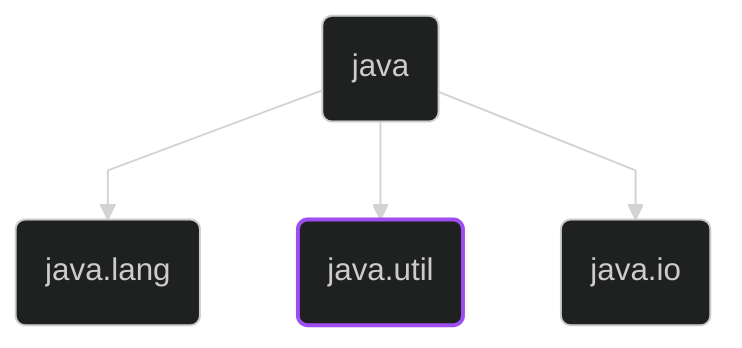
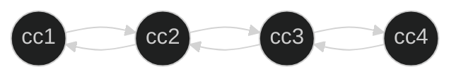
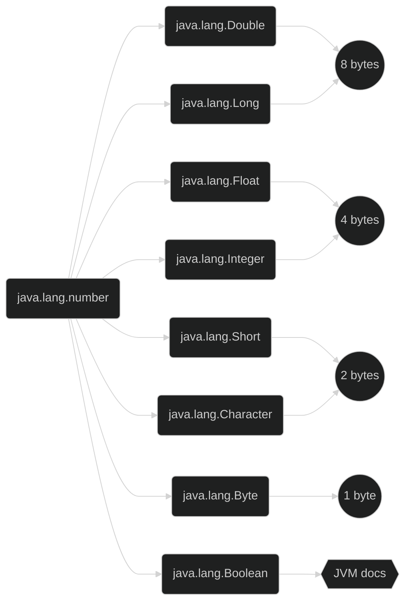

# Java y java.util

Collections, Wrappers y Lambda expressions




## Arrays

TestMain.java

```java
    public static void main(String[] args) {
        int edad1 = 32;
        int edad2 = 18;
        int edad3 = 24;
        
        int[] edades = new int[5];
        edades[1] = edad1;
        edades[2] = edad2;
        edades[3] = edad3;
        
        for (int i = 0; i < 6; i++) {
            try {
                System.out.println(edades[i]);
            } catch (ArrayIndexOutOfBoundsException e) {
                e.printStackTrace();
            }
        }
        
        System.out.println("Tamaño del array: " + edades.length);
        //for (int i = 0; i < edades.length; i++) {
        //        System.out.println(edades[i]);
        //}
        for (int i : edades) {
            System.out.println(i);
        }
    }
```

<details>

<summary markdown="span">Output</summary>

```txt
0
32
18
24
0
java.lang.ArrayIndexOutOfBoundsException: Index 5 out of bounds for length 5
    at bytebank/com.bytebank.test.TestMain.main(TestMain.java:17)
Tamaño del array: 5
0
32
18
24
0
```

</details>

TestArrayReferencia.java

```java
public class TestArrayReferencia {
    public static void main(String[] args) {
        CuentaCorriente cc = new CuentaCorriente(11, 22); 
        CuentaCorriente[] cuentas = new CuentaCorriente[5];
        cuentas[1] = cc;
        System.out.println(cc);
        System.out.println(cuentas[1]);
        separador(1);
        
        cuentas[0] = new CuentaCorriente(10, 20);
        System.out.println(cuentas[0]);
        separador(1);
        
        for (CuentaCorriente cuentaCorriente : cuentas) {
            System.out.println(cuentaCorriente);
        }
    
    } 
```

<details>

<summary markdown="span">Output</summary>

```txt
Cuentas creadas: 1
Cuenta
Nro  : 22
Agnc : 11
Cuenta
Nro  : 22
Agnc : 11
--- --- --- --- --- ---

Cuentas creadas: 2
Cuenta
Nro  : 20
Agnc : 10
--- --- --- --- --- ---

Cuenta
Nro  : 20
Agnc : 10
Cuenta
Nro  : 22
Agnc : 11
null
null
null
```

</details>

### Creación de Arrays

Forma "clasica"

```java
int[] numeros = new int[5]
int[0] numeros = 1;
int[1] numeros = 2;
int[2] numeros = 3;
int[3] numeros = 4;
int[4] numeros = 5;
```

Forma literal

```java
int[] refs = {1,2,3,4,5};
```

### Sumario

- Un array es una estructura de datos y se usa para almacenar elementos (valores
primitivos o referencias)
- Los arrays usan corchetes `[]` sintácticamente
- ¡Los arrays tienen un tamaño fijo!
- ¡Un array también es un objeto!
- Los arrays son zero-based(el primer elemento se encuentra en la posición 0)
- Un array siempre se inicializa con los valores padron.
- Al acceder a una posición no válida recibimos la excepción
**ArrayIndexOutOfBoundException**
- Las matrices tienen el atributo **length** para conocer el tamaño
- La forma literal de crear un array, utilizando llaves `{}`.


### Cast de objetos

Ejemplo
TestArrayReferencia.java

```java
    public static void main(String[] args) {
        CuentaCorriente cc = new CuentaCorriente(11, 22); 
        Object[] referencias = new Object[5];
        referencias[1] = cc;
        System.out.println(cc);
        System.out.println(referencias[1]);
        referencias[0] = new CuentaCorriente(10, 20);
        System.out.println(referencias[0]);
        
        CuentaAhorro ca = new CuentaAhorro(44, 55);
        referencias[2] = ca;
    
        // Cast
        CuentaCorriente ref_cc = (CuentaCorriente)referencias[1];
        //CuentaAhorro ref_cc = (CuentaAhorro)referencias[1]; <- Exception
        // class com.bytebank.modelo.CuentaCorriente cannot be cast to
        // class com.bytebank.modelo.CuentaAhorro
```

Cast implícito

```java
int numero = 3;
double valor = numero;
```

Caso explícito

```java
int numero = 3;
double valor = (double) numero;

double valor = Math.PI;
int numero = (int) valor; // 3
```

### Args

Imprimiendo args

```java
public static void Main(String[] args) {
    for (String string : args) {
        System.out.println(string);
    }
}
```

Terminal en `../bytebank/src`

```sh
javac com/bytebank/test/TestMain.java
java  com/bytebank/test/TestMain arg1 arg2 arg3
```

Sumario

- Un array de tipo Object puede contener cualquier tipo de referencia.
- Cuando convertimos una referencia genérica a una referencia más específica,
necesitamos usar un type cast.
- El cast solo compila cuando es posible, aún así puede fallar al ejecutarse.
- Cuando falla el type cast, podemos recibir una ClassCastException.
- Para recibir valores al llamar al programa Java en la línea de comando,
podemos usar la matríz String[] en el método main.

Ejemplos de arrays de referencias:


<details>

<summary markdown="span"><a href='./bibliotecas/bytebank/src/com/bytebank/modelo/GuardaCuentas.java'>GuardaCuentas.java</a></summary>

```java
public class GuardaCuentas {
    int indice = 0;
    Cuenta[] cuenta = new Cuenta[10];

    public GuardaCuentas() {
        this.indice = 0;
    }
    
    public void guardar(Cuenta cta) {
        cuenta[indice] = cta;
        indice++;
    }

    public Cuenta obtener(int indx) {
        return cuenta[indx];
    }
}
```

</details>

<details>

<summary markdown="span"><a href='./bibliotecas/bytebank/src/com/bytebank/modelo/GuardaReferencias.java'>GuardaReferencias.java</a></summary>

```java
public class GuardaReferencias {
    int indice;
    Object[] objeto;
    
    public GuardaReferencias() {
        this.objeto = new Object[10];
        this.indice = 0;
    }

    public void guardar(Object obj) {
        this.objeto[indice] = obj;
        this.indice++;
    }

    public Object obtener(int indx) {
        return objeto[indx];
    }
}
```

</details>

<details>

<summary markdown="span"><a href='./bibliotecas/bytebank/src/com/bytebank/test/TestGuardaCuentas.java'>TestGuardaCuentas.java</a></summary>

```java
public class TestGuardaCuentas {
    public static void main(String[] args) {
        
        GuardaCuentas guardaCuentas = new GuardaCuentas();        
        Cuenta cc1 = new CuentaCorriente(11, 22);
        guardaCuentas.guardar(cc1);
        Cuenta cc2 = new CuentaCorriente(12, 23);
        guardaCuentas.guardar(cc2);
        
        System.out.println(guardaCuentas.obtener(0));
        System.out.println(guardaCuentas.obtener(1));

        GuardaReferencias guardaRefs = new GuardaReferencias();
        String obj1 = new String("Objeto 1");
        Object obj2 = new Object();
        guardaRefs.guardar(obj1);
        guardaRefs.guardar(obj2);
        System.out.println(guardaRefs.obtener(0));
        System.out.println(guardaRefs.obtener(1));
    }
}
```

Output

```txt
Creada cuenta nro: 22 - Total ctas. creadas: 1
Creada cuenta nro: 23 - Total ctas. creadas: 2
Cuenta
Nro  : 22
Agnc : 11
Cuenta
Nro  : 23
Agnc : 12
Objeto 1
java.lang.Object@39ba5a14
```

</details>

```java
public class TestArrayList {
    public static void main(String[] args) {
        // Forzando el tipo de objs. que contendrá el ArrayList con '<>'
        ArrayList<Cuenta> lista = new ArrayList<>();
        Cuenta cc1 = new CuentaCorriente(33, 34);
        Cuenta cc2 = new CuentaCorriente(44, 45);
        lista.add(cc1);
        lista.add(cc2);
        
        Cuenta obtenerCuenta = lista.get(0);
        System.out.println(obtenerCuenta);
        
        for (int i = 0; i < lista.size(); i++) {
            System.out.println(lista.get(i));
        }
        for (Cuenta cuenta : lista) {
            System.out.println(cuenta);
        }
    }
}
```

```txt
Creada cuenta nro: 34 - Total ctas. creadas: 1
Creada cuenta nro: 45 - Total ctas. creadas: 2
Cuenta
Nro  : 34
Agnc : 33
Cuenta
Nro  : 34
Agnc : 33
Cuenta
Nro  : 45
Agnc : 44
Cuenta
Nro  : 34
Agnc : 33
Cuenta
Nro  : 45
Agnc : 44
```

### Predefinir ArrayList

Predefinir capacidad inicial

```java
ArrayList lista = new ArrayList(16);
```

Crear ArrayList basado en otro

```java
ArrayList lista = new ArrayList(16);

lista.add("01");
lista.add("02");

ArrayList nueva = new ArrayList(lista);
```

Sobre ***java.util.ArrayList***

- la clase `java.util.ArrayList` encapsula el uso de array y ofrece varios 
métodos de más alto nivel.
- Una lista guarda referencias.
- Métodos size, get, remove.
- `foreach` para iterar a través de `ArrayList`.
- *generics* `<>` parametrizan clases.
- En los ArrayList se puede definir el tipo de los elementos mediante generics.

### Override método equals

Sobrescribiendo método de la clase padre **Object** `equals()` en
Cuenta.java
con el fin de adaptar el lenguaje al modelo de negocio.

```java
    @Override
    public boolean equals(Object obj) {
        Cuenta cuenta = (Cuenta) obj;
        return this.agencia == cuenta.getAgencia() &&
               this.numero == cuenta.getNumero();
    }
```

### LinkedList

Cada objeto de este tipo de datos (nodo), tiene referencias a los objetos que lo
anteceden y preceden



```java
import java.util.ArrayList;
import java.util.List;

public class TestArrayList {

    public static void main(String[] args) {
        // Forzando el tipo de objs. que contendrá el ArrayList con '<>'
        //       <obligatorio>                 <opcional>
        ArrayList<Cuenta> lista = new ArrayList<>();    
    }
}
```

#### Uso de `java.util.Arrays` para convertir array a lista

```java
import java.util.Arrays;
import java.util.List;

public class TestArrayList {
    public static void main(String[] args) {
        //java.util.Arrays
        List<String> argumentos = Arrays.asList(args);
    }
}
```

### Vectores

```mermaid
%%{init: {'theme': 'dark','themeVariables': {'clusterBkg': '#2b2f38'}, 'flowchart': {'curve': 'linear'}}}%%

flowchart
    subgraph <b>java.util</b>
        direction TB
        jul(java.util.List)-->jual(java.util.ArrayList)
        jul-->jull(java.util.Linkedlist)
        jul-->juv(java.util.Vector)
        style juv stroke:#9d4df0,stroke-width:2px
    end
```

Un único objeto para todas las pilas de ejecución

```mermaid
%%{init: {'theme': 'dark','themeVariables': {'clusterBkg': '#2b2f38'}, 'flowchart': {'curve': 'linear'}}}%%

flowchart
    subgraph <b>Thread safe</b>
        direction BT
        subgraph HEAP
        juv(java.util.vector)
        end
        subgraph  
        main1(main)-->juv
        end
        subgraph  
        main2(main)-->juv
        end
    end
```

Misma implementación que `LinkedList` y `ArrayList`

```java
import java.util.ArrayList;
import java.util.List;

public class TestArrayList {

    public static void main(String[] args) {
        // Forzando el tipo de objs. que contendrá el ArrayList con '<>'
        //       <obligatorio>                 <opcional>
        ArrayList<Cuenta> lista = new Vector<>();    
    }
}
```

### Collection

```mermaid
%%{init: {'theme': 'dark','themeVariables': {'clusterBkg': '#2b2f38'}, 'flowchart': {'curve': 'linear'}}}%%
flowchart
    subgraph <b>java.util</b>
        direction TB
        jul(java.util.List)-->jual(java.util.ArrayList)
        jul-->jull(java.util.Linkedlist)
        jul-->juv(java.util.Vector)
        jul-->juc(java.util.Collection)
        style juc stroke:#9d4df0,stroke-width:2px
    end
```

```java
public class TestArrayList {
    // error de compilación
    Collection<Cuenta> lista = new Vector<Cuenta>();
    Cuenta ref = lista.get(0) // La clase Vector
}
```

```java
Exception in thread "main" java.lang.Error: Unresolved compilation problem: 
	The method get(int) is undefined for the type Collection<Cuenta>
```

Sumario

- `java.util.Vector` es un `ArrayList` ***threadsafe***.
- La interfaz `java.util.Collection` es la interfaz de todas las colecciones.
- Las listas son secuencias que aceptan elementos duplicados.
- Los conjuntos `java.util.Set` también son colecciones, que no aceptan duplicados
ni listas.

## Clases Wrapper

### Integer

#### Autoboxing

`Integer.valueOf` es un auto *WRAPPER* del deprecado `new Integer(n);`

```java
import java.util.ArrayList;
import java.util.List;

public class TestRepasoArray {
    public static void main(String[] args) {
        int[] numeros = new int[10];
        int numero = 5;

        //Integer numero_objeto = new Integer(5); // Deprecado
        Integer numero_objeto = Integer.valueOf(5);

        List<Integer> lista = new ArrayList<Integer>();
        lista.add(numero); // autoboxing --> lista.add(new Integer(numero));
    }
}
```

#### Unboxing

```java
        Integer numero_objeto = Integer.valueOf(5);
        
        int valorPrimitivo = numero_objeto; // unboxing
        
        //numero_objeto.intValue();
        //numero_objeto.byteValue();
        //numero_objeto.doubleValue();
        //numero_objeto.floatValue();

        // Integer.MAX_VALUE
        // Integer.MIN_VALUE
        // Integer.BYTES
        // Integer.SIZE
        // Integer.TYPE
    }
}
```

#### Wrappers



<br/>

```java
    public static void main(String[] args) {
        Double numero_double = 33.0; 
        boolean verdadero = true;
        
        Double numero_double2 = Double.valueOf(33); 
        System.out.println(numero_double2);
        
        String numero_string = "43";
        Double string_to_double = Double.valueOf(numero_string);
        Integer string_to_integer = Integer.valueOf(numero_string);
        
        System.out.println(string_to_double);
        System.out.println(string_to_integer);
        
        Number numero = Integer.valueOf(5);
        Double num_double_primitivo = numero.doubleValue();
        System.out.println(num_double_primitivo);
    }
}
```

Sumario

- Para cada primitivo hay una clase llamada Wrapper.
- Para almacenar un primitivo en una colección, se necesita crear un objeto que
envuelva el valor.
- La creación del objeto Wrapper se llama autoboxing.
- La extracción del valor primitivo del objeto Wrapper se llama unboxing.
- El autoboxing y unboxing ocurren automáticamente.
- Las clases wrapper tienen varios métodos auxiliares, por ejemplo para el parsing.
- Todas las clases wrappers que representan un valor numérico tienen la clase
`java.lang.Number` como madre.


## Ordenando Listas

TestOrdenLista.java

```java
public class TestOrdenLista {

    public static void main(String[] args) {
        Cuenta cc1 = new CuentaCorriente(22, 33);
        Cliente cliente_cc1 = new Cliente();
        cliente_cc1.setNombre("Diego");
        cc1.setTitular(cliente_cc1);
        cc1.depositar(333.0);
        
        Cuenta ca1 = new CuentaAhorro(22, 44);
        Cliente cliente_ca1 = new Cliente();
        cliente_ca1.setNombre("Cuasimodo");
        ca1.setTitular(cliente_ca1);
        ca1.depositar(444.0);
        
        Cuenta cc2 = new CuentaCorriente(22, 11);
        Cliente cliente_cc2 = new Cliente();
        cliente_cc2.setNombre("Pancracio");
        cc2.setTitular(cliente_cc2);
        cc2.depositar(333.0);
        
        Cuenta ca2 = new CuentaAhorro(22, 22);
        Cliente cliente_ca2 = new Cliente();
        cliente_ca2.setNombre("Joel");
        ca2.setTitular(cliente_ca2);
        ca2.depositar(444.0);
        
        List<Cuenta> lista = new ArrayList<>();
        lista.add(cc1);
        lista.add(ca1);
        lista.add(cc2);
        lista.add(ca2);
       
        System.out.println("Antes de ordenar");
        for (Cuenta cuenta : lista) {
            System.out.println(cuenta);
        }
        // Ordenar las cuentas
        // Comparator<? extends Cuenta> c
        // Comparator es una interfáz funcional, no se requiere instanciar un Comparator,
        //Comparator<Cuenta> comparator = new OrdenadorPorNroCuenta();
        //lista.sort(comparator);
        lista.sort(new OrdenadorPorNroCuenta());
        System.out.println("Despues de ordenar por nro. de cta.");
        for (Cuenta cuenta : lista) {
            System.out.println(cuenta);
        }
        
        // Comparator es una interfáz funcional, no se requiere instanciar un Comparator,
        //Comparator<Cuenta> comp_nombre_titular = new OrdenadorPorNombreTitular();
        //lista.sort(comp_nombre_titular);
        lista.sort(new OrdenadorPorNombreTitular());
        System.out.println("Despues de ordenar por nombre:");
        for (Cuenta cuenta : lista) {
            System.out.println(cuenta);
        }
    }
}

class OrdenadorPorNroCuenta implements Comparator<Cuenta> {
    @Override
    public int compare(Cuenta o1, Cuenta o2) {
        // Forma básica
        //if (o1.getNumero() == o2.getNumero()) {
        //    return 0;
        //} else if (o1.getNumero() > o2.getNumero()) {
        //    return 1;
        //} else {
        //    return -1;
        
        // Forma intermedia
        //return (o1.getNumero() - o2.getNumero());
        
        // Forma WRAPPER
        return (Integer.compare(o1.getNumero(), o2.getNumero()));
    }
}
    
class OrdenadorPorNombreTitular implements Comparator<Cuenta> {
    @Override
    public int compare(Cuenta o1, Cuenta o2) {
        return o1.getTitular().getNombre().compareTo(o2.getTitular().getNombre());
    }
}
```

<details>

<summary markdown="span">Output</summary>

```txt
Creada cuenta nro: 33 - Total ctas. creadas: 1
Creada cuenta nro: 44 - Total ctas. creadas: 2
Creada cuenta nro: 11 - Total ctas. creadas: 3
Creada cuenta nro: 22 - Total ctas. creadas: 4
Antes de ordenar
Cuenta
Nro  : 33
Agnc : 22
Titular: Diego
Cuenta
Nro  : 44
Agnc : 22
Titular: Cuasimodo
Cuenta
Nro  : 11
Agnc : 22
Titular: Pancracio
Cuenta
Nro  : 22
Agnc : 22
Titular: Joel
Despues de ordenar por nro. de cta.
Cuenta
Nro  : 11
Agnc : 22
Titular: Pancracio
Cuenta
Nro  : 22
Agnc : 22
Titular: Joel
Cuenta
Nro  : 33
Agnc : 22
Titular: Diego
Cuenta
Nro  : 44
Agnc : 22
Titular: Cuasimodo
Despues de ordenar por nombre:
Cuenta
Nro  : 44
Agnc : 22
Titular: Cuasimodo
Cuenta
Nro  : 33
Agnc : 22
Titular: Diego
Cuenta
Nro  : 22
Agnc : 22
Titular: Joel
Cuenta
Nro  : 11
Agnc : 22
Titular: Pancracio
```

</details>

</br>

> **Note** una interfáz funcional solo tiene un método por implementar.

### Orden Natural

Cuenta.java

```java
        // Orden "Natural" establecido en Cuenta().compareTo()
        // Forma Antigua
        Collections.sort(lista);
        //Collections.reverse(lista);
        System.out.println("Despues de ordenar por Orden Natural:");
        for (Cuenta cuenta : lista) {
            System.out.println(cuenta);
        }
```

TestOrdenLista.java
```java
...

public abstract class Cuenta implements Comparable<Cuenta> {
    ...

    @Override
    public int compareTo(Cuenta o) {
        // Orden Natural: Nro. agencia
        //return (Integer.compare(this.getAgencia(), o.getAgencia()));
        // Orden Natural: Mayor Saldo (*-1) 
        return (Double.compare(this.getSaldo(), o.getSaldo())) * -1;
    }
}
```

Averiguar:

- ¿Cómo invertir el orden de una lista?
  - Hecho en linea [822](java_util.md#orden-natural) `Collections.reverse(lista);`
- ¿Cómo mezclar todos los elementos de una lista?
  - `Collections.shuffle(lista);`
- ¿Cómo rotar los elementos de una lista?
  - `Collections.rotate(lista, 5); //rotar 5 posiciones`

Sumario

- Para ordenar una lista necesita definir un criterio de ordenación
- Hay dos formas de definir este criterio
- A través de la interfaz del comparador
- A través de la interfaz Comparable (orden natural)
- El algoritmo de ordenación ya se ha implementado
- En la lista en el método de sort
- En la clase Collections por el método sort
- La clase Collections es una fachada con varios métodos auxiliares para trabajar
con colecciones, principalmente listas


## Clase anónima y lambda

### Clase anónima

Implementación de clase anónima al ordenar lista,
TestOrdenLista.java

```java
        lista.sort(new Comparator<Cuenta>() {
            @Override
            public int compare(Cuenta o1, Cuenta o2) {
                return (Integer.compare(o1.getNumero(), o2.getNumero()));
            }
        });
```

```java
        Collections.sort(lista, new Comparator<Cuenta>() {
            @Override
            public int compare(Cuenta o1, Cuenta o2) {
                return o1.getTitular().getNombre().compareTo(o2.getTitular().getNombre());
            }
        });
```

Estas clases son creadas por Java, se pueden ver los archivos compilados como 
`TestOrdenLista$1.class` y `TestOrdenLista$2.class`

### Lambda

Las funciones lambdas provienen de la programación funcional y corresponden
con funciones de Java que normalmente son anónimas y "se escriben en una línea"
donde se usan. Como cualquier función puede recibir argumentos y devuelven
uno o ningún valor de retorno.

```java
public class TestLambda {
        ...
        // Lambda
        lista.sort((Cuenta o1, Cuenta o2) ->
                Integer.compare(o1.getNumero(), o2.getNumero())
            );
        
        System.out.println("Despues de ordenar por nro. de cta.");
        for (Cuenta cuenta : lista) {
            System.out.println(cuenta);
        }

        Collections.sort(lista, (c1, c2) -> 
                c1.getTitular().getNombre().compareTo(c2.getTitular().getNombre())
                );

        System.out.println("Despues de ordenar por nombre:");

        lista.forEach(cuenta -> System.out.println(cuenta));
        }
    }
}
```

- [Lectura - interface funcional](https://www.arquitecturajava.com/java-8-functional-interfaces-y-sus-tipos/)
