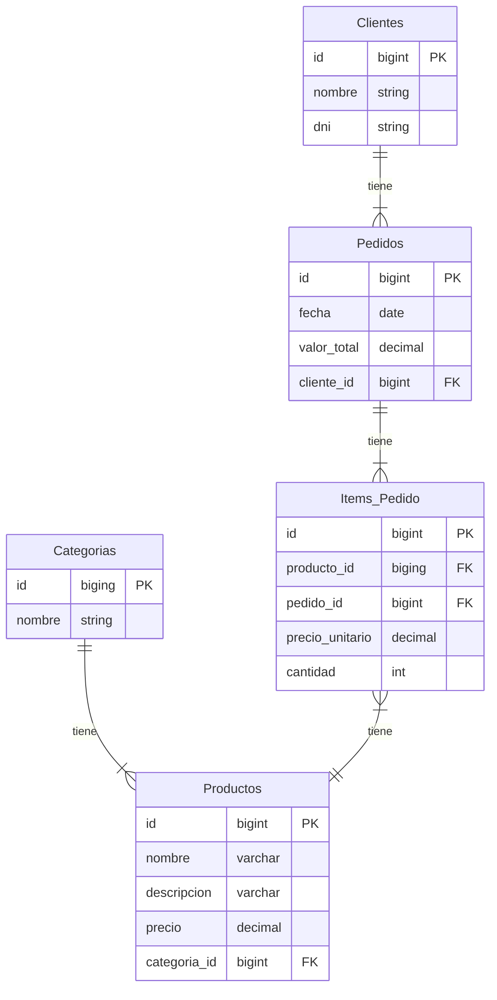
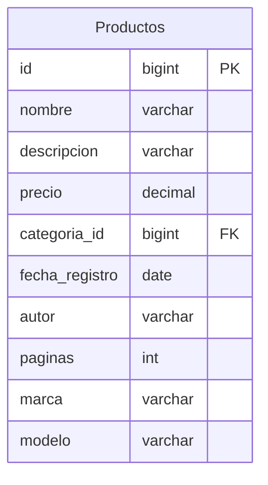
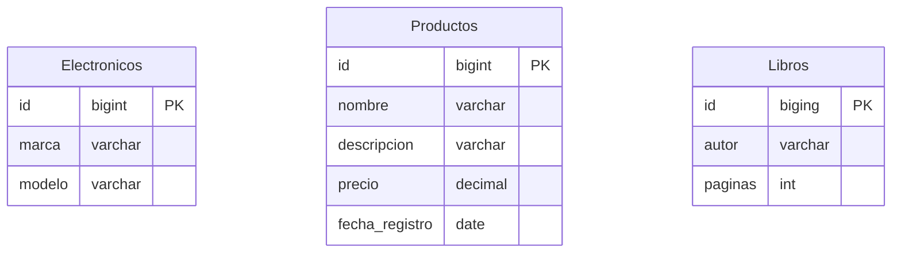

# JPA Avanzado

<style>div.mermaid{text-align: center;}</style>

- doc
[persitence](https://jakarta.ee/specifications/persistence/2.2/apidocs/javax/persistence/package-summary.html)
- Hibernate
[user guide](https://docs.jboss.org/hibernate/orm/current/userguide/html_single/Hibernate_User_Guide.html)

Trabajando sobre el proyecto anterior tienda,
como tienda2


## H2

Alias para manejar H2

```bash
alias h2server='java -cp ${HOME}/.m2/repository/com/h2database/h2/2.2.222/h2-2.2.222.jar org.h2.tools.Server -tcpAllowOthers -pgAllowOthers'
alias h2console='java -jar ${HOME}/.m2/repository/com/h2database/h2/2.2.222/h2-2.2.222.jar'
```

- Creación de base de datos `h2console`

### H2 en modo servidor

```bash
h2server

TCP server running at tcp://127.0.1.1:9092 (others can connect)
PG server running at pg://127.0.1.1:5435 (others can connect)
Web Console server running at http://127.0.1.1:8082 (only local connections)
```


En persistence.xml
cambiar la `url` para usar base de datos creada anteriormente

```xml
...
<properties>
  ...
  <property name="javax.persistence.jdbc.url"
   value="jdbc:h2:tcp://127.0.1.1:9092//ruta/database;DATABASE_TO_UPPER=false;AUTO_SERVER=false"/>
  ...
</properties>
...
```

#### Sumario Aula 1

- Mapeo de nuevas entidades en la aplicación según el modelado de la base de
datos
- Mapeo de relación con cardinalidad de muchos a muchos
- Mapeo de relación bidireccional
- Persistencia entidades que tienen relaciones bidireccionales


### Funciones de agregación SQL

| Función | Descripción |
| - | - |
| **AVG** | Calcula el promedio de los valores de un campo |
| **COUNT** | Devuelve en número de registros de la selección |
| **SUM** | Devuelve la suma de todos los valores de  un campo |
| **MAX** | Devuelve el valor más alto de un campo |
| **MIN** | Devuelve el valor más bajo de un campo |

#### Reporte de ventas

| PRODUCTO | CANT. VENDIDA | ULTIMA VENTA |
| - | :-: | - |
| Celular Motorola X9 | 240 | 01/02/23 |
| Xbox Series S | 198 | 10/02/23 |
| Framework Laptop | 71 | 20/02/2023 |


**NamedQuerys**: Estas se declaran en la clase de entidad.

#### Sumario Aula 2

- Realización de consultas utilizando funciones de agregación (**min, max, avg
y sum**)
- Consultas de reporte/informes usando JPQL
- Uso del nuevo recurso seleccionado en consultas JPQL
- Consultas mediante **NamedQuerys**


Nota: [Relaciones](https://www.adictosaltrabajo.com/2020/04/02/hibernate-onetoone-onetomany-manytoone-y-manytomany/) en Hibernate

### Performance en consultas

- **LAZY** Fetch: ***Carga ondemand*** (menor utlización de recursos), todas
las anotaciones ***many*** (**ManyToOne-OneToMany**) son por defecto del tipo
**LAZY**. Al cerrar el `EntityManager` y solicitar algún dato que requiere hacer
un *select* a alguna entidad de la consulta anterior se produce una expeción.
Esto se resuelve con una **Consulta Planificada** (ej. `PedidoDao` ->
`ConsultarPedidoConCliente()`)

- **EAGER** Fetch: ***Carga Anticipada*** (mayor utlización de recursos), todas
las anotaciones del tipo ***one*** (**OneToOne-ManyToOne**) son por defecto del
tipo **EAGER**

Al construir aplicaciones utilizando recursos que realizan operaciones que no
explicitas se debe estudiar la documentación para entender cual es la ciencia
detrás del framework o recurso.

Cuando se realizan consultas con la anotación **@ManyToOne** o **@OneToOne**
por debajo, JPA aplica una estrategia de carga de información llamada **Eager**
o Anticipada o Proactiva realizando JOINS entre tablas.
Pero esto no es todo, ya que si la entidad que tiene el JOIN, tiene otras entidades
dentro de sus atributos marcados con la anotación finalizando **ToOne**, también
serán cargadas dentro de la consulta. Esto puede saturar la memoria y afectar
seriamente la velocidad de carga. Para corregir se debe utilizar el parámetro
de carga ***FerchType.LAZY*** en todas las anotaciones **ToOne**, lo que indica
a JPA cargar la entidad solo si es solicitada.

Al realizar esta corrección se presenta un posible inconveniente donde se encontre
con la necesidad de utilizar ese atributo de entidad.
Pero para ese momento el **EntityManager** se puede encontrar cerrado, por lo que
se tienen que planear las consultas previniendo el uso de esa entidad cuando se
encuentre cerrado el **EntityManager**.
#### Sumario Aula 3

- Estrategias **EAGER** y **LAZY**, en consultas de entidades relacionadas
- JPA podría lanzar `LazyInitializationException` en ciertas situaciones
- Buenas prácticas en la carga de entidades relacionadas
- Realizar **consultas programadas** con la función de búsqueda de combinación

### Consultas con parámetros dinámicos

### Sin API Criteria

ej. productoDAO.java

```java
    public List<Producto> consultaPorParametro(String nombre, BigDecimal precio, LocalDate fecha){
        StringBuilder jpql = new StringBuilder("SELECT P FROM Producto P WHERE 1=1");
        if (nombre != null && !nombre.trim().isEmpty()) {
            jpql.append(" AND P.nombre=:nombre");
        }
        if (precio != null && !precio.equals(new BigDecimal(0))) {
            jpql.append(" AND P.precio=:precio");
        }
        if (fecha != null) {
            jpql.append(" AND P.fechaDeRegistro=:fecha");
        }
        TypedQuery<Producto> query = em.createQuery(jpql.toString(), Producto.class);
        if (nombre != null && !nombre.trim().isEmpty()) {
            query.setParameter("nombre", nombre);
        }
        if (precio != null && !precio.equals(new BigDecimal(0))) {
            query.setParameter("precio", precio);
        }
        if (fecha != null) {
            query.setParameter("fechaDeRegistro", fecha);
        }
        return query.getResultList();
    }
```

### Con API Criteria

```java
    public List<Producto> consultaPorParametrosConAPICriteria(String nombre, BigDecimal precio, LocalDate fecha){
        CriteriaBuilder builder = em.getCriteriaBuilder();
        CriteriaQuery<Producto> query = builder.createQuery(Producto.class);
        Root<Producto> from = query.from(Producto.class);
        Predicate filtro = builder.and();
        if (nombre != null && !nombre.trim().isEmpty()) {
            filtro = builder.and(filtro, builder.equal(from.get("nombre"), nombre));
        }
        if (precio != null && !precio.equals(new BigDecimal(0))) {
            filtro = builder.and(filtro, builder.equal(from.get("precio"), precio));
        }
        if (fecha != null) {
            filtro = builder.and(filtro, builder.equal(from.get("fechaDeRegistro"), fecha));
        }
        query = query.where(filtro);
        return em.createQuery(query).getResultList();
    }
}
```

#### Sumario Aula 4

- Consultas JPQL con parámetros opcionales
- API de criterios JPA y consulta con parámetros opcionales

## Embeddable

Simplificación de entidades con anotaciones `@Embeddable` y `@Embedded`, ejm. Cliente.java y DatosPersonales.java

## Mapeo de herencias

### Join table

#### Estrategia Single Table

Una única tabla, ejm. Producto.java

```java
...
@Inheritance(strategy = InheritanceType.SINGLE_TABLE)
public class Producto {
    ...
```



#### Estrategia Joined Table

ejm. Producto.java

```java
...
@Inheritance(strategy = InheritanceType.JOINED)
public class Producto {
    ...
```



## Mapeo de llaves compuestas

ejm. Categoria.java y CategoriaId.java
