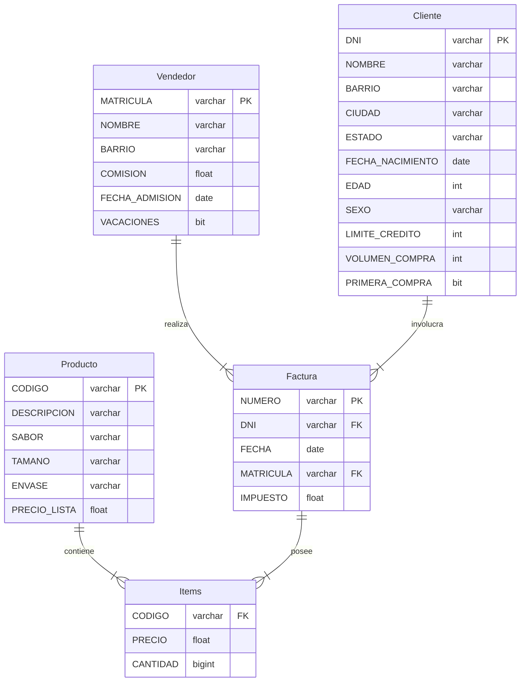

# Proyecto Empresa

#### Entidades

- **Cliente**
- **Vendedor**
- **Producto**
- **Factura**
- **Items**

<style>div.mermaid{text-align: center;}</style>




```sql
CREATE TABLE clientes (
    dni VARCHAR(11) NOT NULL,
    nombre VARCHAR(100) NULL,
    direccion VARCHAR(150),
    barrio VARCHAR(50),
    ciudad VARCHAR(50),
    estado VARCHAR(20),
    cp VARCHAR(10),
    fecha_nacimiento DATE,
    edad SMALLINT,
    limite_credito FLOAT,
    volumen_compra FLOAT,
    primera_compra BIT,
    PRIMARY KEY (dni)
);

CREATE TABLE vendedores (
    matricula VARCHAR(5) NOT NULL,
    nombre VARCHAR(100),
    barrio VARCHAR(50),
    comision float,
    fecha_admision DATE,
    vacaciones BIT(1),
    PRIMARY KEY (matricula)
);

CREATE TABLE productos (
    codigo VARCHAR(10) NOT NULL,
    descripcion VARCHAR(100),
    sabor VARCHAR(50),
    tamano VARCHAR(50),
    envase VARCHAR(50),
    precio FLOAT,
    PRIMARY KEY (codigo)
);

CREATE TABLE facturas (
    numero VARCHAR(5) NOT NULL,
    fecha DATE,
    dni VARCHAR(5) NOT NULL,
    matricula VARCHAR(11) NOT NULL,
    impuesto FLOAT,
    PRIMARY KEY (numero),
    FOREIGN KEY (dni) REFERENCES clientes(dni),
    FOREIGN KEY (matricula) REFERENCES vendedores(matricula)
);

CREATE TABLE items (
    numero VARCHAR(5) NOT NULL,
    codigo VARCHAR(10) NOT NULL,
    cantidad INT,
    precio FLOAT,
    PRIMARY KEY (numero, codigo),
    FOREIGN KEY (numero) REFERENCES facturas(numero),
    FOREIGN KEY (codigo) REFERENCES productos(codigo)
);
```

## Poblar tablas

### Script insertar productos, vendedores y clientes

insert

### Importar registros de facturas e items desde `jugos_ventas`

./proyecto_scripts/import_records.sql

```sql
USE empresa;

INSERT INTO facturas
SELECT numero, fecha_venta as fecha, dni, matricula, impuesto
FROM jugos_ventas.facturas;

INSERT INTO items
SELECT numero, codigo_del_producto AS codigo, cantidad, precio
FROM jugos_ventas.items_facturas;
```

## Funcion RAND

Devuelve un número aleatorio entre 0 y 1

```sql
SELECT RAND();
+---------------------+
| rand()              |
+---------------------+
| 0.20842885617951756 |
+---------------------+
```


```sql
SELECT FLOOR(RAND() * (MAX-MIN+1)+MIN) AS ALEATORIO;
```

```sql
-- MIN = 20, MAX = 250
SELECT FLOOR(RAND() * (250-20+1)+20) AS ALEATORIO;
+-----------+
| ALEATORIO |
+-----------+
|        28 |
+-----------+

-- MIN = 1, MAX = 10
SELECT FLOOR(RAND() * (10-1+1)+1) AS ALEATORIO;
+-----------+
| ALEATORIO |
+-----------+
|         5 |
+-----------+
```

### Funcion número aleatorio

#### Activar creación de funciones

En el caso de MySQL puede ser requerido lo sgte.

```sql
SET GLOBAL log_bin_trust_function_creators = 1;
```

```sql
DROP FUNCTION IF EXISTS f_aleatorio;
DELIMITER $$
CREATE FUNCTION f_aleatorio(min INT, max INT)
RETURNS INT
BEGIN
    DECLARE vresultado INT;
    SELECT FLOOR(RAND() * (MAX-MIN+1)+MIN) INTO vresultado;
    RETURN vresultado;
END $$
DELIMITER ;
```

### Función Cliente Aleatorio

```sql
DROP FUNCTION IF EXISTS f_cliente_aleatorio;
DELIMITER $$
CREATE FUNCTION f_cliente_aleatorio()
RETURNS VARCHAR(11)
BEGIN
    DECLARE vresultado VARCHAR(11);
    DECLARE vmax, vrand INT;
    SELECT COUNT(*) INTO vmax FROM clientes;
    SET vrand = f_aleatorio(1, vmax);
    SET vrand = vrand-1;
    SELECT dni INTO vresultado FROM clientes LIMIT vrand, 1;
    RETURN vresultado;
END $$
DELIMITER ;
```

***Crear una función para obtener un producto y otra para obtener un***
***vendedor, usando como base la función `f_aleatorio()`***

#### Función Producto Aleatorio

```sql
DROP FUNCTION IF EXISTS f_producto_aleatorio;
DELIMITER $$
CREATE FUNCTION f_producto_aleatorio()
RETURNS VARCHAR(11)
BEGIN
    DECLARE vresultado VARCHAR(11);
    DECLARE vmax, vrand INT;
    SELECT COUNT(*) INTO vmax FROM productos;
    SET vrand = f_aleatorio(1, vmax);
    SET vrand = vrand-1;
    SELECT codigo INTO vresultado FROM productos LIMIT vrand, 1;
    RETURN vresultado;
END $$
DELIMITER ;
```

#### Función Vendedor Aleatorio

```sql
DROP FUNCTION IF EXISTS f_vendedor_aleatorio;
DELIMITER $$
CREATE FUNCTION f_vendedor_aleatorio()
RETURNS VARCHAR(11)
BEGIN
    DECLARE vresultado VARCHAR(11);
    DECLARE vmax, vrand INT;
    SELECT COUNT(*) INTO vmax FROM vendedores;
    SET vrand = f_aleatorio(1, vmax);
    SET vrand = vrand-1;
    SELECT matricula INTO vresultado FROM vendedores LIMIT vrand, 1;
    RETURN vresultado;
END $$
DELIMITER ;
```

### Funciones aleatorias

```sql
SELECT f_cliente_aleatorio() AS cliente,
       f_producto_aleatorio() AS producto,
       f_vendedor_aleatorio() AS vendedor;
+-------------+----------+----------+
| cliente     | producto | vendedor |
+-------------+----------+----------+
| 94387575700 | 243083   | 00235    |
+-------------+----------+----------+
```

```sql
DROP PROCEDURE IF EXISTS sp_venta;
DELIMITER $$
CREATE PROCEDURE sp_venta(fecha DATE, max_items INT, max_cantidad INT)
BEGIN
    DECLARE vcliente VARCHAR(11);
    DECLARE vproducto VARCHAR(10);
    DECLARE vvendedor VARCHAR(5);
    DECLARE vcantidad INT;
    DECLARE vprecio FLOAT;
    DECLARE vitems INT;
    DECLARE vnfactura INT;
    DECLARE vcontador INT DEFAULT 1;
    SELECT MAX(numero)+1 INTO vnfactura FROM facturas;
    SET vcliente = f_cliente_aleatorio();
    SET vvendedor = f_vendedor_aleatorio();
    INSERT INTO facturas (numero, fecha, dni, matricula, impuesto)
        VALUES (vnfactura, fecha, vcliente, vvendedor, 0.16);
    SET vitems = f_aleatorio(1, max_items);
    WHILE vcontador <= vitems DO
        SET vproducto = f_producto_aleatorio();
        SET vcantidad = f_aleatorio(1,max_cantidad);
        SELECT precio INTO vprecio FROM productos WHERE codigo = vproducto;
        INSERT INTO items(numero, codigo, cantidad, precio)
            VALUES(vnfactura, vproducto, vcantidad, vprecio);
            SET vcontador = vcontador+1;
    END WHILE;
END $$
DELIMITER ;
```

- Script funciones_y_procedimientos
### Corrigiendo campos numero en tablas `items` y `facturas`

re_create_tables

```sql
CALL sp_venta('20210619', 3, 100);
Query OK, 27 rows affected (0.023 sec)

select * from facturas
where numero = (select max(numero) from facturas);
+--------+------------+------------+-----------+----------+
| numero | fecha      | dni        | matricula | impuesto |
+--------+------------+------------+-----------+----------+
|  87977 | 2021-06-19 | 5648641702 | 00236     |     0.16 |
+--------+------------+------------+-----------+----------+
```

***Calcular la facturación para la fecha '20210619'***

```sql
SELECT F.fecha, SUM(I.cantidad*I.precio) AS Facturacion
FROM facturas F
INNER JOIN
    items I
    ON F.numero = I.numero
WHERE F.fecha = '20210619' GROUP BY F.fecha;
```

***Calcular el valor del impuesto pago por año redondeado al mayor entero***

```sql
SELECT YEAR(fecha) AS "AÑO", CEIL(SUM((cantidad*precio)*impuesto))AS RESULTADO
FROM facturas F 
INNER JOIN items I ON F.numero = I.numero
GROUP BY YEAR(fecha);
+------+-----------+
| AÑO  | RESULTADO |
+------+-----------+
| 2015 |   4382250 |
| 2016 |   4656938 |
| 2017 |   4879519 |
| 2018 |   1211812 |
| 2021 |      9228 |
+------+-----------+
```

## Triggers INSERT DELETE UPDATE

Triggers.sql

```sql
CREATE TABLE facturacion(
    fecha DATE NULL,
    venta_total FLOAT
);

DELIMITER //
CREATE TRIGGER tg_facturacion_insert
AFTER INSERT ON items
FOR EACH ROW BEGIN
  DELETE FROM facturacion;
  INSERT INTO facturacion
  SELECT A.FECHA, SUM(B.cantidad * B.precio) AS VENTA_TOTAL
  FROM facturas A
  INNER JOIN
  items B
  ON A.NUMERO = B.NUMERO
  GROUP BY A.FECHA;
END //

DELIMITER //
CREATE TRIGGER tg_facturacion_delete
AFTER DELETE ON items
FOR EACH ROW BEGIN
  DELETE FROM facturacion;
  INSERT INTO facturacion
  SELECT A.fecha, SUM(B.cantidad * B.precio) AS VENTA_TOTAL
  FROM facturas A
  INNER JOIN
  items B
  ON A.numero = B.numero
  GROUP BY A.fecha;
END //

DELIMITER //
CREATE TRIGGER tg_facturacion_update
AFTER UPDATE ON items
FOR EACH ROW BEGIN
  DELETE FROM facturacion;
  INSERT INTO facturacion
  SELECT A.fecha, SUM(B.cantidad * B.precio) AS VENTA_TOTAL
  FROM facturas A
  INNER JOIN
  items B
  ON A.numero = B.numero
  GROUP BY A.fecha;
END //

DELIMITER ;
```

```sql
CALL sp_venta('20210622', 3, 10);
SELECT * FROM facturacion WHERE fecha = '20210622';
+------------+-------------+
| fecha      | venta_total |
+------------+-------------+
| 2021-06-22 |     14528.2 |
+------------+-------------+
```

Cambio de rutinas en comun de los triggers por un SP

```sql
DROP PROCEDURE IF EXISTS sp_triggers;
DELIMITER $$
CREATE PROCEDURE sp_triggers()
BEGIN
    DELETE FROM facturacion;
    INSERT INTO facturacion
    SELECT A.fecha, SUM(B.cantidad * B.precio) AS VENTA_TOTAL
    FROM facturas A
    INNER JOIN
    items B
    ON A.numero = B.numero
    GROUP BY A.fecha;
END $$


DROP TRIGGER tg_facturacion_insert $$
DROP TRIGGER tg_facturacion_delete $$
DROP TRIGGER tg_facturacion_update $$

CREATE TRIGGER tg_facturacion_insert
AFTER INSERT ON items
FOR EACH ROW BEGIN
    CALL sp_triggers;
END $$

CREATE TRIGGER tg_facturacion_delete
AFTER DELETE ON items
FOR EACH ROW BEGIN
    CALL sp_triggers;
END $$

CREATE TRIGGER tg_facturacion_update
AFTER UPDATE ON items
FOR EACH ROW BEGIN
    CALL sp_triggers;
END $$

DELIMITER ;
```
